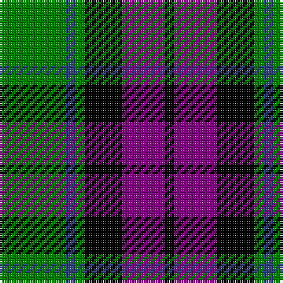

In pattern [GBGKBK](/patterns/gbgkbk/).

This was sourced from weddslist.  It is a [6 stripes tartan](/stripes/stripes6/).

Original link http://www.weddslist.com/cgi-bin/tartans/pg.pl?source=sts

## Thread count
G/28 B4 G4 K16 P18 K/4

## Palette
Each colour and its ΔE from the base-6 reference it is a variant of.

| Colour | Shade | Base | ΔE (OKLab) |
|---|---|---|---|
| B | <code style="background-color:#304080;">#304080</code> `#304080` | B <code style="background-color:#2A418A;">#2A418A</code> | 0.02 |
| G | <code style="background-color:#008000;">#008000</code> `#008000` | G <code style="background-color:#006100;">#006100</code> | 0.10 |
| K | <code style="background-color:#000000;">#000000</code> `#000000` | K <code style="background-color:#000000;">#000000</code> | 0.00 |
| P | <code style="background-color:#800080;">#800080</code> `#800080` | B <code style="background-color:#2A418A;">#2A418A</code> | 0.17 |

# Sample pattern

## Nearest tartans

The nearest existing variants by ΔTartan distance.

1. [Wilson's, No 150 "Coburg"](/setts/s6/g18b2g4k14ba12k3x2~b5480b0-ba800080-g008000-k000000/) — ΔT 0.48
1. [Wilson's No 158](/setts/s6/g21w2g4k17b14k3x2~b800080-g008000-k000000-we0e0e0/) — ΔT 0.69
1. [Wilson's, No 160](/setts/s6/g21y2g4k16b14k3x2~b800080-g008000-k000000-yf0c000/) — ΔT 0.69
1. [Murray](/setts/s6/b2k2b12k8g11r2x2~b304080-g008000-k000000-rc00000/) — ΔT 0.77
1. [Triad Highland Games Proposed](/setts/s7/r1b8k8r1k8g8r1x4~b2888c4-g006818-k101010-re87878/) — ΔT 0.86
1. [Lennie](/setts/s6/g2b8k9ba2g10k2x2~b800080-ba5480b0-g008000-k000000/) — ΔT 0.90
1. [MacKay](/setts/s6/g1b5g1k5g6y1x2~b304080-g008000-k000000-yf0c000/) — ΔT 0.92
1. [Morrison](/setts/s6/k3g14k14g2b14r3x2~b304080-g008000-k000000-rc00000/) — ΔT 0.92
1. [Wilson's, No 100](/setts/s6/g3b17k18y2g17k3x2~b800080-g008000-k000000-yf0c000/) — ΔT 0.93
1. [Fletcher of Dunans](/setts/s7/b6k1b6k8r1g8r2x2~b304080-g008000-k000000-rc00000/) — ΔT 0.93

## Neighbour map

Every grey dot is one of 15726 variants placed by the first two principal components of the ΔTartan feature space (44% of its variance). Red is this tartan; blue dots are its nearest — click one to open its page.

<svg viewBox="0 0 640 380" role="img" style="max-width:100%;height:auto;border:1px solid #e0e0e0;border-radius:4px;display:block" xmlns="http://www.w3.org/2000/svg"><image href="/nn/cloud.v1.png" width="640" height="380"/><a href="/setts/s6/g18b2g4k14ba12k3x2~b5480b0-ba800080-g008000-k000000/"><circle cx="173.6" cy="222.1" r="4" fill="#3465a4"><title>Wilson's, No 150 &quot;Coburg&quot;</title></circle></a><a href="/setts/s6/g21w2g4k17b14k3x2~b800080-g008000-k000000-we0e0e0/"><circle cx="178.7" cy="210.7" r="4" fill="#3465a4"><title>Wilson's No 158</title></circle></a><a href="/setts/s6/g21y2g4k16b14k3x2~b800080-g008000-k000000-yf0c000/"><circle cx="181.8" cy="211.0" r="4" fill="#3465a4"><title>Wilson's, No 160</title></circle></a><a href="/setts/s6/b2k2b12k8g11r2x2~b304080-g008000-k000000-rc00000/"><circle cx="148.6" cy="240.0" r="4" fill="#3465a4"><title>Murray</title></circle></a><a href="/setts/s7/r1b8k8r1k8g8r1x4~b2888c4-g006818-k101010-re87878/"><circle cx="191.7" cy="225.2" r="4" fill="#3465a4"><title>Triad Highland Games Proposed</title></circle></a><a href="/setts/s6/g2b8k9ba2g10k2x2~b800080-ba5480b0-g008000-k000000/"><circle cx="123.5" cy="245.8" r="4" fill="#3465a4"><title>Lennie</title></circle></a><a href="/setts/s6/g1b5g1k5g6y1x2~b304080-g008000-k000000-yf0c000/"><circle cx="153.3" cy="238.7" r="4" fill="#3465a4"><title>MacKay</title></circle></a><a href="/setts/s6/k3g14k14g2b14r3x2~b304080-g008000-k000000-rc00000/"><circle cx="133.2" cy="235.5" r="4" fill="#3465a4"><title>Morrison</title></circle></a><a href="/setts/s6/g3b17k18y2g17k3x2~b800080-g008000-k000000-yf0c000/"><circle cx="152.5" cy="214.8" r="4" fill="#3465a4"><title>Wilson's, No 100</title></circle></a><a href="/setts/s7/b6k1b6k8r1g8r2x2~b304080-g008000-k000000-rc00000/"><circle cx="143.6" cy="227.6" r="4" fill="#3465a4"><title>Fletcher of Dunans</title></circle></a><circle cx="174.5" cy="226.4" r="5" fill="#c00000"/></svg>

ID: /setts/s6/g14b2g2k8ba9k2x2~b304080-ba800080-g008000-k000000/
