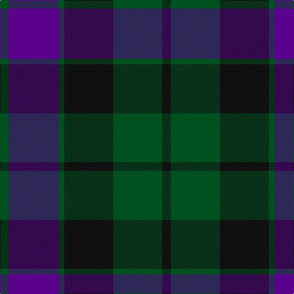

In pattern [GBGKGK](/patterns/gbgkgk/).

This was sourced from register-of-tartans.  It is a [6 stripes tartan](/stripes/stripes6/).

Original link https://www.tartanregister.gov.uk/tartanDetails.aspx?ref=2504

## Thread count
G/14 P82 G9 K80 G80 K/14

## Palette
Each colour and its ΔE from the base-6 reference it is a variant of.

| Colour | Shade | Base | ΔE (OKLab) |
|---|---|---|---|
| G | <code style="background-color:#005020;">#005020</code> `#005020` | G <code style="background-color:#006400;">#006400</code> | 0.08 |
| K | <code style="background-color:#101010;">#101010</code> `#101010` | K <code style="background-color:#000000;">#000000</code> | 0.17 |
| P | <code style="background-color:#5A008C;">#5A008C</code> `#5A008C` | B <code style="background-color:#2C4084;">#2C4084</code> | 0.12 |

# Sample pattern

## Nearest tartans

The nearest existing variants by ΔTartan distance.

1. [Renfrew](/setts/s7/b12k4b36k36g36k6r4-b2c2c80-g006818-k101010-rc80000/) — ΔT 1.07
1. [Fletcher Clan Tartan Tartan Number: 257. Earliest known date: 1906 Sometimes known as Fletcher of Saltoun, but commonly worn by all the Scottish Fletchers regardless family origins. According to legend, "Is e Clann-an-leisdeir a thog a cued smuid thug goil air uisge 'an Urcha." (It was the Fletcher clan that first raised smoke and boiled their water in Glen Orchy.) See products available Copyright © Blair Urquhart, Comrie, 2015](/setts/s7/b12k2b12k16r2g16k4-b2c2c80-g006818-k101010-rc80000/) — ΔT 1.11
1. [Campbell of Glenlyon Clan Tartan Tartan Number: 14. Earliest known date: pre 2003 MacKinlay strip. Sample in STS collection. See products available Copyright © Blair Urquhart, Comrie, 2015](/setts/s5/g14k12b14k2b4-b2c2c80-g006818-k101010/) — ΔT 1.14
1. [Wilson's No.100](/setts/s6/g6b34k36y4g34k6-b5a008c-g005020-k101010-ye8c000/) — ΔT 1.16
1. [Reid and Taylor](/setts/s7/b4k2r2b18k18g20k4-b2c2c80-g006818-k101010-rc80000/) — ΔT 1.16
1. [Strathspey District Tartan Tartan Number: 1039. Earliest known date: 1795 From the back of a waistcoat of a Strathspey Fencible 1794-5. The design, which is a variation of the Black Watch may be attributed to General James Grant of Ballindalloch who raised the fencible unit and whose clan already used the the Black Watch as a hunting sett. The Strathspey tartan is now produced as a District tartan. See products available Copyright © Blair Urquhart, Comrie, 2015](/setts/s7/k4g20k20b20k4b4k4-b2c2c80-g006818-k101010/) — ΔT 1.18
1. [Skene](/setts/s7/b18r6b2r6g18r6b2-b000052-g11450d-raa0000/) — ΔT 1.19
1. [Gallamore](/setts/s6/k6b28r4k28g28k6-b2c2c80-g006818-k101010-rc80000/) — ΔT 1.21
1. [National Galleries of Scotland Corporate Tartan Tartan Number: 2050. Earliest known date: November 1991 Based on the Black Watch or Government tartan. The three claret stripes represent the three galleries and the colour is that of William Playfair's original colour scheme for the National Gallery. See products available Copyright © Blair Urquhart, Comrie, 2015](/setts/s7/k14g44k44b12r4b30r4-b202060-g006818-k101010-rc80000/) — ΔT 1.21
1. [Bareback (Corporate)](/setts/s6/b6k6b21k16ba36y4-b5c5c5c-ba2c2c80-k101010-ye8c000/) — ΔT 1.21

## Neighbour map

Every grey dot is one of 15726 variants placed by the first two principal components of the ΔTartan feature space (44% of its variance). Red is this tartan; blue dots are its nearest — click one to open its page.

<svg viewBox="0 0 640 380" role="img" style="max-width:100%;height:auto;border:1px solid #e0e0e0;border-radius:4px;display:block" xmlns="http://www.w3.org/2000/svg"><image href="/nn/cloud.v1.png" width="640" height="380"/><a href="/setts/s7/b12k4b36k36g36k6r4-b2c2c80-g006818-k101010-rc80000/"><circle cx="215.3" cy="233.5" r="4" fill="#3465a4"><title>Renfrew</title></circle></a><a href="/setts/s7/b12k2b12k16r2g16k4-b2c2c80-g006818-k101010-rc80000/"><circle cx="206.3" cy="251.2" r="4" fill="#3465a4"><title>Fletcher Clan Tartan Tartan Number: 257. Earliest known date: 1906 Sometimes known as Fletcher of Saltoun, but commonly worn by all the Scottish Fletchers regardless family origins. According to legend, &quot;Is e Clann-an-leisdeir a thog a cued smuid thug goil air uisge 'an Urcha.&quot; (It was the Fletcher clan that first raised smoke and boiled their water in Glen Orchy.) See products available Copyright © Blair Urquhart, Comrie, 2015</title></circle></a><a href="/setts/s5/g14k12b14k2b4-b2c2c80-g006818-k101010/"><circle cx="232.3" cy="297.9" r="4" fill="#3465a4"><title>Campbell of Glenlyon Clan Tartan Tartan Number: 14. Earliest known date: pre 2003 MacKinlay strip. Sample in STS collection. See products available Copyright © Blair Urquhart, Comrie, 2015</title></circle></a><a href="/setts/s6/g6b34k36y4g34k6-b5a008c-g005020-k101010-ye8c000/"><circle cx="200.9" cy="235.4" r="4" fill="#3465a4"><title>Wilson's No.100</title></circle></a><a href="/setts/s7/b4k2r2b18k18g20k4-b2c2c80-g006818-k101010-rc80000/"><circle cx="217.1" cy="226.5" r="4" fill="#3465a4"><title>Reid and Taylor</title></circle></a><a href="/setts/s7/k4g20k20b20k4b4k4-b2c2c80-g006818-k101010/"><circle cx="244.6" cy="279.2" r="4" fill="#3465a4"><title>Strathspey District Tartan Tartan Number: 1039. Earliest known date: 1795 From the back of a waistcoat of a Strathspey Fencible 1794-5. The design, which is a variation of the Black Watch may be attributed to General James Grant of Ballindalloch who raised the fencible unit and whose clan already used the the Black Watch as a hunting sett. The Strathspey tartan is now produced as a District tartan. See products available Copyright © Blair Urquhart, Comrie, 2015</title></circle></a><a href="/setts/s7/b18r6b2r6g18r6b2-b000052-g11450d-raa0000/"><circle cx="234.6" cy="236.8" r="4" fill="#3465a4"><title>Skene</title></circle></a><a href="/setts/s6/k6b28r4k28g28k6-b2c2c80-g006818-k101010-rc80000/"><circle cx="211.1" cy="256.0" r="4" fill="#3465a4"><title>Gallamore</title></circle></a><a href="/setts/s7/k14g44k44b12r4b30r4-b202060-g006818-k101010-rc80000/"><circle cx="225.8" cy="229.5" r="4" fill="#3465a4"><title>National Galleries of Scotland Corporate Tartan Tartan Number: 2050. Earliest known date: November 1991 Based on the Black Watch or Government tartan. The three claret stripes represent the three galleries and the colour is that of William Playfair's original colour scheme for the National Gallery. See products available Copyright © Blair Urquhart, Comrie, 2015</title></circle></a><a href="/setts/s6/b6k6b21k16ba36y4-b5c5c5c-ba2c2c80-k101010-ye8c000/"><circle cx="229.7" cy="235.8" r="4" fill="#3465a4"><title>Bareback (Corporate)</title></circle></a><circle cx="255.1" cy="261.7" r="5" fill="#c00000"/></svg>

ID: /setts/s6/g14b82g9k80g80k14-b5a008c-g005020-k101010/
