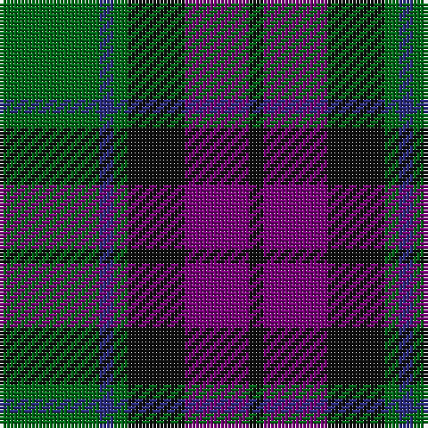

In pattern [GBGKBK](/stripes/gbgkbk/).

This was sourced from house-of-tartan.  It is a [6 stripe tartan](/stripes/stripes6/).

Original link http://www.house-of-tartan.scotland.net/house/TartanViewjs.asp?colr=Def&tnam=700

## Thread count
G/28 DB4 G4 K16 P18 K/4

## Palette
Each colour and its ΔE from the base-6 reference it is a variant of.

| Colour | Shade | Base | ΔE (OKLab) |
|---|---|---|---|
| DB | <code style="background-color:#2C2C80;">#2C2C80</code> `#2C2C80` | B <code style="background-color:#2A418A;">#2A418A</code> | 0.06 |
| G | <code style="background-color:#006818;">#006818</code> `#006818` | G <code style="background-color:#006100;">#006100</code> | 0.02 |
| K | <code style="background-color:#101010;">#101010</code> `#101010` | K <code style="background-color:#000000;">#000000</code> | 0.17 |
| P | <code style="background-color:#780078;">#780078</code> `#780078` | B <code style="background-color:#2A418A;">#2A418A</code> | 0.17 |

# Sample pattern

## Nearest tartans

The nearest existing variants by ΔTartan distance.

1. [MacArthur of Milton (Clan)](/setts/s6/g7db1g1k4dp4k1~x4/) — ΔT 0.33
1. [Coburg](/setts/s6/g18t2g4k14dp12k3~x2/) — ΔT 0.71
1. [Callum Beg (Fashion)](/setts/s6/g1db6k6g6r1g1~x6/) — ΔT 0.72
1. [Gallamore](/setts/s6/k3db14r2k14g14k3~x2/) — ΔT 0.73
1. [Redland](/setts/s6/g52lb7g9k35db35k7/) — ΔT 0.82
1. [MacKay (Bonner)](/setts/s6/dg1db5dg1k5dg6ly1~x2/) — ΔT 0.86
1. [Daks (Navy)](/setts/s8/r3g6db2db2db11g9db2r3~x2/) — ΔT 0.86
1. [MacTavish Hunting](/setts/s6/t4dy28g6t12k12t3~x2/) — ΔT 0.88
1. [Lennie Family Tartan Tartan Number: 725. Earliest known date: 1819 Wilson's No 231. See products available Copyright © Blair Urquhart, Comrie, 2015](/setts/s6/k2g10t2k9dp8g2~x2/) — ΔT 0.88
1. [Gunn - 1810 (Clan)](/setts/s6/r4g12k12g2db12g3~x2/) — ΔT 0.88

## Neighbour map

Every grey dot is one of 14299 variants placed by the first two principal components of the ΔTartan feature space (44% of its variance). Red is this tartan; blue dots are its nearest — click one to open its page.

<svg viewBox="0 0 640 380" role="img" style="max-width:100%;height:auto;border:1px solid #e0e0e0;border-radius:4px;display:block" xmlns="http://www.w3.org/2000/svg"><image href="/nn/cloud.v1.png" width="640" height="380"/><a href="/setts/s6/g7db1g1k4dp4k1~x4/"><circle cx="233.3" cy="248.6" r="4" fill="#3465a4"><title>MacArthur of Milton (Clan)</title></circle></a><a href="/setts/s6/g18t2g4k14dp12k3~x2/"><circle cx="229.5" cy="248.4" r="4" fill="#3465a4"><title>Coburg</title></circle></a><a href="/setts/s6/g1db6k6g6r1g1~x6/"><circle cx="197.7" cy="260.1" r="4" fill="#3465a4"><title>Callum Beg (Fashion)</title></circle></a><a href="/setts/s6/k3db14r2k14g14k3~x2/"><circle cx="214.2" cy="260.7" r="4" fill="#3465a4"><title>Gallamore</title></circle></a><a href="/setts/s6/g52lb7g9k35db35k7/"><circle cx="207.6" cy="246.5" r="4" fill="#3465a4"><title>Redland</title></circle></a><a href="/setts/s6/dg1db5dg1k5dg6ly1~x2/"><circle cx="212.9" cy="265.6" r="4" fill="#3465a4"><title>MacKay (Bonner)</title></circle></a><a href="/setts/s8/r3g6db2db2db11g9db2r3~x2/"><circle cx="200.7" cy="247.1" r="4" fill="#3465a4"><title>Daks (Navy)</title></circle></a><a href="/setts/s6/t4dy28g6t12k12t3~x2/"><circle cx="237.9" cy="230.6" r="4" fill="#3465a4"><title>MacTavish Hunting</title></circle></a><a href="/setts/s6/k2g10t2k9dp8g2~x2/"><circle cx="165.7" cy="261.8" r="4" fill="#3465a4"><title>Lennie Family Tartan Tartan Number: 725. Earliest known date: 1819 Wilson's No 231. See products available Copyright © Blair Urquhart, Comrie, 2015</title></circle></a><a href="/setts/s6/r4g12k12g2db12g3~x2/"><circle cx="167.6" cy="263.6" r="4" fill="#3465a4"><title>Gunn - 1810 (Clan)</title></circle></a><circle cx="221.3" cy="245.2" r="5" fill="#c00000"/></svg>

ID: /setts/s6/g14db2g2k8dp9k2~x2/
