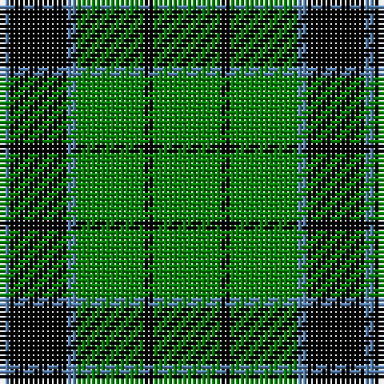

In pattern [BKBGKG](/patterns/bkbgkg/).

This was sourced from weddslist.  It is a [6 stripes tartan](/stripes/stripes6/).

Original link http://www.weddslist.com/cgi-bin/tartans/pg.pl?source=sts

## Thread count
B/2 K12 B2 G14 K2 G/14

## Palette
Each colour and its ΔE from the base-6 reference it is a variant of.

| Colour | Shade | Base | ΔE (OKLab) |
|---|---|---|---|
| B | <code style="background-color:#5480B0;">#5480B0</code> `#5480B0` | B <code style="background-color:#2C4084;">#2C4084</code> | 0.20 |
| G | <code style="background-color:#008000;">#008000</code> `#008000` | G <code style="background-color:#006400;">#006400</code> | 0.09 |
| K | <code style="background-color:#000000;">#000000</code> `#000000` | K <code style="background-color:#000000;">#000000</code> | 0.00 |

# Sample pattern

## Nearest tartans

The nearest existing variants by ΔTartan distance.

1. [Innes, Georgina (Portrait)](/setts/s6/g28k4g28b4k24b4-b5c8ca8-g006818-k000000/) — ΔT 0.62
1. [MacArthur](/setts/s6/g36y4g36k8g4k30-g008000-k000000-yf0c000/) — ΔT 0.75
1. [MacArthur-Fox](/setts/s5/k19g8k10g31r3-g008000-k000000-rc00000/) — ΔT 1.08
1. [Northcroft](/setts/s7/g48r8g6k28g10r4g20-g008000-k000000-rc00000/) — ΔT 1.32
1. [Lauder](/setts/s6/g6b16g6k8g30r4-b304080-g008000-k000000-rc00000/) — ΔT 1.37
1. [Paton](/setts/s7/r6g48k56g38y6g6y6-g008000-k000000-rc00000-yf0c000/) — ΔT 1.37
1. [Fife, Duchess of..](/setts/s6/g60k24g12k12b4k10-b304080-g008000-k000000/) — ΔT 1.38
1. [MacArthur](/setts/s5/k36g12k12g48y8-g006818-k101010-ye8c000/) — ΔT 1.42
1. [Moore Caledonian (Personal)](/setts/s6/r6k36g36y6g36y6-g006818-k101010-rc8002c-yfccc00/) — ΔT 1.45
1. [Granger](/setts/s6/g80k8g24k42g34w8-g006030-k000000-we0e0e0/) — ΔT 1.47

## Neighbour map

Every grey dot is one of 15726 variants placed by the first two principal components of the ΔTartan feature space (44% of its variance). Red is this tartan; blue dots are its nearest — click one to open its page.

<svg viewBox="0 0 640 380" role="img" style="max-width:100%;height:auto;border:1px solid #e0e0e0;border-radius:4px;display:block" xmlns="http://www.w3.org/2000/svg"><image href="/nn/cloud.v1.png" width="640" height="380"/><a href="/setts/s6/g28k4g28b4k24b4-b5c8ca8-g006818-k000000/"><circle cx="309.7" cy="255.1" r="4" fill="#3465a4"><title>Innes, Georgina (Portrait)</title></circle></a><a href="/setts/s6/g36y4g36k8g4k30-g008000-k000000-yf0c000/"><circle cx="333.9" cy="242.6" r="4" fill="#3465a4"><title>MacArthur</title></circle></a><a href="/setts/s5/k19g8k10g31r3-g008000-k000000-rc00000/"><circle cx="293.5" cy="248.7" r="4" fill="#3465a4"><title>MacArthur-Fox</title></circle></a><a href="/setts/s7/g48r8g6k28g10r4g20-g008000-k000000-rc00000/"><circle cx="367.2" cy="217.1" r="4" fill="#3465a4"><title>Northcroft</title></circle></a><a href="/setts/s6/g6b16g6k8g30r4-b304080-g008000-k000000-rc00000/"><circle cx="286.7" cy="232.0" r="4" fill="#3465a4"><title>Lauder</title></circle></a><a href="/setts/s7/r6g48k56g38y6g6y6-g008000-k000000-rc00000-yf0c000/"><circle cx="260.9" cy="199.2" r="4" fill="#3465a4"><title>Paton</title></circle></a><a href="/setts/s6/g60k24g12k12b4k10-b304080-g008000-k000000/"><circle cx="342.1" cy="210.7" r="4" fill="#3465a4"><title>Fife, Duchess of..</title></circle></a><a href="/setts/s5/k36g12k12g48y8-g006818-k101010-ye8c000/"><circle cx="281.6" cy="277.0" r="4" fill="#3465a4"><title>MacArthur</title></circle></a><a href="/setts/s6/r6k36g36y6g36y6-g006818-k101010-rc8002c-yfccc00/"><circle cx="261.6" cy="242.7" r="4" fill="#3465a4"><title>Moore Caledonian (Personal)</title></circle></a><a href="/setts/s6/g80k8g24k42g34w8-g006030-k000000-we0e0e0/"><circle cx="390.9" cy="245.1" r="4" fill="#3465a4"><title>Granger</title></circle></a><circle cx="297.4" cy="250.1" r="5" fill="#c00000"/></svg>

ID: /setts/s6/g14k2g14b2k12b2-b5480b0-g008000-k000000/
