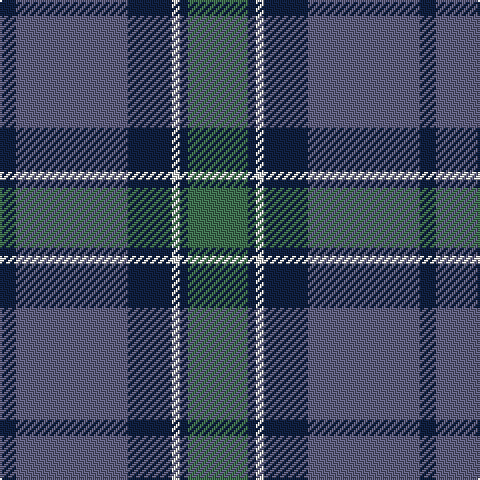

In pattern [BBBWBG](/stripes/bbbwbg/).

This was sourced from weddslist.  It is a [6 stripe tartan](/stripes/stripes6/).

Original link http://www.weddslist.com/cgi-bin/tartans/pg.pl?source=sts

## Thread count
G/30 DB4 LN4 DB22 N56 DB/8

## Palette
Each colour and the base-6 reference it is a variant of.

| Colour | Shade | Base |
|---|---|---|
| DB | <code style="background-color:#102040;">#102040</code> `oklch(24.9% 0.065 262.6)` <small>#102040</small> | B <code style="background-color:#2A418A;">#2A418A</code> |
| G | <code style="background-color:#407050;">#407050</code> `oklch(50.1% 0.074 153.7)` <small>#407050</small> | G <code style="background-color:#006100;">#006100</code> |
| LN | <code style="background-color:#E0E0E0;">#E0E0E0</code> `oklch(90.7% 0.000 89.9)` <small>#E0E0E0</small> | W <code style="background-color:#F7F7F7;">#F7F7F7</code> |
| N | <code style="background-color:#606080;">#606080</code> `oklch(50.2% 0.051 284.4)` <small>#606080</small> | B <code style="background-color:#2A418A;">#2A418A</code> |

# Sample pattern

## Nearest tartans

The nearest existing variants by ΔTartan distance.

1. [Thorburn (Lochcarron)](/setts/s6/dt3t14dt3o16dt34r3~x2/) — ΔT 1.14
1. [Speyside Blue (Fashion)](/setts/s8/n32k3n3k3b5k8o21k4~x2/) — ΔT 1.20
1. [Thompson/Thomson/MacTavish Hunting](/setts/s6/t4dy28dg6t12k12t3~x2/) — ΔT 1.28
1. [Devlin, Craig (Personal)](/setts/s6/g8w3n6db11n30db5~x2/) — ΔT 1.30
1. [Graeme Heckenberg Hunting](/setts/s7/db3g13lr1o3lr1db10lo1~x2/) — ΔT 1.32
1. [Peter of Lee (Personal)](/setts/s8/r3g1k1g12b12k1b1k1~x4/) — ΔT 1.32
1. [Gammell Family Tartan Tartan Number: 597. Earliest known date: 1965 Designed (probably by David Thomas and Arthur Mackie of Strathmore Woollen Co) for the Hill family of Angus as a personal tartan. Tommy Gemmell (6.3.05) said "The tartan was designed using the largest Government sett by Mrs Hill's mother - a Mrs Gammell - who was a handweaver." See products available Copyright © Blair Urquhart, Comrie, 2015](/setts/s8/db32do3db3do3db3do10g24r3~x2/) — ΔT 1.34
1. [Speyside Grey (Fashion)](/setts/s8/n32k3n3k3o5k8o21k4~x2/) — ΔT 1.35
1. [Stuart/Stewart of Appin](/setts/s10/dg8r3dg3r5dg26db7t3db28r3db6~x2/) — ΔT 1.37
1. [Deeside, Royal](/setts/s6/lp4dy2dp4dy35n27r3~x2/) — ΔT 1.37

## Neighbour map

Every grey dot is one of 14299 variants placed by the first two principal components of the ΔTartan feature space (44% of its variance). Red is this tartan; blue dots are its nearest — click one to open its page.

<svg viewBox="0 0 640 380" role="img" style="max-width:100%;height:auto;border:1px solid #e0e0e0;border-radius:4px;display:block" xmlns="http://www.w3.org/2000/svg"><image href="/nn/cloud.v1.png" width="640" height="380"/><a href="/setts/s6/dt3t14dt3o16dt34r3~x2/"><circle cx="333.0" cy="225.4" r="4" fill="#3465a4"><title>Thorburn (Lochcarron)</title></circle></a><a href="/setts/s8/n32k3n3k3b5k8o21k4~x2/"><circle cx="267.1" cy="197.7" r="4" fill="#3465a4"><title>Speyside Blue (Fashion)</title></circle></a><a href="/setts/s6/t4dy28dg6t12k12t3~x2/"><circle cx="249.9" cy="241.5" r="4" fill="#3465a4"><title>Thompson/Thomson/MacTavish Hunting</title></circle></a><a href="/setts/s6/g8w3n6db11n30db5~x2/"><circle cx="357.6" cy="242.2" r="4" fill="#3465a4"><title>Devlin, Craig (Personal)</title></circle></a><a href="/setts/s7/db3g13lr1o3lr1db10lo1~x2/"><circle cx="261.7" cy="190.9" r="4" fill="#3465a4"><title>Graeme Heckenberg Hunting</title></circle></a><a href="/setts/s8/r3g1k1g12b12k1b1k1~x4/"><circle cx="282.3" cy="192.5" r="4" fill="#3465a4"><title>Peter of Lee (Personal)</title></circle></a><a href="/setts/s8/db32do3db3do3db3do10g24r3~x2/"><circle cx="315.5" cy="216.8" r="4" fill="#3465a4"><title>Gammell Family Tartan Tartan Number: 597. Earliest known date: 1965 Designed (probably by David Thomas and Arthur Mackie of Strathmore Woollen Co) for the Hill family of Angus as a personal tartan. Tommy Gemmell (6.3.05) said &quot;The tartan was designed using the largest Government sett by Mrs Hill's mother - a Mrs Gammell - who was a handweaver.&quot; See products available Copyright © Blair Urquhart, Comrie, 2015</title></circle></a><a href="/setts/s8/n32k3n3k3o5k8o21k4~x2/"><circle cx="270.3" cy="197.1" r="4" fill="#3465a4"><title>Speyside Grey (Fashion)</title></circle></a><a href="/setts/s10/dg8r3dg3r5dg26db7t3db28r3db6~x2/"><circle cx="294.0" cy="210.9" r="4" fill="#3465a4"><title>Stuart/Stewart of Appin</title></circle></a><a href="/setts/s6/lp4dy2dp4dy35n27r3~x2/"><circle cx="337.9" cy="188.3" r="4" fill="#3465a4"><title>Deeside, Royal</title></circle></a><circle cx="299.5" cy="222.8" r="5" fill="#c00000"/></svg>

ID: /setts/s6/g15dt2w2dt11n28dt4~x2/
