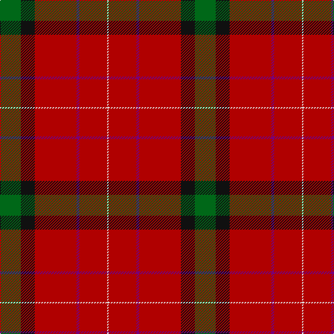

This page is one **sett** — a single exact thread-count. It belongs to the [tartan](/tartans/g15k10r30dp2r20w1/)
(the same proportion at any scale), whose colour order is pattern [GKRBRW](/stripes/gkrbrw/).

Sourced from tartans-authority.  It is a [6 stripe tartan](/stripes/stripes6/).

Original link http://www.tartansauthority.com/tartan-ferret/display/7781/

## Also known as

This cloth is also recorded under:

- Kinnaird #2

2 attestations — the source records this cloth was collapsed from (oldest owns this page)

<ul>
<li>Nov.2008 — Kinnaird (Name) (tartans-authority, <a href="http://www.tartansauthority.com/tartan-ferret/display/7781/">record</a>)</li>
<li>undated — Kinnaird #2 (register-of-tartans, <a href="https://www.tartanregister.gov.uk/tartanDetails.aspx?ref=5750">record</a>)</li>
</ul>

## Register references

External register numbers recorded for this tartan.

- Scottish Register of Tartans: [5750](https://www.tartanregister.gov.uk/tartanDetails.aspx?ref=5750)
- Scottish Tartans Authority (ITI): 7781

## Thread count
G/30 K20 DR60 P4 DR40 LN/2

## Palette

Palette: <strong>Tartan Register</strong> <small style="color:#888">(4 of 5 colours)</small>
<table><thead><tr><th>Colour</th><th>Threads</th><th>Shade</th><th>Base</th><th>OKLCh</th></tr></thead><tbody><tr><td>G/</td><td style="text-align:right;font-variant-numeric:tabular-nums">30</td><td><code style="background-color:#006818;">#006818</code> <small style="color:#888">#006818</small></td><td>G <code style="background-color:#006100;">#006100</code></td><td><small style="color:#888">oklch(45.0% 0.142 145.0)</small></td></tr><tr><td>K</td><td style="text-align:right;font-variant-numeric:tabular-nums">20</td><td><code style="background-color:#101010;">#101010</code> <small style="color:#888">#101010</small></td><td>K <code style="background-color:#000000;">#000000</code></td><td><small style="color:#888">oklch(17.3% 0.000 89.9)</small></td></tr><tr><td>DR</td><td style="text-align:right;font-variant-numeric:tabular-nums">60</td><td><code style="background-color:#B00000;">#B00000</code> <small style="color:#888">#B00000</small></td><td>R <code style="background-color:#CC0000;">#CC0000</code></td><td><small style="color:#888">oklch(47.5% 0.195 29.2)</small></td></tr><tr><td>P</td><td style="text-align:right;font-variant-numeric:tabular-nums">4</td><td><code style="background-color:#780078;">#780078</code> <small style="color:#888">#780078</small></td><td>B <code style="background-color:#2A418A;">#2A418A</code></td><td><small style="color:#888">oklch(40.2% 0.185 328.4)</small></td></tr><tr><td>DR</td><td style="text-align:right;font-variant-numeric:tabular-nums">40</td><td><code style="background-color:#B00000;">#B00000</code> <small style="color:#888">#B00000</small></td><td>R <code style="background-color:#CC0000;">#CC0000</code></td><td><small style="color:#888">oklch(47.5% 0.195 29.2)</small></td></tr><tr><td>LN/</td><td style="text-align:right;font-variant-numeric:tabular-nums">2</td><td><code style="background-color:#E0E0E0;">#E0E0E0</code> <small style="color:#888">#E0E0E0</small></td><td>W <code style="background-color:#F7F7F7;">#F7F7F7</code></td><td><small style="color:#888">oklch(90.7% 0.000 89.9)</small></td></tr></tbody></table>

# Sample pattern

## Nearest tartans

The nearest existing variants by ΔTartan distance, with this tartan at the top so the swatches line up against it.

ΔTartan

Tartan

Sett

—

<a href="/ttd/edit/#slug=g15k10r30dp2r20w1~x2">Kinnaird (Name)</a> <a class="nn-out" href="/setts/s6/g15k10r30dp2r20w1~x2/" title="open its dictionary page">↗</a>

0.49

<a href="/ttd/edit/#slug=r28dg16k4lr1b6r28~x2">Sinclair Dress</a> <a class="nn-out" href="/setts/s6/r28dg16k4lr1b6r28~x2/" title="open its dictionary page">↗</a>

0.49

<a href="/ttd/edit/#slug=r28dg16k4lr1b6r28">Sinclair Dress</a> <a class="nn-out" href="/setts/s6/r28dg16k4lr1b6r28/" title="open its dictionary page">↗</a>

0.68

<a href="/ttd/edit/#slug=r28g16k4w1db6r28~x2">Sinclair (Logan)</a> <a class="nn-out" href="/setts/s6/r28g16k4w1db6r28~x2/" title="open its dictionary page">↗</a>

0.71

<a href="/ttd/edit/#slug=r36t8w1k5g20r18~x4">Sinclair</a> <a class="nn-out" href="/setts/s6/r36t8w1k5g20r18~x4/" title="open its dictionary page">↗</a>

0.86

<a href="/ttd/edit/#slug=r28g16k4w1t6r28~x2">Sinclair</a> <a class="nn-out" href="/setts/s6/r28g16k4w1t6r28~x2/" title="open its dictionary page">↗</a>

1.25

<a href="/ttd/edit/#slug=r52b16k16g22r16lo3r16~x2">Sturrock, Blue/Black (Clan)</a> <a class="nn-out" href="/setts/s7/r52b16k16g22r16lo3r16~x2/" title="open its dictionary page">↗</a>

1.30

<a href="/ttd/edit/#slug=r60k2w3dg20r10dg20~x2">Greig (Personal)</a> <a class="nn-out" href="/setts/s6/r60k2w3dg20r10dg20~x2/" title="open its dictionary page">↗</a>

1.35

<a href="/ttd/edit/#slug=r30dg12k5lr2b6r30~x2">Sinclair</a> <a class="nn-out" href="/setts/s6/r30dg12k5lr2b6r30~x2/" title="open its dictionary page">↗</a>

1.35

<a href="/ttd/edit/#slug=r30dg12k5lr2b6r30">Sinclair</a> <a class="nn-out" href="/setts/s6/r30dg12k5lr2b6r30/" title="open its dictionary page">↗</a>

1.43

<a href="/ttd/edit/#slug=r40b8r6g24t1k4~x2">MacPhail (Blue Bands)</a> <a class="nn-out" href="/setts/s6/r40b8r6g24t1k4~x2/" title="open its dictionary page">↗</a>

## Neighbour map

Every grey dot is one of 14299 variants placed by the first two principal components of the ΔTartan feature space (44% of its variance). Red is this tartan; blue dots are its nearest — click one to open its page.

<svg viewBox="0 0 640 380" role="img" style="max-width:100%;height:auto;border:1px solid #e0e0e0;border-radius:4px;display:block" xmlns="http://www.w3.org/2000/svg"><image href="/nn/cloud.v1.png" width="640" height="380"/><a href="/setts/s6/r28dg16k4lr1b6r28~x2/"><circle cx="424.1" cy="165.5" r="4" fill="#3465a4"><title>Sinclair Dress</title></circle></a><a href="/setts/s6/r28dg16k4lr1b6r28/"><circle cx="424.1" cy="165.5" r="4" fill="#3465a4"><title>Sinclair Dress</title></circle></a><a href="/setts/s6/r28g16k4w1db6r28~x2/"><circle cx="416.0" cy="156.4" r="4" fill="#3465a4"><title>Sinclair (Logan)</title></circle></a><a href="/setts/s6/r36t8w1k5g20r18~x4/"><circle cx="380.1" cy="147.4" r="4" fill="#3465a4"><title>Sinclair</title></circle></a><a href="/setts/s6/r28g16k4w1t6r28~x2/"><circle cx="404.0" cy="151.7" r="4" fill="#3465a4"><title>Sinclair</title></circle></a><a href="/setts/s7/r52b16k16g22r16lo3r16~x2/"><circle cx="317.0" cy="172.8" r="4" fill="#3465a4"><title>Sturrock, Blue/Black (Clan)</title></circle></a><a href="/setts/s6/r60k2w3dg20r10dg20~x2/"><circle cx="419.6" cy="150.9" r="4" fill="#3465a4"><title>Greig (Personal)</title></circle></a><a href="/setts/s6/r30dg12k5lr2b6r30~x2/"><circle cx="419.7" cy="182.6" r="4" fill="#3465a4"><title>Sinclair</title></circle></a><a href="/setts/s6/r30dg12k5lr2b6r30/"><circle cx="419.7" cy="182.6" r="4" fill="#3465a4"><title>Sinclair</title></circle></a><a href="/setts/s6/r40b8r6g24t1k4~x2/"><circle cx="364.3" cy="130.5" r="4" fill="#3465a4"><title>MacPhail (Blue Bands)</title></circle></a><circle cx="397.5" cy="161.6" r="5" fill="#c00000"/></svg>

ID: /setts/s6/g15k10r30dp2r20w1~x2/
