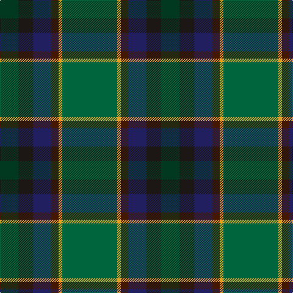

**Bands:** [GKBBYG](/stripes/gkbbyg/) · **Stripes:** [DG K DB DO LO G](/stripes/stripes6/) DG K DB DO LO G

This was sourced from register-of-tartans.  It is a [6 band tartan](/bands/bands6/).

Original link https://www.tartanregister.gov.uk/tartanDetails.aspx?ref=10943

## Register references

External register numbers recorded for this tartan.

- Scottish Register of Tartans: [10943](https://www.tartanregister.gov.uk/tartanDetails.aspx?ref=10943)

## Thread count
DG/30 K24 DB30 DR12 Y6 G/90

## Palette
Each colour and its ΔE from the base-6 reference it is a variant of.

| Colour | Shade | Base | ΔE (OKLab) |
|---|---|---|---|
| DB | <code style="background-color:#202060;">#202060</code> `#202060` | B <code style="background-color:#2A418A;">#2A418A</code> | 0.11 |
| DG | <code style="background-color:#003820;">#003820</code> `#003820` | G <code style="background-color:#006100;">#006100</code> | 0.15 |
| DR | <code style="background-color:#441800;">#441800</code> `#441800` | B <code style="background-color:#2A418A;">#2A418A</code> | 0.23 |
| G | <code style="background-color:#00643C;">#00643C</code> `#00643C` | G <code style="background-color:#006100;">#006100</code> | 0.05 |
| K | <code style="background-color:#1C1714;">#1C1714</code> `#1C1714` | K <code style="background-color:#000000;">#000000</code> | 0.21 |
| Y | <code style="background-color:#E0A126;">#E0A126</code> `#E0A126` | Y <code style="background-color:#F2BF00;">#F2BF00</code> | 0.08 |

# Sample pattern

## Nearest tartans

The nearest existing variants by ΔTartan distance.

1. [Glencross (Tynron) (Personal)](/setts/s6/o3dg13dt13lo2dg34w3~x2/) — ΔT 0.77
1. [Dobson (Palm Bay) (Personal)](/setts/s6/g15ly1dy2db5k4dg5~x6/) — ΔT 0.97
1. [Waterford, County](/setts/s6/dg42lo2y16db7do16r5~x2/) — ΔT 1.03
1. [Telfer Green](/setts/s8/g7lo2g5dg37db6r16db5b2~x2/) — ΔT 1.24
1. [Dallard Personal Tartan Tartan Number: 7424. Earliest known date: 2007 The material was going towards a kilt for my wedding in June 2008. See products available Copyright © Blair Urquhart, Comrie, 2015](/setts/s5/dt37dg37o8k3dp5~x2/) — ΔT 1.34
1. [US Army Regimental Tartan Tartan Number: 6307. Earliest known date: 2004 The Army was the only arm of the U.S. Forces not to have its own tartan. The colours were chosen to represent the uniforms - black for the beret, khaki for the summer uniform, light green for the original sniper and now part of the summer uniform, dark blue for the original dress uniform, olive for the combat uniform and gold for the cavalry. See products available Copyright © Blair Urquhart, Comrie, 2015](/setts/s6/dt12k17y4dg51ly3g4~x2/) — ΔT 1.36
1. [Reidy Wedding](/setts/s7/g31dg7lo3dg14g8db18dp5~x2/) — ΔT 1.37
1. [MacSween Hunting (Lochs, Isle of Lewis) (Personal)](/setts/s7/dg3r3dg31dg18dg4k22lo3/) — ΔT 1.39
1. [Montrose (1983)](/setts/s6/dg6ly3dg26k10n30lb3~x2/) — ΔT 1.41
1. [Bennett, John Paul (Personal)](/setts/s7/r4n38k4n6k41dg62y4/) — ΔT 1.43

## Neighbour map

Every grey dot is one of 14313 variants placed by the first two principal components of the ΔTartan feature space (44% of its variance). Red is this tartan; blue dots are its nearest — click one to open its page.

<svg viewBox="0 0 640 380" role="img" style="max-width:100%;height:auto;border:1px solid #e0e0e0;border-radius:4px;display:block" xmlns="http://www.w3.org/2000/svg"><image href="/nn/cloud.v1.png" width="640" height="380"/><a href="/setts/s6/o3dg13dt13lo2dg34w3~x2/"><circle cx="302.3" cy="193.2" r="4" fill="#3465a4"><title>Glencross (Tynron) (Personal)</title></circle></a><a href="/setts/s6/g15ly1dy2db5k4dg5~x6/"><circle cx="242.7" cy="195.4" r="4" fill="#3465a4"><title>Dobson (Palm Bay) (Personal)</title></circle></a><a href="/setts/s6/dg42lo2y16db7do16r5~x2/"><circle cx="302.4" cy="191.3" r="4" fill="#3465a4"><title>Waterford, County</title></circle></a><a href="/setts/s8/g7lo2g5dg37db6r16db5b2~x2/"><circle cx="285.4" cy="163.0" r="4" fill="#3465a4"><title>Telfer Green</title></circle></a><a href="/setts/s5/dt37dg37o8k3dp5~x2/"><circle cx="287.6" cy="236.9" r="4" fill="#3465a4"><title>Dallard Personal Tartan Tartan Number: 7424. Earliest known date: 2007 The material was going towards a kilt for my wedding in June 2008. See products available Copyright © Blair Urquhart, Comrie, 2015</title></circle></a><a href="/setts/s6/dt12k17y4dg51ly3g4~x2/"><circle cx="351.6" cy="191.3" r="4" fill="#3465a4"><title>US Army Regimental Tartan Tartan Number: 6307. Earliest known date: 2004 The Army was the only arm of the U.S. Forces not to have its own tartan. The colours were chosen to represent the uniforms - black for the beret, khaki for the summer uniform, light green for the original sniper and now part of the summer uniform, dark blue for the original dress uniform, olive for the combat uniform and gold for the cavalry. See products available Copyright © Blair Urquhart, Comrie, 2015</title></circle></a><a href="/setts/s7/g31dg7lo3dg14g8db18dp5~x2/"><circle cx="245.6" cy="231.0" r="4" fill="#3465a4"><title>Reidy Wedding</title></circle></a><a href="/setts/s7/dg3r3dg31dg18dg4k22lo3/"><circle cx="277.4" cy="229.3" r="4" fill="#3465a4"><title>MacSween Hunting (Lochs, Isle of Lewis) (Personal)</title></circle></a><a href="/setts/s6/dg6ly3dg26k10n30lb3~x2/"><circle cx="254.3" cy="228.1" r="4" fill="#3465a4"><title>Montrose (1983)</title></circle></a><a href="/setts/s7/r4n38k4n6k41dg62y4/"><circle cx="291.4" cy="211.4" r="4" fill="#3465a4"><title>Bennett, John Paul (Personal)</title></circle></a><circle cx="266.2" cy="207.2" r="5" fill="#c00000"/></svg>

ID: /setts/s6/g15lo1do2db5k4dg5~x6/
