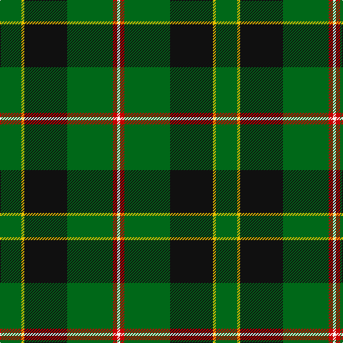

In pattern [GYKGRW](/patterns/gykgrw/).

This was sourced from register-of-tartans.  It is a [6 stripes tartan](/stripes/stripes6/).

Original link https://www.tartanregister.gov.uk/tartanDetails.aspx?ref=2940

## Attestations

This cloth appears in 2 source records; the oldest owns this page.

- 05/12/2003 — Merwe (register-of-tartans, [record](https://www.tartanregister.gov.uk/tartanDetails.aspx?ref=2940))
- pre 2004 — Merwe (Name) (tartans-authority, [record](http://www.tartansauthority.com/tartan-ferret/display/6215/))

## Thread count
G/30 Y4 K60 G64 R6 W/4

## Palette
Each colour and its ΔE from the base-6 reference it is a variant of.

| Colour | Shade | Base | ΔE (OKLab) |
|---|---|---|---|
| G | <code style="background-color:#006818;">#006818</code> `#006818` | G <code style="background-color:#006100;">#006100</code> | 0.02 |
| K | <code style="background-color:#101010;">#101010</code> `#101010` | K <code style="background-color:#000000;">#000000</code> | 0.17 |
| R | <code style="background-color:#C80000;">#C80000</code> `#C80000` | R <code style="background-color:#CC0000;">#CC0000</code> | 0.01 |
| W | <code style="background-color:#FCFCFC;">#FCFCFC</code> `#FCFCFC` | W <code style="background-color:#F7F7F7;">#F7F7F7</code> | 0.01 |
| Y | <code style="background-color:#E8C000;">#E8C000</code> `#E8C000` | Y <code style="background-color:#F2BF00;">#F2BF00</code> | 0.02 |

# Sample pattern

## Nearest tartans

The nearest existing variants by ΔTartan distance.

1. [MacArthur (Variant)](/setts/s6/r3g30k12g6k16y2~g006818-k101010-rc80000-ye8c000~x2/) — ΔT 1.02
1. [Asheville Firefighters, The](/setts/s6/k17g48y4r10b12g4~b202060-g006818-k101010-rc80000-ye8c000/) — ΔT 1.05
1. [Vipont (Yellow line)](/setts/s7/r3g14k2b2g14k36y3~b9058d8-g006818-k101010-rc80000-ye8c000~x2/) — ΔT 1.06
1. [Moran Family Tartan Tartan Number: 675. Earliest known date: 1986 The designers requested that the threadcount be Restricted. See products available Copyright © Blair Urquhart, Comrie, 2015](/setts/s6/g55k17r9k11y2b4~b202060-g006818-k101010-rc8002c-ye8c000~x2/) — ΔT 1.13
1. [Arkansas](/setts/s7/g3w1g12r6g3k3ga2~g004010-ga008000-k000000-rc00020-we0e0e0~x4/) — ΔT 1.13
1. [O'Donoghue](/setts/s5/g62k40y3k3w3~g006818-k101010-wf8f8f8-ye8c000~x2/) — ΔT 1.16
1. [Carrick Hunting District Tartan Tartan Number: 721. Earliest known date: 1930 This sample comes from the MacGregor-Hastie collection which forms the basis of the cloth archive of the Scottish Tartans Society. Some of the samples, including this one, were unmarked. One can assume that the sample dates between 1930 and 1950. See products available Copyright © Blair Urquhart, Comrie, 2015](/setts/s8/g13b1g1b1g3ba5k4y2~b780078-ba2c2c80-g006818-k101010-ye8c000~x2/) — ΔT 1.20
1. [Henderson/MacKendrick](/setts/s9/w1b6g4b1g16k1g4k6y1~b2c2c80-g006818-k101010-we0e0e0-ye8c000~x4/) — ΔT 1.21
1. [MacKendrick](/setts/s9/w1b6g4b1g16k1g4k6y1~b2c2c80-g006818-k101010-we0e0e0-ye8c000~x2/) — ΔT 1.21
1. [Paton Family Tartan Tartan Number: 2127. Earliest known date: 1930 Discovered in 1993 at P and J Haggart, weavers in Aberfeldy. It was possibly designed by the late Mr John Robertson around the 1930's, but the sample appears to have been woven in 1952. The Paton family associated with the tartan come from Aberdeenshire. Apart from the red stripe this sett resembles the Gordon of Abergeldy previously known as Ancient Gordon. See products available Copyright © Blair Urquhart, Comrie, 2015](/setts/s7/r3g24k28g19y3g3y3~g006818-k101010-rc80000-ye8c000~x2/) — ΔT 1.23

## Neighbour map

Every grey dot is one of 15726 variants placed by the first two principal components of the ΔTartan feature space (44% of its variance). Red is this tartan; blue dots are its nearest — click one to open its page.

<svg viewBox="0 0 640 380" role="img" style="max-width:100%;height:auto;border:1px solid #e0e0e0;border-radius:4px;display:block" xmlns="http://www.w3.org/2000/svg"><image href="/nn/cloud.v1.png" width="640" height="380"/><a href="/setts/s6/r3g30k12g6k16y2~g006818-k101010-rc80000-ye8c000~x2/"><circle cx="316.8" cy="213.2" r="4" fill="#3465a4"><title>MacArthur (Variant)</title></circle></a><a href="/setts/s6/k17g48y4r10b12g4~b202060-g006818-k101010-rc80000-ye8c000/"><circle cx="276.3" cy="188.1" r="4" fill="#3465a4"><title>Asheville Firefighters, The</title></circle></a><a href="/setts/s7/r3g14k2b2g14k36y3~b9058d8-g006818-k101010-rc80000-ye8c000~x2/"><circle cx="301.1" cy="160.2" r="4" fill="#3465a4"><title>Vipont (Yellow line)</title></circle></a><a href="/setts/s6/g55k17r9k11y2b4~b202060-g006818-k101010-rc8002c-ye8c000~x2/"><circle cx="343.0" cy="154.3" r="4" fill="#3465a4"><title>Moran Family Tartan Tartan Number: 675. Earliest known date: 1986 The designers requested that the threadcount be Restricted. See products available Copyright © Blair Urquhart, Comrie, 2015</title></circle></a><a href="/setts/s7/g3w1g12r6g3k3ga2~g004010-ga008000-k000000-rc00020-we0e0e0~x4/"><circle cx="292.9" cy="191.4" r="4" fill="#3465a4"><title>Arkansas</title></circle></a><a href="/setts/s5/g62k40y3k3w3~g006818-k101010-wf8f8f8-ye8c000~x2/"><circle cx="360.0" cy="188.2" r="4" fill="#3465a4"><title>O'Donoghue</title></circle></a><a href="/setts/s8/g13b1g1b1g3ba5k4y2~b780078-ba2c2c80-g006818-k101010-ye8c000~x2/"><circle cx="286.5" cy="171.0" r="4" fill="#3465a4"><title>Carrick Hunting District Tartan Tartan Number: 721. Earliest known date: 1930 This sample comes from the MacGregor-Hastie collection which forms the basis of the cloth archive of the Scottish Tartans Society. Some of the samples, including this one, were unmarked. One can assume that the sample dates between 1930 and 1950. See products available Copyright © Blair Urquhart, Comrie, 2015</title></circle></a><a href="/setts/s9/w1b6g4b1g16k1g4k6y1~b2c2c80-g006818-k101010-we0e0e0-ye8c000~x4/"><circle cx="324.2" cy="163.4" r="4" fill="#3465a4"><title>Henderson/MacKendrick</title></circle></a><a href="/setts/s9/w1b6g4b1g16k1g4k6y1~b2c2c80-g006818-k101010-we0e0e0-ye8c000~x2/"><circle cx="324.2" cy="163.4" r="4" fill="#3465a4"><title>MacKendrick</title></circle></a><a href="/setts/s7/r3g24k28g19y3g3y3~g006818-k101010-rc80000-ye8c000~x2/"><circle cx="294.2" cy="213.2" r="4" fill="#3465a4"><title>Paton Family Tartan Tartan Number: 2127. Earliest known date: 1930 Discovered in 1993 at P and J Haggart, weavers in Aberfeldy. It was possibly designed by the late Mr John Robertson around the 1930's, but the sample appears to have been woven in 1952. The Paton family associated with the tartan come from Aberdeenshire. Apart from the red stripe this sett resembles the Gordon of Abergeldy previously known as Ancient Gordon. See products available Copyright © Blair Urquhart, Comrie, 2015</title></circle></a><circle cx="310.5" cy="184.4" r="5" fill="#c00000"/></svg>

ID: /setts/s6/g15y2k30g32r3w2~g006818-k101010-rc80000-wfcfcfc-ye8c000~x2/
