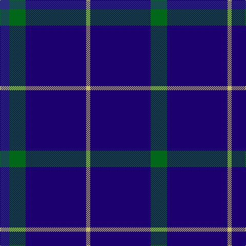

**Bands:** [GBYBGB](/stripes/gbybgb/) · **Stripes:** [G DB LY DB G DB](/stripes/stripes6/) G DB LY DB G DB

This was sourced from register-of-tartans.  It is a [6 band tartan](/bands/bands6/).

Original link https://www.tartanregister.gov.uk/tartanDetails.aspx?ref=3280

## Register references

External register numbers recorded for this tartan.

- Scottish Register of Tartans: [3280](https://www.tartanregister.gov.uk/tartanDetails.aspx?ref=3280)
- Scottish Tartans Authority (ITI): 2652
- Scottish Tartans World Register: 2652

## Thread count
G/32 DBa118 LG8 DBa118 G32 DB/18

## Palette
Each colour and its ΔE from the base-6 reference it is a variant of.

| Colour | Shade | Base | ΔE (OKLab) |
|---|---|---|---|
| DB | <code style="background-color:#2C2C80;">#2C2C80</code> `#2C2C80` | B <code style="background-color:#2A418A;">#2A418A</code> | 0.06 |
| DBa | <code style="background-color:#1C0070;">#1C0070</code> `#1C0070` | B <code style="background-color:#2A418A;">#2A418A</code> | 0.14 |
| G | <code style="background-color:#006818;">#006818</code> `#006818` | G <code style="background-color:#006100;">#006100</code> | 0.02 |
| LG | <code style="background-color:#C4BC68;">#C4BC68</code> `#C4BC68` | Y <code style="background-color:#F2BF00;">#F2BF00</code> | 0.08 |

# Sample pattern

## Nearest tartans

The nearest existing variants by ΔTartan distance.

1. [Oxford University (Corporate)](/setts/s4/db9g16db59ly4~x2/) — ΔT 1.28
1. [JetBlue (Corporate)](/setts/s7/db4w3b6db40b8db12g3~x2/) — ΔT 1.30
1. [Dollar Academy](/setts/s6/db9k9db9k9db42lb5~x2/) — ΔT 1.32
1. [Dollar Academy (1930s) (Corporate)](/setts/s6/db9k9db9k9db42w5~x2/) — ΔT 1.38
1. [Scottish Nuclear](/setts/s6/db9k4lb1k4db9r1~x4/) — ΔT 1.48
1. [Wheadon (Name)](/setts/s6/db40g7ly3g7db15r5~x2/) — ΔT 1.49
1. [Brash](/setts/s9/db60r5db60b40db36r10db36b40w5/) — ΔT 1.56
1. [Masai Shuka 29 (Artefact)](/setts/s8/r5db20r3db20k6db3lb2db1~x2/) — ΔT 1.63
1. [Gulfmark (Corporate)](/setts/s5/db72t6db12t17w6~x2/) — ΔT 1.67
1. [Bacon, Blue](/setts/s4/db14k3r3w1~x2/) — ΔT 1.68

## Neighbour map

Every grey dot is one of 14299 variants placed by the first two principal components of the ΔTartan feature space (44% of its variance). Red is this tartan; blue dots are its nearest — click one to open its page.

<svg viewBox="0 0 640 380" role="img" style="max-width:100%;height:auto;border:1px solid #e0e0e0;border-radius:4px;display:block" xmlns="http://www.w3.org/2000/svg"><image href="/nn/cloud.v1.png" width="640" height="380"/><a href="/setts/s4/db9g16db59ly4~x2/"><circle cx="422.9" cy="230.2" r="4" fill="#3465a4"><title>Oxford University (Corporate)</title></circle></a><a href="/setts/s7/db4w3b6db40b8db12g3~x2/"><circle cx="471.5" cy="200.6" r="4" fill="#3465a4"><title>JetBlue (Corporate)</title></circle></a><a href="/setts/s6/db9k9db9k9db42lb5~x2/"><circle cx="464.1" cy="257.7" r="4" fill="#3465a4"><title>Dollar Academy</title></circle></a><a href="/setts/s6/db9k9db9k9db42w5~x2/"><circle cx="448.5" cy="249.6" r="4" fill="#3465a4"><title>Dollar Academy (1930s) (Corporate)</title></circle></a><a href="/setts/s6/db9k4lb1k4db9r1~x4/"><circle cx="382.3" cy="257.2" r="4" fill="#3465a4"><title>Scottish Nuclear</title></circle></a><a href="/setts/s6/db40g7ly3g7db15r5~x2/"><circle cx="428.1" cy="201.7" r="4" fill="#3465a4"><title>Wheadon (Name)</title></circle></a><a href="/setts/s9/db60r5db60b40db36r10db36b40w5/"><circle cx="379.4" cy="236.7" r="4" fill="#3465a4"><title>Brash</title></circle></a><a href="/setts/s8/r5db20r3db20k6db3lb2db1~x2/"><circle cx="453.2" cy="175.9" r="4" fill="#3465a4"><title>Masai Shuka 29 (Artefact)</title></circle></a><a href="/setts/s5/db72t6db12t17w6~x2/"><circle cx="496.7" cy="232.9" r="4" fill="#3465a4"><title>Gulfmark (Corporate)</title></circle></a><a href="/setts/s4/db14k3r3w1~x2/"><circle cx="412.5" cy="224.3" r="4" fill="#3465a4"><title>Bacon, Blue</title></circle></a><circle cx="454.7" cy="230.9" r="5" fill="#c00000"/></svg>

ID: /setts/s6/g16db59ly4db59g16db9~x2/
