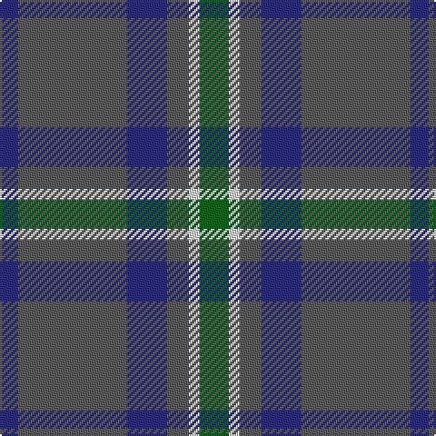

In pattern [BBBBWG](/patterns/bbbbwg/).

This was sourced from tartans-authority.  It is a [6 stripes tartan](/stripes/stripes6/).

Original link http://www.tartansauthority.com/tartan-ferret/display/10514/

## Thread count
DB/10 N60 DB22 N12 LN6 G/16

## Palette
Each colour and its ΔE from the base-6 reference it is a variant of.

| Colour | Shade | Base | ΔE (OKLab) |
|---|---|---|---|
| DB | <code style="background-color:#2C2C80;">#2C2C80</code> `#2C2C80` | B <code style="background-color:#2C4084;">#2C4084</code> | 0.05 |
| G | <code style="background-color:#006818;">#006818</code> `#006818` | G <code style="background-color:#006400;">#006400</code> | 0.02 |
| LN | <code style="background-color:#E0E0E0;">#E0E0E0</code> `#E0E0E0` | W <code style="background-color:#F4F4F0;">#F4F4F0</code> | 0.06 |
| N | <code style="background-color:#5C5C5C;">#5C5C5C</code> `#5C5C5C` | B <code style="background-color:#2C4084;">#2C4084</code> | 0.14 |

# Sample pattern

## Nearest tartans

The nearest existing variants by ΔTartan distance.

1. [Thorburn (Lochcarron)](/setts/s6/b6ba28b6r32b68ra6-b003c64-ba5c8ca8-r888888-rac80000/) — ΔT 0.93
1. [Cameron Hunting](/setts/s6/b30r10b60ba64b8y6-b4c3428-ba1474b4-rc80000-yd09800/) — ΔT 0.95
1. [Cameron, hunting](/setts/s6/r30ra10r60b64r8y6-b304080-r806050-rac00000-yf0c000/) — ΔT 1.10
1. [Bermuda, Plaid](/setts/s7/b66r16ba24g24b16ba4b16-b5480b0-ba304080-g008000-rc00000/) — ΔT 1.22
1. [Balfour blue & brown](/setts/s6/b36y4r12y4r38ra6-b304080-r806050-rac00000-yf0c000/) — ΔT 1.26
1. [Dama Classic](/setts/s8/g60y6g6y6g24b60k6b10-b2e2e2e-g615e57-k181818-ye2d1a3/) — ΔT 1.29
1. [Rhode Island, The State of](/setts/s6/g30b4w4b22ba56b8-b102040-ba606080-g407050-we0e0e0/) — ΔT 1.30
1. [Hector James](/setts/s5/r4g22b54g10ra4-b304080-g008000-r806050-rac00000/) — ΔT 1.32
1. [Cameron Hunting Brown Clan Tartan Tartan Number: 1745. Earliest known date: 1916 Nothing See products available Copyright © Blair Urquhart, Comrie, 2015](/setts/s6/g30r10g60b64g8y6-b2c2c80-g604000-rc80000-ye8c000/) — ΔT 1.34
1. [Lawrence of Broughty Ferry](/setts/s6/g40k4g40b50w4ba6-b3d2e60-ba3e647a-g124b24-k120a01-wf7f1e8/) — ΔT 1.41

## Neighbour map

Every grey dot is one of 15726 variants placed by the first two principal components of the ΔTartan feature space (44% of its variance). Red is this tartan; blue dots are its nearest — click one to open its page.

<svg viewBox="0 0 640 380" role="img" style="max-width:100%;height:auto;border:1px solid #e0e0e0;border-radius:4px;display:block" xmlns="http://www.w3.org/2000/svg"><image href="/nn/cloud.v1.png" width="640" height="380"/><a href="/setts/s6/b6ba28b6r32b68ra6-b003c64-ba5c8ca8-r888888-rac80000/"><circle cx="329.9" cy="220.1" r="4" fill="#3465a4"><title>Thorburn (Lochcarron)</title></circle></a><a href="/setts/s6/b30r10b60ba64b8y6-b4c3428-ba1474b4-rc80000-yd09800/"><circle cx="347.3" cy="230.0" r="4" fill="#3465a4"><title>Cameron Hunting</title></circle></a><a href="/setts/s6/r30ra10r60b64r8y6-b304080-r806050-rac00000-yf0c000/"><circle cx="377.7" cy="238.9" r="4" fill="#3465a4"><title>Cameron, hunting</title></circle></a><a href="/setts/s7/b66r16ba24g24b16ba4b16-b5480b0-ba304080-g008000-rc00000/"><circle cx="361.9" cy="214.7" r="4" fill="#3465a4"><title>Bermuda, Plaid</title></circle></a><a href="/setts/s6/b36y4r12y4r38ra6-b304080-r806050-rac00000-yf0c000/"><circle cx="315.8" cy="222.6" r="4" fill="#3465a4"><title>Balfour blue &amp; brown</title></circle></a><a href="/setts/s8/g60y6g6y6g24b60k6b10-b2e2e2e-g615e57-k181818-ye2d1a3/"><circle cx="333.3" cy="207.1" r="4" fill="#3465a4"><title>Dama Classic</title></circle></a><a href="/setts/s6/g30b4w4b22ba56b8-b102040-ba606080-g407050-we0e0e0/"><circle cx="295.9" cy="216.6" r="4" fill="#3465a4"><title>Rhode Island, The State of</title></circle></a><a href="/setts/s5/r4g22b54g10ra4-b304080-g008000-r806050-rac00000/"><circle cx="376.5" cy="218.9" r="4" fill="#3465a4"><title>Hector James</title></circle></a><a href="/setts/s6/g30r10g60b64g8y6-b2c2c80-g604000-rc80000-ye8c000/"><circle cx="354.6" cy="230.9" r="4" fill="#3465a4"><title>Cameron Hunting Brown Clan Tartan Tartan Number: 1745. Earliest known date: 1916 Nothing See products available Copyright © Blair Urquhart, Comrie, 2015</title></circle></a><a href="/setts/s6/g40k4g40b50w4ba6-b3d2e60-ba3e647a-g124b24-k120a01-wf7f1e8/"><circle cx="357.4" cy="229.3" r="4" fill="#3465a4"><title>Lawrence of Broughty Ferry</title></circle></a><circle cx="355.4" cy="236.0" r="5" fill="#c00000"/></svg>

ID: /setts/s6/g16w6b12ba22b60ba10-b5c5c5c-ba2c2c80-g006818-we0e0e0/
