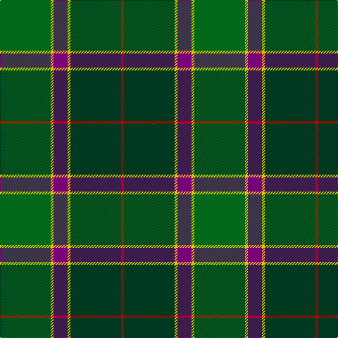

**Bands:** [RGYBYG](/stripes/rgybyg/) · **Stripes:** [R DG LY DP LY G](/stripes/stripes6/) R DG LY DP LY G

This was sourced from register-of-tartans.  It is a [6 band tartan](/bands/bands6/).

Original link https://www.tartanregister.gov.uk/tartanDetails.aspx?ref=11473

## Register references

External register numbers recorded for this tartan.

- Scottish Register of Tartans: [11473](https://www.tartanregister.gov.uk/tartanDetails.aspx?ref=11473)

## Thread count
G/72 Y4 P20 Y4 DG72 R/4

## Palette
Each colour and its ΔE from the base-6 reference it is a variant of.

| Colour | Shade | Base | ΔE (OKLab) |
|---|---|---|---|
| DG | <code style="background-color:#003820;">#003820</code> `#003820` | G <code style="background-color:#006100;">#006100</code> | 0.15 |
| G | <code style="background-color:#006818;">#006818</code> `#006818` | G <code style="background-color:#006100;">#006100</code> | 0.02 |
| P | <code style="background-color:#780078;">#780078</code> `#780078` | B <code style="background-color:#2A418A;">#2A418A</code> | 0.17 |
| R | <code style="background-color:#C80000;">#C80000</code> `#C80000` | R <code style="background-color:#CC0000;">#CC0000</code> | 0.01 |
| Y | <code style="background-color:#E8C000;">#E8C000</code> `#E8C000` | Y <code style="background-color:#F2BF00;">#F2BF00</code> | 0.02 |

# Sample pattern

## Nearest tartans

The nearest existing variants by ΔTartan distance.

1. [Sinclair Green (Personal)](/setts/s7/r4db15w2n15g30r2g4~x2/) — ΔT 1.18
1. [MacSween Hunting (Lochs, Isle of Lew](/setts/s7/g3r3g31dg18g4k22ly3/) — ΔT 1.20
1. [Hope-Vere (Lochcarron)](/setts/s10/g16k1t2k1g3k5n12k1ly1k3~x4/) — ΔT 1.20
1. [Wagland (Name)](/setts/s7/r3db6ly2db15g12dg39w3~x2/) — ΔT 1.23
1. [Manor (Corporate)](/setts/s8/dg14k1dg2k1dg2k10g14lp2/) — ΔT 1.34
1. [Graeme Heckenberg Hunting](/setts/s7/db3g13lr1o3lr1db10lo1~x2/) — ΔT 1.35
1. [Dobson (Palm Bay) (Personal)](/setts/s6/g15ly1dy2db5k4dg5~x6/) — ΔT 1.37
1. [Wcwm 1716](/setts/s6/g6ly3g26dg10dt30lb3~x2/) — ΔT 1.38
1. [Zimmermann, Martin (Personal)](/setts/s6/db3dg19dg29k11r4ly2~x2/) — ΔT 1.38
1. [Balfour Hunting](/setts/s6/b30ly3dy11ly3g33r6~x2/) — ΔT 1.40

## Neighbour map

Every grey dot is one of 14299 variants placed by the first two principal components of the ΔTartan feature space (44% of its variance). Red is this tartan; blue dots are its nearest — click one to open its page.

<svg viewBox="0 0 640 380" role="img" style="max-width:100%;height:auto;border:1px solid #e0e0e0;border-radius:4px;display:block" xmlns="http://www.w3.org/2000/svg"><image href="/nn/cloud.v1.png" width="640" height="380"/><a href="/setts/s7/r4db15w2n15g30r2g4~x2/"><circle cx="255.1" cy="182.9" r="4" fill="#3465a4"><title>Sinclair Green (Personal)</title></circle></a><a href="/setts/s7/g3r3g31dg18g4k22ly3/"><circle cx="240.1" cy="207.8" r="4" fill="#3465a4"><title>MacSween Hunting (Lochs, Isle of Lew</title></circle></a><a href="/setts/s10/g16k1t2k1g3k5n12k1ly1k3~x4/"><circle cx="253.4" cy="163.4" r="4" fill="#3465a4"><title>Hope-Vere (Lochcarron)</title></circle></a><a href="/setts/s7/r3db6ly2db15g12dg39w3~x2/"><circle cx="271.9" cy="154.2" r="4" fill="#3465a4"><title>Wagland (Name)</title></circle></a><a href="/setts/s8/dg14k1dg2k1dg2k10g14lp2/"><circle cx="257.6" cy="209.2" r="4" fill="#3465a4"><title>Manor (Corporate)</title></circle></a><a href="/setts/s7/db3g13lr1o3lr1db10lo1~x2/"><circle cx="261.7" cy="190.9" r="4" fill="#3465a4"><title>Graeme Heckenberg Hunting</title></circle></a><a href="/setts/s6/g15ly1dy2db5k4dg5~x6/"><circle cx="242.8" cy="195.5" r="4" fill="#3465a4"><title>Dobson (Palm Bay) (Personal)</title></circle></a><a href="/setts/s6/g6ly3g26dg10dt30lb3~x2/"><circle cx="216.4" cy="211.9" r="4" fill="#3465a4"><title>Wcwm 1716</title></circle></a><a href="/setts/s6/db3dg19dg29k11r4ly2~x2/"><circle cx="221.0" cy="188.8" r="4" fill="#3465a4"><title>Zimmermann, Martin (Personal)</title></circle></a><a href="/setts/s6/b30ly3dy11ly3g33r6~x2/"><circle cx="216.9" cy="209.0" r="4" fill="#3465a4"><title>Balfour Hunting</title></circle></a><circle cx="279.1" cy="185.9" r="5" fill="#c00000"/></svg>

ID: /setts/s6/g18ly1dp5ly1dg18r1~x4/
