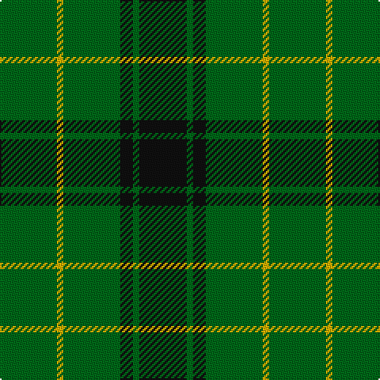

This page is one **sett** — a single exact thread-count. It belongs to the [tartan](/tartans/g18ly2g18k4g2k15/)
(the same proportion at any scale), whose colour order is pattern [GYGKGK](/stripes/gygkgk/).

Sourced from register-of-tartans.  It is a [6 stripe tartan](/stripes/stripes6/).

Original link https://www.tartanregister.gov.uk/tartanDetails.aspx?ref=2280

3 attestations — the source records this cloth was collapsed from (oldest owns this page)

<ul>
<li>01/01/1815 — MacArthur (Highland Society) (register-of-tartans, <a href="https://www.tartanregister.gov.uk/tartanDetails.aspx?ref=2280">record</a>)</li>
<li>1815 — MacArthur (1815) (Clan) (tartans-authority, <a href="http://www.tartansauthority.com/tartan-ferret/display/959/">record</a>)</li>
<li>undated — MacArthur (weddslist, <a href="http://www.weddslist.com/cgi-bin/tartans/pg.pl?source=sts">record</a>)</li>
</ul>

## Register references

External register numbers recorded for this tartan.

- Scottish Register of Tartans: [2280](https://www.tartanregister.gov.uk/tartanDetails.aspx?ref=2280)
- Scottish Tartans Authority (ITI): 959
- Scottish Tartans World Register: 959

## Thread count
G/36 Y4 G36 K8 G4 K/30

## Palette

Palette: <strong>Tartan Register</strong>
<table><thead><tr><th>Colour</th><th>Threads</th><th>Shade</th><th>Base</th><th>OKLCh</th></tr></thead><tbody><tr><td>G/</td><td style="text-align:right;font-variant-numeric:tabular-nums">36</td><td><code style="background-color:#006818;">#006818</code> <small style="color:#888">#006818</small></td><td>G <code style="background-color:#006100;">#006100</code></td><td><small style="color:#888">oklch(45.0% 0.142 145.0)</small></td></tr><tr><td>Y</td><td style="text-align:right;font-variant-numeric:tabular-nums">4</td><td><code style="background-color:#D8B000;">#D8B000</code> <small style="color:#888">#D8B000</small></td><td>Y <code style="background-color:#F2BF00;">#F2BF00</code></td><td><small style="color:#888">oklch(77.1% 0.158 92.3)</small></td></tr><tr><td>G</td><td style="text-align:right;font-variant-numeric:tabular-nums">36</td><td><code style="background-color:#006818;">#006818</code> <small style="color:#888">#006818</small></td><td>G <code style="background-color:#006100;">#006100</code></td><td><small style="color:#888">oklch(45.0% 0.142 145.0)</small></td></tr><tr><td>K</td><td style="text-align:right;font-variant-numeric:tabular-nums">8</td><td><code style="background-color:#101010;">#101010</code> <small style="color:#888">#101010</small></td><td>K <code style="background-color:#000000;">#000000</code></td><td><small style="color:#888">oklch(17.3% 0.000 89.9)</small></td></tr><tr><td>G</td><td style="text-align:right;font-variant-numeric:tabular-nums">4</td><td><code style="background-color:#006818;">#006818</code> <small style="color:#888">#006818</small></td><td>G <code style="background-color:#006100;">#006100</code></td><td><small style="color:#888">oklch(45.0% 0.142 145.0)</small></td></tr><tr><td>K/</td><td style="text-align:right;font-variant-numeric:tabular-nums">30</td><td><code style="background-color:#101010;">#101010</code> <small style="color:#888">#101010</small></td><td>K <code style="background-color:#000000;">#000000</code></td><td><small style="color:#888">oklch(17.3% 0.000 89.9)</small></td></tr></tbody></table>

# Sample pattern

## Nearest tartans

The nearest existing variants by ΔTartan distance, with this tartan at the top so the swatches line up against it.

ΔTartan

Tartan

Sett

—

<a href="/ttd/edit/#slug=g18ly2g18k4g2k15~x2">MacArthur (Highland Society)</a> <a class="nn-out" href="/setts/s6/g18ly2g18k4g2k15~x2/" title="open its dictionary page">↗</a>

0.80

<a href="/ttd/edit/#slug=g24r4g3k14g5r2g10~x2">Northcroft (Personal)</a> <a class="nn-out" href="/setts/s7/g24r4g3k14g5r2g10~x2/" title="open its dictionary page">↗</a>

1.16

<a href="/ttd/edit/#slug=k8g3k4g20r4~x2">MacArthur-Fox (Personal)</a> <a class="nn-out" href="/setts/s5/k8g3k4g20r4~x2/" title="open its dictionary page">↗</a>

1.26

<a href="/setts/s8/k8g3k4g20r3~x2/">MacArthur-Fox (Personal)</a>

1.27

<a href="/ttd/edit/#slug=r3g20k20g20lo2g2lo2~x2">Paton (Personal)</a> <a class="nn-out" href="/setts/s7/r3g20k20g20lo2g2lo2~x2/" title="open its dictionary page">↗</a>

1.32

<a href="/ttd/edit/#slug=lo1dg11k6dg3lo1dg1lo1~x4">Angle, Green (Fashion)</a> <a class="nn-out" href="/setts/s7/lo1dg11k6dg3lo1dg1lo1~x4/" title="open its dictionary page">↗</a>

1.33

<a href="/ttd/edit/#slug=r3g22db16g14r2g6lo2~x2">Scottish Scouts (1957) (Corporate)</a> <a class="nn-out" href="/setts/s7/r3g22db16g14r2g6lo2~x2/" title="open its dictionary page">↗</a>

1.46

<a href="/ttd/edit/#slug=g2db2g6db4g3db4g18ly2~x4">Crow (Name)</a> <a class="nn-out" href="/setts/s8/g2db2g6db4g3db4g18ly2~x4/" title="open its dictionary page">↗</a>

1.52

<a href="/ttd/edit/#slug=g10k2dp5g1~x8">Bumbee #1 (Fashion)</a> <a class="nn-out" href="/setts/s4/g10k2dp5g1~x8/" title="open its dictionary page">↗</a>

1.53

<a href="/ttd/edit/#slug=dg40k4dg12k21dg17w4~x2">Granger</a> <a class="nn-out" href="/setts/s6/dg40k4dg12k21dg17w4~x2/" title="open its dictionary page">↗</a>

1.54

<a href="/ttd/edit/#slug=g3k6r2k6g3k2g16k1~x4">Glenbarr</a> <a class="nn-out" href="/setts/s8/g3k6r2k6g3k2g16k1~x4/" title="open its dictionary page">↗</a>

## Neighbour map

Every grey dot is one of 14299 variants placed by the first two principal components of the ΔTartan feature space (44% of its variance). Red is this tartan; blue dots are its nearest — click one to open its page.

<svg viewBox="0 0 640 380" role="img" style="max-width:100%;height:auto;border:1px solid #e0e0e0;border-radius:4px;display:block" xmlns="http://www.w3.org/2000/svg"><image href="/nn/cloud.v1.png" width="640" height="380"/><a href="/setts/s7/g24r4g3k14g5r2g10~x2/"><circle cx="418.0" cy="239.4" r="4" fill="#3465a4"><title>Northcroft (Personal)</title></circle></a><a href="/setts/s5/k8g3k4g20r4~x2/"><circle cx="355.9" cy="277.8" r="4" fill="#3465a4"><title>MacArthur-Fox (Personal)</title></circle></a><a href="/setts/s8/k8g3k4g20r3~x2/"><circle cx="436.1" cy="263.1" r="4" fill="#3465a4"><title>MacArthur-Fox (Personal)</title></circle></a><a href="/setts/s7/r3g20k20g20lo2g2lo2~x2/"><circle cx="347.8" cy="221.4" r="4" fill="#3465a4"><title>Paton (Personal)</title></circle></a><a href="/setts/s7/lo1dg11k6dg3lo1dg1lo1~x4/"><circle cx="396.8" cy="226.0" r="4" fill="#3465a4"><title>Angle, Green (Fashion)</title></circle></a><a href="/setts/s7/r3g22db16g14r2g6lo2~x2/"><circle cx="365.8" cy="226.6" r="4" fill="#3465a4"><title>Scottish Scouts (1957) (Corporate)</title></circle></a><a href="/setts/s8/g2db2g6db4g3db4g18ly2~x4/"><circle cx="439.5" cy="235.0" r="4" fill="#3465a4"><title>Crow (Name)</title></circle></a><a href="/setts/s4/g10k2dp5g1~x8/"><circle cx="355.8" cy="263.8" r="4" fill="#3465a4"><title>Bumbee #1 (Fashion)</title></circle></a><a href="/setts/s6/dg40k4dg12k21dg17w4~x2/"><circle cx="391.4" cy="245.5" r="4" fill="#3465a4"><title>Granger</title></circle></a><a href="/setts/s8/g3k6r2k6g3k2g16k1~x4/"><circle cx="376.8" cy="215.1" r="4" fill="#3465a4"><title>Glenbarr</title></circle></a><circle cx="386.4" cy="265.0" r="5" fill="#c00000"/></svg>

ID: /setts/s6/g18ly2g18k4g2k15~x2/
