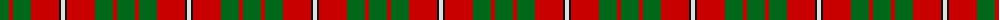

In pattern [GRGRKW](/patterns/grgrkw/).

This was sourced from register-of-tartans.  It is a [6 stripes tartan](/stripes/stripes6/).

Original link https://www.tartanregister.gov.uk/tartanDetails.aspx?ref=2456

## Attestations

This cloth appears in 2 source records; the oldest owns this page.

- 01/01/1842 — MacGregor of Balquidder (Logan) (register-of-tartans, [record](https://www.tartanregister.gov.uk/tartanDetails.aspx?ref=2456))
- undated — MacGregor of Balquhidder Clan Tartan Tartan Number: 988. Earliest known date: 1831 This sett is shown in the earliest publication of clan tartans. James Logan collected material for, 'The Scottish Gael', around 1826 and published in 1831. A number of minor anomilies in Logans method of recording tartans has led to errors appearing in some versions of the sett. See products available Copyright © Blair Urquhart, Comrie, 2015 (house-of-tartan, [record](http://www.house-of-tartan.scotland.net/house/TartanViewjs.asp?colr=Def&tnam=988))

## Thread count
G/18 R4 G18 R28 K2 LN/4

## Palette
Each colour and its ΔE from the base-6 reference it is a variant of.

| Colour | Shade | Base | ΔE (OKLab) |
|---|---|---|---|
| G | <code style="background-color:#006818;">#006818</code> `#006818` | G <code style="background-color:#006400;">#006400</code> | 0.02 |
| K | <code style="background-color:#101010;">#101010</code> `#101010` | K <code style="background-color:#000000;">#000000</code> | 0.17 |
| LN | <code style="background-color:#E0E0E0;">#E0E0E0</code> `#E0E0E0` | W <code style="background-color:#F4F4F0;">#F4F4F0</code> | 0.06 |
| R | <code style="background-color:#C80000;">#C80000</code> `#C80000` | R <code style="background-color:#C80000;">#C80000</code> | 0.00 |

# Sample pattern

ID: /setts/s6/g18r4g18r28k2w4-g006818-k101010-rc80000-we0e0e0/
