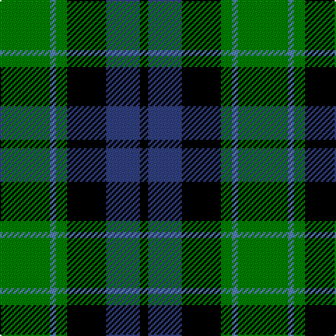

This page is one **sett** — a single exact thread-count. It belongs to the [tartan](/tartans/g18t2g4k14db12k3/)
(the same proportion at any scale), whose colour order is pattern [GBGKBK](/stripes/gbgkbk/).

Sourced from weddslist.  It is a [6 stripe tartan](/stripes/stripes6/).

Original link http://www.weddslist.com/cgi-bin/tartans/pg.pl?source=sts

2 attestations — the source records this cloth was collapsed from (oldest owns this page)

<ul>
<li>undated — Graham of Menteith (weddslist, <a href="http://www.weddslist.com/cgi-bin/tartans/pg.pl?source=sts">record</a>)</li>
<li>undated — Graham of Menteith Clan Tartan Tartan Number: 698. Earliest known date: 1831 Logan describes the broad blue stripe as 'smalt', in his book, 'The Scottish Gael' published in 1831. Smibert also records this sett in 1850. However, in the text for McIan's Costume of the Clans (1845-47), Logan admits that this sett's antiquity is questionable. Menteith is the name given to the western branch of the Graham family. The Menteith District tartan is similar but the azure stripe is white. (See also Montrose, Menteith.) See products available Copyright © Blair Urquhart, Comrie, 2015 (house-of-tartan, <a href="http://www.house-of-tartan.scotland.net/house/TartanViewjs.asp?colr=Def&tnam=698">record</a>)</li>
</ul>

## Thread count
G/36 Ba4 G8 K28 B24 K/6

## Palette

Palette: <strong>Ingles Buchan</strong> <small style="color:#888">(1 of 4 colours)</small>
<table><thead><tr><th>Colour</th><th>Threads</th><th>Shade</th><th>Base</th><th>OKLCh</th></tr></thead><tbody><tr><td>G/</td><td style="text-align:right;font-variant-numeric:tabular-nums">36</td><td><code style="background-color:#008000;">#008000</code> <small style="color:#888">#008000</small></td><td>G <code style="background-color:#006100;">#006100</code></td><td><small style="color:#888">oklch(52.0% 0.177 142.5)</small></td></tr><tr><td>Ba</td><td style="text-align:right;font-variant-numeric:tabular-nums">4</td><td><code style="background-color:#5480B0;">#5480B0</code> <small style="color:#888">#5480B0</small></td><td>B <code style="background-color:#2A418A;">#2A418A</code></td><td><small style="color:#888">oklch(58.8% 0.089 251.5)</small></td></tr><tr><td>G</td><td style="text-align:right;font-variant-numeric:tabular-nums">8</td><td><code style="background-color:#008000;">#008000</code> <small style="color:#888">#008000</small></td><td>G <code style="background-color:#006100;">#006100</code></td><td><small style="color:#888">oklch(52.0% 0.177 142.5)</small></td></tr><tr><td>K</td><td style="text-align:right;font-variant-numeric:tabular-nums">28</td><td><code style="background-color:#000000;">#000000</code> <small style="color:#888">#000000</small></td><td>K <code style="background-color:#000000;">#000000</code></td><td><small style="color:#888">oklch(0.0% 0.000 0.0)</small></td></tr><tr><td>B</td><td style="text-align:right;font-variant-numeric:tabular-nums">24</td><td><code style="background-color:#304080;">#304080</code> <small style="color:#888">#304080</small></td><td>B <code style="background-color:#2A418A;">#2A418A</code></td><td><small style="color:#888">oklch(39.4% 0.109 270.2)</small></td></tr><tr><td>K/</td><td style="text-align:right;font-variant-numeric:tabular-nums">6</td><td><code style="background-color:#000000;">#000000</code> <small style="color:#888">#000000</small></td><td>K <code style="background-color:#000000;">#000000</code></td><td><small style="color:#888">oklch(0.0% 0.000 0.0)</small></td></tr></tbody></table>

# Sample pattern

## Nearest tartans

The nearest existing variants by ΔTartan distance, with this tartan at the top so the swatches line up against it.

ΔTartan

Tartan

Sett

—

<a href="/ttd/edit/#slug=g18t2g4k14db12k3~x2">Graham of Menteith</a> <a class="nn-out" href="/setts/s6/g18t2g4k14db12k3~x2/" title="open its dictionary page">↗</a>

0.34

<a href="/ttd/edit/#slug=k4g19k16w2db15g4~x2">Graham of Montrose</a> <a class="nn-out" href="/setts/s6/k4g19k16w2db15g4~x2/" title="open its dictionary page">↗</a>

0.44

<a href="/ttd/edit/#slug=g8k2t1g4k6db6k1~x2">MacCallum</a> <a class="nn-out" href="/setts/s7/g8k2t1g4k6db6k1~x2/" title="open its dictionary page">↗</a>

0.50

<a href="/ttd/edit/#slug=k4w2g18k13db12k2~x2">Melville</a> <a class="nn-out" href="/setts/s6/k4w2g18k13db12k2~x2/" title="open its dictionary page">↗</a>

0.64

<a href="/ttd/edit/#slug=k2g9t1k6b4g2~x2">Unnamed 3</a> <a class="nn-out" href="/setts/s6/k2g9t1k6b4g2~x2/" title="open its dictionary page">↗</a>

0.70

<a href="/ttd/edit/#slug=db12k17g19w2k5~x2">Wilson's, Folio 131</a> <a class="nn-out" href="/setts/s5/db12k17g19w2k5~x2/" title="open its dictionary page">↗</a>

0.73

<a href="/ttd/edit/#slug=g1db5g1k5g6ly1~x2">MacKay</a> <a class="nn-out" href="/setts/s6/g1db5g1k5g6ly1~x2/" title="open its dictionary page">↗</a>

0.83

<a href="/ttd/edit/#slug=g18t2g4k14p12k3~x2">Wilson's, No 150 &quot;Coburg&quot;</a> <a class="nn-out" href="/setts/s6/g18t2g4k14p12k3~x2/" title="open its dictionary page">↗</a>

0.83

<a href="/ttd/edit/#slug=db3r1db10k8g10r1g3~x4">Blair</a> <a class="nn-out" href="/setts/s7/db3r1db10k8g10r1g3~x4/" title="open its dictionary page">↗</a>

0.84

<a href="/ttd/edit/#slug=w1db9k9g9k2w1~x4">MacNeil 1</a> <a class="nn-out" href="/setts/s6/w1db9k9g9k2w1~x4/" title="open its dictionary page">↗</a>

0.85

<a href="/ttd/edit/#slug=g9w1g6k7db7k1~x2">Menteith</a> <a class="nn-out" href="/setts/s6/g9w1g6k7db7k1~x2/" title="open its dictionary page">↗</a>

## Neighbour map

Every grey dot is one of 14359 variants placed by the first two principal components of the ΔTartan feature space (44% of its variance). Red is this tartan; blue dots are its nearest — click one to open its page.

<svg viewBox="0 0 640 380" role="img" style="max-width:100%;height:auto;border:1px solid #e0e0e0;border-radius:4px;display:block" xmlns="http://www.w3.org/2000/svg"><image href="/nn/cloud.v1.png" width="640" height="380"/><a href="/setts/s6/k4g19k16w2db15g4~x2/"><circle cx="162.0" cy="225.6" r="4" fill="#3465a4"><title>Graham of Montrose</title></circle></a><a href="/setts/s7/g8k2t1g4k6db6k1~x2/"><circle cx="171.2" cy="232.4" r="4" fill="#3465a4"><title>MacCallum</title></circle></a><a href="/setts/s6/k4w2g18k13db12k2~x2/"><circle cx="159.6" cy="222.8" r="4" fill="#3465a4"><title>Melville</title></circle></a><a href="/setts/s6/k2g9t1k6b4g2~x2/"><circle cx="189.7" cy="223.2" r="4" fill="#3465a4"><title>Unnamed 3</title></circle></a><a href="/setts/s5/db12k17g19w2k5~x2/"><circle cx="165.0" cy="242.0" r="4" fill="#3465a4"><title>Wilson's, Folio 131</title></circle></a><a href="/setts/s6/g1db5g1k5g6ly1~x2/"><circle cx="156.9" cy="239.1" r="4" fill="#3465a4"><title>MacKay</title></circle></a><a href="/setts/s6/g18t2g4k14p12k3~x2/"><circle cx="176.7" cy="221.4" r="4" fill="#3465a4"><title>Wilson's, No 150 &quot;Coburg&quot;</title></circle></a><a href="/setts/s7/db3r1db10k8g10r1g3~x4/"><circle cx="167.2" cy="214.7" r="4" fill="#3465a4"><title>Blair</title></circle></a><a href="/setts/s6/w1db9k9g9k2w1~x4/"><circle cx="146.4" cy="218.0" r="4" fill="#3465a4"><title>MacNeil 1</title></circle></a><a href="/setts/s6/g9w1g6k7db7k1~x2/"><circle cx="194.3" cy="237.3" r="4" fill="#3465a4"><title>Menteith</title></circle></a><circle cx="177.6" cy="229.3" r="5" fill="#c00000"/></svg>

ID: /setts/s6/g18t2g4k14db12k3~x2/
