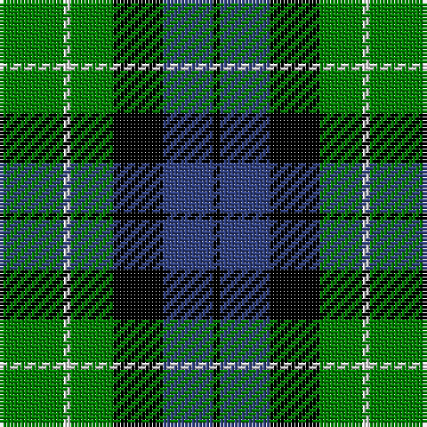

In pattern [GWGKBK](/patterns/gwgkbk/).

This was sourced from weddslist.  It is a [6 stripes tartan](/stripes/stripes6/).

Original link http://www.weddslist.com/cgi-bin/tartans/pg.pl?source=sts

## Thread count
G/18 LN2 G12 K14 B14 K/2

## Palette
Each colour and its ΔE from the base-6 reference it is a variant of.

| Colour | Shade | Base | ΔE (OKLab) |
|---|---|---|---|
| B | <code style="background-color:#304080;">#304080</code> `#304080` | B <code style="background-color:#2C4084;">#2C4084</code> | 0.01 |
| G | <code style="background-color:#008000;">#008000</code> `#008000` | G <code style="background-color:#006400;">#006400</code> | 0.09 |
| K | <code style="background-color:#000000;">#000000</code> `#000000` | K <code style="background-color:#000000;">#000000</code> | 0.00 |
| LN | <code style="background-color:#E0E0E0;">#E0E0E0</code> `#E0E0E0` | W <code style="background-color:#F4F4F0;">#F4F4F0</code> | 0.06 |

# Sample pattern

## Nearest tartans

The nearest existing variants by ΔTartan distance.

1. [Unnamed 3](/setts/s6/g4b8k12ba2g18k4-b8080d0-ba5480b0-g008000-k000000/) — ΔT 0.53
1. [MacCallum](/setts/s7/g16k4b2g8k12ba12k2-b5480b0-ba304080-g008000-k000000/) — ΔT 0.75
1. [Trafalger](/setts/s6/g6b2g16b14k6y2-b304080-g008000-k000000-yf0c000/) — ΔT 0.84
1. [Graham of Menteith](/setts/s6/g36b4g8k28ba24k6-b5480b0-ba304080-g008000-k000000/) — ΔT 0.85
1. [MacKay](/setts/s6/g2b10g2k10g12y2-b304080-g008000-k000000-yf0c000/) — ΔT 0.96
1. [St Johnstone F.C.](/setts/s7/k38w16k38g32y8g32w4-g30a010-k000000-we0e0e0-yf0c000/) — ΔT 1.02
1. [Graham of Montrose](/setts/s6/g8b30w4k32g38k8-b304080-g008000-k000000-we0e0e0/) — ΔT 1.07
1. [Wilson's, Folio 131](/setts/s5/b24k34g38w4k10-b304080-g008000-k000000-we0e0e0/) — ΔT 1.13
1. [MacKay](/setts/s7/b16g16b2g16k16b16y4-b304080-g008000-k000000-yf0c000/) — ΔT 1.17
1. [Unnamed, No 31](/setts/s7/k16g16k2g16k16b16w4-b8080d0-g008000-k000000-we0e0e0/) — ΔT 1.17

## Neighbour map

Every grey dot is one of 15726 variants placed by the first two principal components of the ΔTartan feature space (44% of its variance). Red is this tartan; blue dots are its nearest — click one to open its page.

<svg viewBox="0 0 640 380" role="img" style="max-width:100%;height:auto;border:1px solid #e0e0e0;border-radius:4px;display:block" xmlns="http://www.w3.org/2000/svg"><image href="/nn/cloud.v1.png" width="640" height="380"/><a href="/setts/s6/g4b8k12ba2g18k4-b8080d0-ba5480b0-g008000-k000000/"><circle cx="187.2" cy="221.9" r="4" fill="#3465a4"><title>Unnamed 3</title></circle></a><a href="/setts/s7/g16k4b2g8k12ba12k2-b5480b0-ba304080-g008000-k000000/"><circle cx="168.2" cy="230.0" r="4" fill="#3465a4"><title>MacCallum</title></circle></a><a href="/setts/s6/g6b2g16b14k6y2-b304080-g008000-k000000-yf0c000/"><circle cx="214.6" cy="230.7" r="4" fill="#3465a4"><title>Trafalger</title></circle></a><a href="/setts/s6/g36b4g8k28ba24k6-b5480b0-ba304080-g008000-k000000/"><circle cx="174.5" cy="226.9" r="4" fill="#3465a4"><title>Graham of Menteith</title></circle></a><a href="/setts/s6/g2b10g2k10g12y2-b304080-g008000-k000000-yf0c000/"><circle cx="154.3" cy="237.3" r="4" fill="#3465a4"><title>MacKay</title></circle></a><a href="/setts/s7/k38w16k38g32y8g32w4-g30a010-k000000-we0e0e0-yf0c000/"><circle cx="164.7" cy="222.0" r="4" fill="#3465a4"><title>St Johnstone F.C.</title></circle></a><a href="/setts/s6/g8b30w4k32g38k8-b304080-g008000-k000000-we0e0e0/"><circle cx="158.8" cy="223.4" r="4" fill="#3465a4"><title>Graham of Montrose</title></circle></a><a href="/setts/s5/b24k34g38w4k10-b304080-g008000-k000000-we0e0e0/"><circle cx="162.3" cy="240.1" r="4" fill="#3465a4"><title>Wilson's, Folio 131</title></circle></a><a href="/setts/s7/b16g16b2g16k16b16y4-b304080-g008000-k000000-yf0c000/"><circle cx="142.5" cy="247.1" r="4" fill="#3465a4"><title>MacKay</title></circle></a><a href="/setts/s7/k16g16k2g16k16b16w4-b8080d0-g008000-k000000-we0e0e0/"><circle cx="126.1" cy="240.2" r="4" fill="#3465a4"><title>Unnamed, No 31</title></circle></a><circle cx="192.2" cy="235.5" r="5" fill="#c00000"/></svg>

ID: /setts/s6/g18w2g12k14b14k2-b304080-g008000-k000000-we0e0e0/
