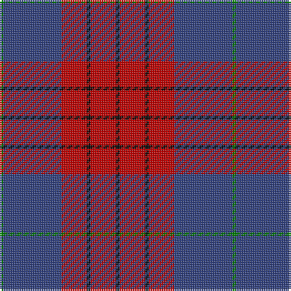

In pattern [GBRKRK](/patterns/gbrkrk/).

This was sourced from weddslist.  It is a [6 stripes tartan](/stripes/stripes6/).

Original link http://www.weddslist.com/cgi-bin/tartans/pg.pl?source=sts

## Thread count
G/2 B32 R14 K2 R14 K/2

## Palette
Each colour and its ΔE from the base-6 reference it is a variant of.

| Colour | Shade | Base | ΔE (OKLab) |
|---|---|---|---|
| B | <code style="background-color:#304080;">#304080</code> `#304080` | B <code style="background-color:#2A418A;">#2A418A</code> | 0.02 |
| G | <code style="background-color:#008000;">#008000</code> `#008000` | G <code style="background-color:#006100;">#006100</code> | 0.10 |
| K | <code style="background-color:#000000;">#000000</code> `#000000` | K <code style="background-color:#000000;">#000000</code> | 0.00 |
| R | <code style="background-color:#C00000;">#C00000</code> `#C00000` | R <code style="background-color:#CC0000;">#CC0000</code> | 0.03 |

# Sample pattern

## Nearest tartans

The nearest existing variants by ΔTartan distance.

1. [Robinson Dress (Pendleton) #1](/setts/s6/g1b16r7k1r7k1x4~b2c2c80-g006818-k101010-rc80000/) — ΔT 0.37
1. [Robinson Dress Dress Clan Tartan Tartan Number: 739. Earliest known date: pre 2003 Colour variation of 'MacQueen' See products available Copyright © Blair Urquhart, Comrie, 2015](/setts/s6/g1b16r7k1r7k1x2~b2c2c80-g006818-k101010-rc80000/) — ΔT 0.37
1. [Galloway Dress (Yellow Line)](/setts/s6/g2r1b16r16b1y2x2~b2c2c80-g285800-rc80000-ye8c000/) — ΔT 0.62
1. [Galloway Dress District Tartan Tartan Number: 850. Earliest known date: 1950 This sett is taken from a sample in MacGregor-Hastie Collection at the Scottish Tartans Museum. It is the more usual form of the dress version. See products available Copyright © Blair Urquhart, Comrie, 2015](/setts/s6/g2r1b16r16b1y2x2~b2c2c80-g006818-rc80000-ye8c000/) — ΔT 0.63
1. [Galloway dress](/setts/s6/g2r1b16r16b1y2x2~b304080-g008000-rc00000-yf0c000/) — ΔT 0.72
1. [Galloway, dress](/setts/s6/g1r1b16r16b1w1x2~b304080-g008000-rc00000-we0e0e0/) — ΔT 0.80
1. [Galloway Red](/setts/s6/g3r2b22r22b2w3x2~b2c2c80-g006818-rc80000-wfcfcfc/) — ΔT 0.99
1. [Americana - 1978 #2 (Fashion)](/setts/s7/b2r2b28k11r27w2r2x2~b1c1c50-k101010-rc80000-we0e0e0/) — ΔT 1.09
1. [Fraser VS](/setts/s6/r1b6r1g6r12y1x2~b000052-g11450d-raa0000-yaaaaaa/) — ΔT 1.14
1. [Swedish Para Whisky Club (Corporate](/setts/s6/b2g14w3b13y1b2x4~b680028-g003820-w98c8e8-yc4bc68/) — ΔT 1.14

## Neighbour map

Every grey dot is one of 15726 variants placed by the first two principal components of the ΔTartan feature space (44% of its variance). Red is this tartan; blue dots are its nearest — click one to open its page.

<svg viewBox="0 0 640 380" role="img" style="max-width:100%;height:auto;border:1px solid #e0e0e0;border-radius:4px;display:block" xmlns="http://www.w3.org/2000/svg"><image href="/nn/cloud.v1.png" width="640" height="380"/><a href="/setts/s6/g1b16r7k1r7k1x4~b2c2c80-g006818-k101010-rc80000/"><circle cx="327.9" cy="183.4" r="4" fill="#3465a4"><title>Robinson Dress (Pendleton) #1</title></circle></a><a href="/setts/s6/g1b16r7k1r7k1x2~b2c2c80-g006818-k101010-rc80000/"><circle cx="327.9" cy="183.4" r="4" fill="#3465a4"><title>Robinson Dress Dress Clan Tartan Tartan Number: 739. Earliest known date: pre 2003 Colour variation of 'MacQueen' See products available Copyright © Blair Urquhart, Comrie, 2015</title></circle></a><a href="/setts/s6/g2r1b16r16b1y2x2~b2c2c80-g285800-rc80000-ye8c000/"><circle cx="307.3" cy="169.3" r="4" fill="#3465a4"><title>Galloway Dress (Yellow Line)</title></circle></a><a href="/setts/s6/g2r1b16r16b1y2x2~b2c2c80-g006818-rc80000-ye8c000/"><circle cx="306.3" cy="169.0" r="4" fill="#3465a4"><title>Galloway Dress District Tartan Tartan Number: 850. Earliest known date: 1950 This sett is taken from a sample in MacGregor-Hastie Collection at the Scottish Tartans Museum. It is the more usual form of the dress version. See products available Copyright © Blair Urquhart, Comrie, 2015</title></circle></a><a href="/setts/s6/g2r1b16r16b1y2x2~b304080-g008000-rc00000-yf0c000/"><circle cx="315.7" cy="173.2" r="4" fill="#3465a4"><title>Galloway dress</title></circle></a><a href="/setts/s6/g1r1b16r16b1w1x2~b304080-g008000-rc00000-we0e0e0/"><circle cx="352.7" cy="171.6" r="4" fill="#3465a4"><title>Galloway, dress</title></circle></a><a href="/setts/s6/g3r2b22r22b2w3x2~b2c2c80-g006818-rc80000-wfcfcfc/"><circle cx="276.1" cy="182.0" r="4" fill="#3465a4"><title>Galloway Red</title></circle></a><a href="/setts/s7/b2r2b28k11r27w2r2x2~b1c1c50-k101010-rc80000-we0e0e0/"><circle cx="269.1" cy="169.7" r="4" fill="#3465a4"><title>Americana - 1978 #2 (Fashion)</title></circle></a><a href="/setts/s6/r1b6r1g6r12y1x2~b000052-g11450d-raa0000-yaaaaaa/"><circle cx="297.8" cy="198.4" r="4" fill="#3465a4"><title>Fraser VS</title></circle></a><a href="/setts/s6/b2g14w3b13y1b2x4~b680028-g003820-w98c8e8-yc4bc68/"><circle cx="311.1" cy="198.8" r="4" fill="#3465a4"><title>Swedish Para Whisky Club (Corporate</title></circle></a><circle cx="323.7" cy="182.8" r="5" fill="#c00000"/></svg>

ID: /setts/s6/g1b16r7k1r7k1x2~b304080-g008000-k000000-rc00000/
