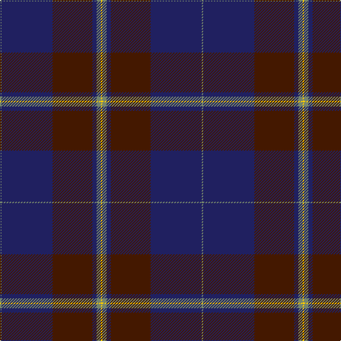

In pattern [GBBBGY](/patterns/gbbbgy/).

This was sourced from tartans-authority.  It is a [6 stripes tartan](/stripes/stripes6/).

Original link http://www.tartansauthority.com/tartan-ferret/display/4538/

## Thread count
N/2 DB72 DR56 DB6 N6 Y/2

## Palette
Each colour and its ΔE from the base-6 reference it is a variant of.

| Colour | Shade | Base | ΔE (OKLab) |
|---|---|---|---|
| DB | <code style="background-color:#202060;">#202060</code> `#202060` | B <code style="background-color:#2A418A;">#2A418A</code> | 0.11 |
| DR | <code style="background-color:#441800;">#441800</code> `#441800` | B <code style="background-color:#2A418A;">#2A418A</code> | 0.23 |
| N | <code style="background-color:#74846C;">#74846C</code> `#74846C` | G <code style="background-color:#006100;">#006100</code> | 0.20 |
| Y | <code style="background-color:#FCCC00;">#FCCC00</code> `#FCCC00` | Y <code style="background-color:#F2BF00;">#F2BF00</code> | 0.04 |

# Sample pattern

## Nearest tartans

The nearest existing variants by ΔTartan distance.

1. [Potts (Personal)](/setts/s6/g1b36ba28b3g3k1x2~b202060-ba441800-g74846c-k000000/) — ΔT 0.68
1. [Home or Hume Clan Tartan Tartan Number: 127. Earliest known date: 1842 D.W.Stewart says, "The tartan of the ancient and notable family of Home, though differing in colour, has the same scheme as the Grey Douglas. Both first appear in the Vestiarium Scoticum." Border 'Clans' are mentioned in an Act of the Scottish Parliament in 1587, but no evidence of a Clan tartan exists before the earliest date given here. See products available Copyright © Blair Urquhart, Comrie, 2015](/setts/s8/k28r1k2r1k8b24g2b3x2~b2c2c80-g006818-k101010-rc80000/) — ΔT 1.09
1. [Home or Hume (Vestiarium Scoticum)](/setts/s8/k28r1k2r1k8b24g2b3x2~b2c4084-g005020-k101010-rdc0000/) — ΔT 1.27
1. [Earl Blue Marl](/setts/s6/b80k28ba9k3r5k12x2~b2c2c80-ba780078-k101010-r9c68a4/) — ΔT 1.29
1. [Round Table (1997)](/setts/s6/b47g14ba5bb2r3g7x2~b202060-ba440044-bb4c3428-g285800-r880000/) — ΔT 1.38
1. [Dalziel Rugby Club (Corporate)](/setts/s7/b56k4w1b6k20w2k20x2~b202060-k101010-we0e0e0/) — ΔT 1.41
1. [Klappert Original (Odsherred, Denmark) (Personal)](/setts/s9/r1k1b30k6b1k6g8k1r1x2~b3f4441-g5c391d-k010512-rb62531/) — ΔT 1.45
1. [Klappert Original Name Tartan Tartan Number: 10475. Earliest known date: 2011 This tartan was designed to commemorate the original family of Klapperts in Denmark. The colours chosen represent the Klappert family heritage and their enviroment. The black symbolises the dark Nordic winter and the dark grey is the cold sea which embraces the vast Danish coastline. The dark red symbolises this family's Danish origins. The brown is a reference to the longships which brought the Vikings to Scotland, representing the connection between the Nordic and Scottish cultures. This tartan may only be worn/used by members/descendants of the original Klappert family from Odsherred in Denmark. See products available Copyright © Blair Urquhart, Comrie, 2015](/setts/s9/r1k1b30k6b1k6g8k1r1x2~b3c4440-g5c381c-k000410-rb42430/) — ΔT 1.45
1. [Koot Wedding (Personal)](/setts/s6/b48k32r1k8r3w3x2~b1b3357-k101010-rcc0000-wffffff/) — ΔT 1.49
1. [Lion Brand Sportswear](/setts/s7/y4b1r15b42r6b4ya1x2~b142836-r800028-ya0a0a0-yac88c00/) — ΔT 1.49

## Neighbour map

Every grey dot is one of 15726 variants placed by the first two principal components of the ΔTartan feature space (44% of its variance). Red is this tartan; blue dots are its nearest — click one to open its page.

<svg viewBox="0 0 640 380" role="img" style="max-width:100%;height:auto;border:1px solid #e0e0e0;border-radius:4px;display:block" xmlns="http://www.w3.org/2000/svg"><image href="/nn/cloud.v1.png" width="640" height="380"/><a href="/setts/s6/g1b36ba28b3g3k1x2~b202060-ba441800-g74846c-k000000/"><circle cx="471.4" cy="188.0" r="4" fill="#3465a4"><title>Potts (Personal)</title></circle></a><a href="/setts/s8/k28r1k2r1k8b24g2b3x2~b2c2c80-g006818-k101010-rc80000/"><circle cx="433.5" cy="177.1" r="4" fill="#3465a4"><title>Home or Hume Clan Tartan Tartan Number: 127. Earliest known date: 1842 D.W.Stewart says, &quot;The tartan of the ancient and notable family of Home, though differing in colour, has the same scheme as the Grey Douglas. Both first appear in the Vestiarium Scoticum.&quot; Border 'Clans' are mentioned in an Act of the Scottish Parliament in 1587, but no evidence of a Clan tartan exists before the earliest date given here. See products available Copyright © Blair Urquhart, Comrie, 2015</title></circle></a><a href="/setts/s8/k28r1k2r1k8b24g2b3x2~b2c4084-g005020-k101010-rdc0000/"><circle cx="422.1" cy="172.4" r="4" fill="#3465a4"><title>Home or Hume (Vestiarium Scoticum)</title></circle></a><a href="/setts/s6/b80k28ba9k3r5k12x2~b2c2c80-ba780078-k101010-r9c68a4/"><circle cx="451.2" cy="193.1" r="4" fill="#3465a4"><title>Earl Blue Marl</title></circle></a><a href="/setts/s6/b47g14ba5bb2r3g7x2~b202060-ba440044-bb4c3428-g285800-r880000/"><circle cx="440.5" cy="183.1" r="4" fill="#3465a4"><title>Round Table (1997)</title></circle></a><a href="/setts/s7/b56k4w1b6k20w2k20x2~b202060-k101010-we0e0e0/"><circle cx="497.7" cy="187.6" r="4" fill="#3465a4"><title>Dalziel Rugby Club (Corporate)</title></circle></a><a href="/setts/s9/r1k1b30k6b1k6g8k1r1x2~b3f4441-g5c391d-k010512-rb62531/"><circle cx="442.8" cy="156.1" r="4" fill="#3465a4"><title>Klappert Original (Odsherred, Denmark) (Personal)</title></circle></a><a href="/setts/s9/r1k1b30k6b1k6g8k1r1x2~b3c4440-g5c381c-k000410-rb42430/"><circle cx="438.2" cy="154.8" r="4" fill="#3465a4"><title>Klappert Original Name Tartan Tartan Number: 10475. Earliest known date: 2011 This tartan was designed to commemorate the original family of Klapperts in Denmark. The colours chosen represent the Klappert family heritage and their enviroment. The black symbolises the dark Nordic winter and the dark grey is the cold sea which embraces the vast Danish coastline. The dark red symbolises this family's Danish origins. The brown is a reference to the longships which brought the Vikings to Scotland, representing the connection between the Nordic and Scottish cultures. This tartan may only be worn/used by members/descendants of the original Klappert family from Odsherred in Denmark. See products available Copyright © Blair Urquhart, Comrie, 2015</title></circle></a><a href="/setts/s6/b48k32r1k8r3w3x2~b1b3357-k101010-rcc0000-wffffff/"><circle cx="402.1" cy="162.1" r="4" fill="#3465a4"><title>Koot Wedding (Personal)</title></circle></a><a href="/setts/s7/y4b1r15b42r6b4ya1x2~b142836-r800028-ya0a0a0-yac88c00/"><circle cx="494.6" cy="153.0" r="4" fill="#3465a4"><title>Lion Brand Sportswear</title></circle></a><circle cx="451.6" cy="179.5" r="5" fill="#c00000"/></svg>

ID: /setts/s6/g1b36ba28b3g3y1x2~b202060-ba441800-g74846c-yfccc00/
