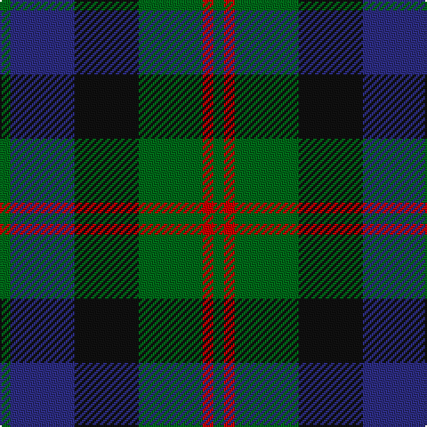

In pattern [GBKGRG](/patterns/gbkgrg/).

This was sourced from tartans-authority.  It is a [6 stripes tartan](/stripes/stripes6/).

Original link http://www.tartansauthority.com/tartan-ferret/display/8077/

## Thread count
G/6 DB36 K36 G36 R6 G/6

## Palette
Each colour and its ΔE from the base-6 reference it is a variant of.

| Colour | Shade | Base | ΔE (OKLab) |
|---|---|---|---|
| DB | <code style="background-color:#2C2C80;">#2C2C80</code> `#2C2C80` | B <code style="background-color:#2A418A;">#2A418A</code> | 0.06 |
| G | <code style="background-color:#006818;">#006818</code> `#006818` | G <code style="background-color:#006100;">#006100</code> | 0.02 |
| K | <code style="background-color:#101010;">#101010</code> `#101010` | K <code style="background-color:#000000;">#000000</code> | 0.17 |
| R | <code style="background-color:#C80000;">#C80000</code> `#C80000` | R <code style="background-color:#CC0000;">#CC0000</code> | 0.01 |

# Sample pattern

## Nearest tartans

The nearest existing variants by ΔTartan distance.

1. [MacKay (Bonner)](/setts/s6/g1b5g1k5g6y1~b2c4084-g005020-k101010-ye8c000~x2/) — ΔT 0.48
1. [Murray (Variation) Clan Tartan Tartan Number: 271. Earliest known date: 1810-15 A simplified version of the Murray of Atholl. The Cockburn collection housed in the Mitchell Library in Glasgow, is one of the earliest references for clan tartans. James Logan, in his book, The Scottish Gael (1831), wrote concerning the Black Watch, that "...a red stripe is often introduced", and this by Lord Murray who commanded the regiment. See products available Copyright © Blair Urquhart, Comrie, 2015](/setts/s6/b2k2b12k8g11r2~b2c2c80-g006818-k101010-rc80000~x2/) — ΔT 0.48
1. [Morrison Clan Tartan Tartan Number: 1083. Earliest known date: 1908 The Clan Morrison have strong links with the MacKays and this is evident in the similarity of the tartans. Morrison has an added red stripe. Lord Lyon recorded a new sett in 1968 based on a fragment of Morrison tartan dated 1747. See products available Copyright © Blair Urquhart, Comrie, 2015](/setts/s6/k3g14k14g2b14r3~b2c2c80-g006818-k101010-rc80000~x2/) — ΔT 0.49
1. [Gallamore](/setts/s6/k3b14r2k14g14k3~b2c2c80-g006818-k101010-rc80000~x2/) — ΔT 0.50
1. [Graham of Menteith (Clan)](/setts/s6/g8b1g1k6ba6k1~b5c8ca8-ba2c2c80-g006818-k101010~x4/) — ΔT 0.55
1. [Glenturret Corporate Tartan Tartan Number: 1097. Earliest known date: 1988 Glenturret Distillery is open to the public. Visitors can view the whisky making process and taste the final product. Glenturret tartan goods are for sale in the distillery shop. See products available Copyright © Blair Urquhart, Comrie, 2015](/setts/s6/k3g14k14g2b15y2~b202060-g006818-k101010-ye8c000~x2/) — ΔT 0.59
1. [Ferguson of Balquhidder #2](/setts/s6/g4b24r3k24g25k4~b2c2c80-g006818-k101010-rc80000~x2/) — ΔT 0.60
1. [Inneryne (Personal)](/setts/s7/b4k3b16k14g14r3g3~b2c2c80-g006818-k101010-rc80000~x2/) — ΔT 0.60
1. [Blaylock Annandale (Name)](/setts/s7/g24b6ba3k6b12k15g4~b2c2c80-ba5c8ca8-g006818-k101010~x2/) — ΔT 0.64
1. [Forbes #4](/setts/s7/b1k1b6k6g6k1w1~b2c4084-g005020-k101010-we0e0e0~x2/) — ΔT 0.67

## Neighbour map

Every grey dot is one of 15726 variants placed by the first two principal components of the ΔTartan feature space (44% of its variance). Red is this tartan; blue dots are its nearest — click one to open its page.

<svg viewBox="0 0 640 380" role="img" style="max-width:100%;height:auto;border:1px solid #e0e0e0;border-radius:4px;display:block" xmlns="http://www.w3.org/2000/svg"><image href="/nn/cloud.v1.png" width="640" height="380"/><a href="/setts/s6/g1b5g1k5g6y1~b2c4084-g005020-k101010-ye8c000~x2/"><circle cx="209.8" cy="260.4" r="4" fill="#3465a4"><title>MacKay (Bonner)</title></circle></a><a href="/setts/s6/b2k2b12k8g11r2~b2c2c80-g006818-k101010-rc80000~x2/"><circle cx="194.8" cy="256.6" r="4" fill="#3465a4"><title>Murray (Variation) Clan Tartan Tartan Number: 271. Earliest known date: 1810-15 A simplified version of the Murray of Atholl. The Cockburn collection housed in the Mitchell Library in Glasgow, is one of the earliest references for clan tartans. James Logan, in his book, The Scottish Gael (1831), wrote concerning the Black Watch, that &quot;...a red stripe is often introduced&quot;, and this by Lord Murray who commanded the regiment. See products available Copyright © Blair Urquhart, Comrie, 2015</title></circle></a><a href="/setts/s6/k3g14k14g2b14r3~b2c2c80-g006818-k101010-rc80000~x2/"><circle cx="180.0" cy="251.8" r="4" fill="#3465a4"><title>Morrison Clan Tartan Tartan Number: 1083. Earliest known date: 1908 The Clan Morrison have strong links with the MacKays and this is evident in the similarity of the tartans. Morrison has an added red stripe. Lord Lyon recorded a new sett in 1968 based on a fragment of Morrison tartan dated 1747. See products available Copyright © Blair Urquhart, Comrie, 2015</title></circle></a><a href="/setts/s6/k3b14r2k14g14k3~b2c2c80-g006818-k101010-rc80000~x2/"><circle cx="211.1" cy="255.8" r="4" fill="#3465a4"><title>Gallamore</title></circle></a><a href="/setts/s6/g8b1g1k6ba6k1~b5c8ca8-ba2c2c80-g006818-k101010~x4/"><circle cx="214.6" cy="243.5" r="4" fill="#3465a4"><title>Graham of Menteith (Clan)</title></circle></a><a href="/setts/s6/k3g14k14g2b15y2~b202060-g006818-k101010-ye8c000~x2/"><circle cx="183.1" cy="245.6" r="4" fill="#3465a4"><title>Glenturret Corporate Tartan Tartan Number: 1097. Earliest known date: 1988 Glenturret Distillery is open to the public. Visitors can view the whisky making process and taste the final product. Glenturret tartan goods are for sale in the distillery shop. See products available Copyright © Blair Urquhart, Comrie, 2015</title></circle></a><a href="/setts/s6/g4b24r3k24g25k4~b2c2c80-g006818-k101010-rc80000~x2/"><circle cx="201.1" cy="243.1" r="4" fill="#3465a4"><title>Ferguson of Balquhidder #2</title></circle></a><a href="/setts/s7/b4k3b16k14g14r3g3~b2c2c80-g006818-k101010-rc80000~x2/"><circle cx="176.3" cy="254.3" r="4" fill="#3465a4"><title>Inneryne (Personal)</title></circle></a><a href="/setts/s7/g24b6ba3k6b12k15g4~b2c2c80-ba5c8ca8-g006818-k101010~x2/"><circle cx="209.5" cy="242.8" r="4" fill="#3465a4"><title>Blaylock Annandale (Name)</title></circle></a><a href="/setts/s7/b1k1b6k6g6k1w1~b2c4084-g005020-k101010-we0e0e0~x2/"><circle cx="188.4" cy="241.7" r="4" fill="#3465a4"><title>Forbes #4</title></circle></a><circle cx="194.5" cy="255.4" r="5" fill="#c00000"/></svg>

ID: /setts/s6/g1b6k6g6r1g1~b2c2c80-g006818-k101010-rc80000~x6/
