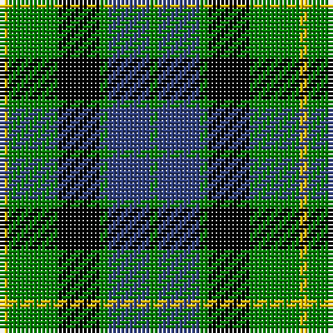

In pattern [GBGKGY](/stripes/gbgkgy/).

This was sourced from weddslist.  It is a [6 stripe tartan](/stripes/stripes6/).

Original link http://www.weddslist.com/cgi-bin/tartans/pg.pl?source=sts

## Thread count
Y/2 G12 K10 G2 B10 G/2

## Palette
Each colour and the base-6 reference it is a variant of.

| Colour | Shade | Base |
|---|---|---|
| B | <code style="background-color:#304080;">#304080</code> `oklch(39.4% 0.109 270.2)` <small>#304080</small> | B <code style="background-color:#2A418A;">#2A418A</code> |
| G | <code style="background-color:#008000;">#008000</code> `oklch(52.0% 0.177 142.5)` <small>#008000</small> | G <code style="background-color:#006100;">#006100</code> |
| K | <code style="background-color:#000000;">#000000</code> `oklch(0.0% 0.000 0.0)` <small>#000000</small> | K <code style="background-color:#000000;">#000000</code> |
| Y | <code style="background-color:#F0C000;">#F0C000</code> `oklch(82.7% 0.169 90.5)` <small>#F0C000</small> | Y <code style="background-color:#F2BF00;">#F2BF00</code> |

# Sample pattern

## Nearest tartans

The nearest existing variants by ΔTartan distance, with this tartan at the top so the swatches line up against it.

ΔTartan

Tartan

Sett

—

<a href="/ttd/edit/#slug=g1db5g1k5g6ly1~x2">MacKay</a> <a class="nn-out" href="/setts/s6/g1db5g1k5g6ly1~x2/" title="open its dictionary page">↗</a>

0.69

<a href="/ttd/edit/#slug=g8k2t1g4k6db6k1~x2">MacCallum</a> <a class="nn-out" href="/setts/s7/g8k2t1g4k6db6k1~x2/" title="open its dictionary page">↗</a>

0.73

<a href="/ttd/edit/#slug=g18t2g4k14db12k3~x2">Graham of Menteith</a> <a class="nn-out" href="/setts/s6/g18t2g4k14db12k3~x2/" title="open its dictionary page">↗</a>

0.77

<a href="/ttd/edit/#slug=k2g9t1k6b4g2~x2">Unnamed 3</a> <a class="nn-out" href="/setts/s6/k2g9t1k6b4g2~x2/" title="open its dictionary page">↗</a>

0.84

<a href="/ttd/edit/#slug=t3g6k6t4r1t1~x2">Wellington, or Waterloo</a> <a class="nn-out" href="/setts/s6/t3g6k6t4r1t1~x2/" title="open its dictionary page">↗</a>

0.86

<a href="/ttd/edit/#slug=k4g19k16w2db15g4~x2">Graham of Montrose</a> <a class="nn-out" href="/setts/s6/k4g19k16w2db15g4~x2/" title="open its dictionary page">↗</a>

0.92

<a href="/ttd/edit/#slug=g14db2g2k8p9k2~x2">MacArthur of Milton, hunting</a> <a class="nn-out" href="/setts/s6/g14db2g2k8p9k2~x2/" title="open its dictionary page">↗</a>

0.94

<a href="/ttd/edit/#slug=k4w2g18k13db12k2~x2">Melville</a> <a class="nn-out" href="/setts/s6/k4w2g18k13db12k2~x2/" title="open its dictionary page">↗</a>

0.96

<a href="/ttd/edit/#slug=g9w1g6k7db7k1~x2">Menteith</a> <a class="nn-out" href="/setts/s6/g9w1g6k7db7k1~x2/" title="open its dictionary page">↗</a>

0.97

<a href="/ttd/edit/#slug=t3g12k14t11r3t3~x2">Wellington, or Waterloo</a> <a class="nn-out" href="/setts/s6/t3g12k14t11r3t3~x2/" title="open its dictionary page">↗</a>

1.00

<a href="/ttd/edit/#slug=db2k2db12k8g11r2~x2">Murray</a> <a class="nn-out" href="/setts/s6/db2k2db12k8g11r2~x2/" title="open its dictionary page">↗</a>

## Neighbour map

Every grey dot is one of 14299 variants placed by the first two principal components of the ΔTartan feature space (44% of its variance). Red is this tartan; blue dots are its nearest — click one to open its page.

<svg viewBox="0 0 640 380" role="img" style="max-width:100%;height:auto;border:1px solid #e0e0e0;border-radius:4px;display:block" xmlns="http://www.w3.org/2000/svg"><image href="/nn/cloud.v1.png" width="640" height="380"/><a href="/setts/s7/g8k2t1g4k6db6k1~x2/"><circle cx="171.3" cy="231.1" r="4" fill="#3465a4"><title>MacCallum</title></circle></a><a href="/setts/s6/g18t2g4k14db12k3~x2/"><circle cx="177.8" cy="228.0" r="4" fill="#3465a4"><title>Graham of Menteith</title></circle></a><a href="/setts/s6/k2g9t1k6b4g2~x2/"><circle cx="190.0" cy="221.9" r="4" fill="#3465a4"><title>Unnamed 3</title></circle></a><a href="/setts/s6/t3g6k6t4r1t1~x2/"><circle cx="128.6" cy="243.8" r="4" fill="#3465a4"><title>Wellington, or Waterloo</title></circle></a><a href="/setts/s6/k4g19k16w2db15g4~x2/"><circle cx="162.2" cy="224.2" r="4" fill="#3465a4"><title>Graham of Montrose</title></circle></a><a href="/setts/s6/g14db2g2k8p9k2~x2/"><circle cx="177.9" cy="224.5" r="4" fill="#3465a4"><title>MacArthur of Milton, hunting</title></circle></a><a href="/setts/s6/k4w2g18k13db12k2~x2/"><circle cx="159.8" cy="221.5" r="4" fill="#3465a4"><title>Melville</title></circle></a><a href="/setts/s6/g9w1g6k7db7k1~x2/"><circle cx="194.6" cy="236.0" r="4" fill="#3465a4"><title>Menteith</title></circle></a><a href="/setts/s6/t3g12k14t11r3t3~x2/"><circle cx="115.7" cy="248.1" r="4" fill="#3465a4"><title>Wellington, or Waterloo</title></circle></a><a href="/setts/s6/db2k2db12k8g11r2~x2/"><circle cx="152.4" cy="240.0" r="4" fill="#3465a4"><title>Murray</title></circle></a><circle cx="157.1" cy="237.7" r="5" fill="#c00000"/></svg>

ID: /setts/s6/g1db5g1k5g6ly1~x2/
