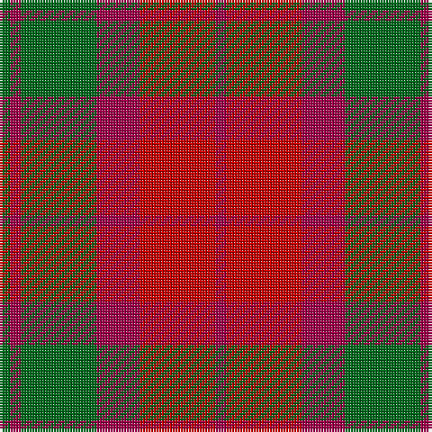

**Bands:** [GRGRRR](/stripes/grgrrr/) · **Stripes:** [G M G M R M](/stripes/stripes6/) G M G M R M

This was sourced from register-of-tartans.  It is a [6 band tartan](/bands/bands6/).

Original link https://www.tartanregister.gov.uk/tartanDetails.aspx?ref=2665

## Register references

External register numbers recorded for this tartan.

- Scottish Register of Tartans: [2665](https://www.tartanregister.gov.uk/tartanDetails.aspx?ref=2665)
- Scottish Tartans Authority (ITI): 967
- Scottish Tartans World Register: 967

## Thread count
Gb/4 R4 Gb28 R16 Ra28 R/4

## Palette
Each colour and its ΔE from the base-6 reference it is a variant of.

| Colour | Shade | Base | ΔE (OKLab) |
|---|---|---|---|
| G | <code style="background-color:#285800;">#285800</code> `#285800` | G <code style="background-color:#006100;">#006100</code> | 0.03 |
| Ga | <code style="background-color:#289C18;">#289C18</code> `#289C18` | G <code style="background-color:#006100;">#006100</code> | 0.19 |
| Gb | <code style="background-color:#006818;">#006818</code> `#006818` | G <code style="background-color:#006100;">#006100</code> | 0.02 |
| R | <code style="background-color:#A00048;">#A00048</code> `#A00048` | R <code style="background-color:#CC0000;">#CC0000</code> | 0.12 |
| Ra | <code style="background-color:#C80000;">#C80000</code> `#C80000` | R <code style="background-color:#CC0000;">#CC0000</code> | 0.01 |

# Sample pattern

## Nearest tartans

The nearest existing variants by ΔTartan distance.

1. [MacNab, Variant](/setts/s6/g1r1g7r4r7r1~x4/) — ΔT 0.56
1. [Dewar (Name)](/setts/s6/dg1r1dg7r4r7r1~x6/) — ΔT 0.98
1. [Harmony 8](/setts/s5/dr2y10o15dr10y2~x4/) — ΔT 1.13
1. [Unidentified Artifact Tartan Tartan Number: 463. Earliest known date: 0 Wilson's of Bannockburn 'New Broad Sett' perhaps. See products available Copyright © Blair Urquhart, Comrie, 2015](/setts/s6/dp4r3dp26r26g26r4~x2/) — ΔT 1.20
1. [Unidentified 16](/setts/s6/p4r3p26r26g26r4~x2/) — ΔT 1.25
1. [Moray of Abercairney](/setts/s5/r8r1g4r1db4~x2/) — ΔT 1.27
1. [Moray of Abercairney](/setts/s6/r8r1g4r1g1t2~x2/) — ΔT 1.32
1. [Moray of Abercairney](/setts/s6/r8r1dg4r1dg1t2~x2/) — ΔT 1.39
1. [Glen Esk (1993)](/setts/s7/dg2r1dg8r5y5r1y2~x4/) — ΔT 1.43
1. [Scottish Netball Association](/setts/s7/p3g14r2p10g2r14p3~x2/) — ΔT 1.45

## Neighbour map

Every grey dot is one of 14313 variants placed by the first two principal components of the ΔTartan feature space (44% of its variance). Red is this tartan; blue dots are its nearest — click one to open its page.

<svg viewBox="0 0 640 380" role="img" style="max-width:100%;height:auto;border:1px solid #e0e0e0;border-radius:4px;display:block" xmlns="http://www.w3.org/2000/svg"><image href="/nn/cloud.v1.png" width="640" height="380"/><a href="/setts/s6/g1r1g7r4r7r1~x4/"><circle cx="252.1" cy="248.3" r="4" fill="#3465a4"><title>MacNab, Variant</title></circle></a><a href="/setts/s6/dg1r1dg7r4r7r1~x6/"><circle cx="285.7" cy="263.6" r="4" fill="#3465a4"><title>Dewar (Name)</title></circle></a><a href="/setts/s5/dr2y10o15dr10y2~x4/"><circle cx="257.1" cy="276.8" r="4" fill="#3465a4"><title>Harmony 8</title></circle></a><a href="/setts/s6/dp4r3dp26r26g26r4~x2/"><circle cx="249.8" cy="236.0" r="4" fill="#3465a4"><title>Unidentified Artifact Tartan Tartan Number: 463. Earliest known date: 0 Wilson's of Bannockburn 'New Broad Sett' perhaps. See products available Copyright © Blair Urquhart, Comrie, 2015</title></circle></a><a href="/setts/s6/p4r3p26r26g26r4~x2/"><circle cx="240.4" cy="231.3" r="4" fill="#3465a4"><title>Unidentified 16</title></circle></a><a href="/setts/s5/r8r1g4r1db4~x2/"><circle cx="242.4" cy="235.1" r="4" fill="#3465a4"><title>Moray of Abercairney</title></circle></a><a href="/setts/s6/r8r1g4r1g1t2~x2/"><circle cx="278.4" cy="214.5" r="4" fill="#3465a4"><title>Moray of Abercairney</title></circle></a><a href="/setts/s6/r8r1dg4r1dg1t2~x2/"><circle cx="271.8" cy="208.3" r="4" fill="#3465a4"><title>Moray of Abercairney</title></circle></a><a href="/setts/s7/dg2r1dg8r5y5r1y2~x4/"><circle cx="271.2" cy="257.8" r="4" fill="#3465a4"><title>Glen Esk (1993)</title></circle></a><a href="/setts/s7/p3g14r2p10g2r14p3~x2/"><circle cx="220.2" cy="240.3" r="4" fill="#3465a4"><title>Scottish Netball Association</title></circle></a><circle cx="261.7" cy="251.4" r="5" fill="#c00000"/></svg>

ID: /setts/s6/g1m1g7m4r7m1~x4/
