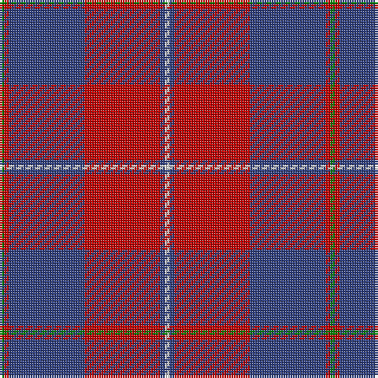

In pattern [GRBRBW](/stripes/grbrbw/).

This was sourced from weddslist.  It is a [6 stripe tartan](/stripes/stripes6/).

Original link http://www.weddslist.com/cgi-bin/tartans/pg.pl?source=sts

## Thread count
G/2 R2 B32 R32 B2 LN/2

## Palette
Each colour and the base-6 reference it is a variant of.

| Colour | Shade | Base |
|---|---|---|
| B | <code style="background-color:#304080;">#304080</code> `oklch(39.4% 0.109 270.2)` <small>#304080</small> | B <code style="background-color:#2A418A;">#2A418A</code> |
| G | <code style="background-color:#008000;">#008000</code> `oklch(52.0% 0.177 142.5)` <small>#008000</small> | G <code style="background-color:#006100;">#006100</code> |
| LN | <code style="background-color:#E0E0E0;">#E0E0E0</code> `oklch(90.7% 0.000 89.9)` <small>#E0E0E0</small> | W <code style="background-color:#F7F7F7;">#F7F7F7</code> |
| R | <code style="background-color:#C00000;">#C00000</code> `oklch(50.7% 0.208 29.2)` <small>#C00000</small> | R <code style="background-color:#CC0000;">#CC0000</code> |

# Sample pattern

## Nearest tartans

The nearest existing variants by ΔTartan distance, with this tartan at the top so the swatches line up against it.

ΔTartan

Tartan

Sett

—

<a href="/ttd/edit/#slug=g1r1db16r16db1w1~x2">Galloway, dress</a> <a class="nn-out" href="/setts/s6/g1r1db16r16db1w1~x2/" title="open its dictionary page">↗</a>

0.62

<a href="/ttd/edit/#slug=g2r1db16r16db1ly2~x2">Galloway dress</a> <a class="nn-out" href="/setts/s6/g2r1db16r16db1ly2~x2/" title="open its dictionary page">↗</a>

0.76

<a href="/ttd/edit/#slug=dg2r1db16r16db1ly2~x2">Galloway Dress (Yellow Line)</a> <a class="nn-out" href="/setts/s6/dg2r1db16r16db1ly2~x2/" title="open its dictionary page">↗</a>

0.81

<a href="/ttd/edit/#slug=k1r7k1r7db16g1~x2">Robinson, dress</a> <a class="nn-out" href="/setts/s6/k1r7k1r7db16g1~x2/" title="open its dictionary page">↗</a>

0.85

<a href="/ttd/edit/#slug=k1r7k1r7db16g1~x4">Robinson Dress (Pendleton) #1</a> <a class="nn-out" href="/setts/s6/k1r7k1r7db16g1~x4/" title="open its dictionary page">↗</a>

1.24

<a href="/ttd/edit/#slug=g3r2db22r22db2w3~x2">Galloway Red</a> <a class="nn-out" href="/setts/s6/g3r2db22r22db2w3~x2/" title="open its dictionary page">↗</a>

1.32

<a href="/ttd/edit/#slug=m18g9m2g3k1w1~x4">MacGregor of Cardney</a> <a class="nn-out" href="/setts/s6/m18g9m2g3k1w1~x4/" title="open its dictionary page">↗</a>

1.32

<a href="/ttd/edit/#slug=db16w2db3ly4db3w2db10r35db4~x2">Mercer Personal Tartan Tartan Number: 3019. Earliest known date: 2004 Sent to House of Tartan by the owner. See products available Copyright © Blair Urquhart, Comrie, 2015</a> <a class="nn-out" href="/setts/s9/db16w2db3ly4db3w2db10r35db4~x2/" title="open its dictionary page">↗</a>

1.34

<a href="/ttd/edit/#slug=m7w2m32db7g3db2g3db2g16m3~x2">Chisholm Hunting (HSL) Clan Tartan Tartan Number: 1457. Earliest known date: c.1815 Possibly the true source of the Vestiarium Scoticum sett with crimson changed to red. See products available Copyright © Blair Urquhart, Comrie, 2015</a> <a class="nn-out" href="/setts/s10/m7w2m32db7g3db2g3db2g16m3~x2/" title="open its dictionary page">↗</a>

1.38

<a href="/ttd/edit/#slug=dt6lo2dt27r27lo2r2lo2r2dt4~x2">New Breckon (Fashion?)</a> <a class="nn-out" href="/setts/s9/dt6lo2dt27r27lo2r2lo2r2dt4~x2/" title="open its dictionary page">↗</a>

1.42

<a href="/ttd/edit/#slug=db18r9db2r3k1o1~x4">MacGregor, Modern</a> <a class="nn-out" href="/setts/s6/db18r9db2r3k1o1~x4/" title="open its dictionary page">↗</a>

## Neighbour map

Every grey dot is one of 14299 variants placed by the first two principal components of the ΔTartan feature space (44% of its variance). Red is this tartan; blue dots are its nearest — click one to open its page.

<svg viewBox="0 0 640 380" role="img" style="max-width:100%;height:auto;border:1px solid #e0e0e0;border-radius:4px;display:block" xmlns="http://www.w3.org/2000/svg"><image href="/nn/cloud.v1.png" width="640" height="380"/><a href="/setts/s6/g2r1db16r16db1ly2~x2/"><circle cx="316.6" cy="172.0" r="4" fill="#3465a4"><title>Galloway dress</title></circle></a><a href="/setts/s6/dg2r1db16r16db1ly2~x2/"><circle cx="308.4" cy="166.9" r="4" fill="#3465a4"><title>Galloway Dress (Yellow Line)</title></circle></a><a href="/setts/s6/k1r7k1r7db16g1~x2/"><circle cx="324.9" cy="181.2" r="4" fill="#3465a4"><title>Robinson, dress</title></circle></a><a href="/setts/s6/k1r7k1r7db16g1~x4/"><circle cx="329.1" cy="182.1" r="4" fill="#3465a4"><title>Robinson Dress (Pendleton) #1</title></circle></a><a href="/setts/s6/g3r2db22r22db2w3~x2/"><circle cx="277.4" cy="178.6" r="4" fill="#3465a4"><title>Galloway Red</title></circle></a><a href="/setts/s6/m18g9m2g3k1w1~x4/"><circle cx="396.4" cy="173.1" r="4" fill="#3465a4"><title>MacGregor of Cardney</title></circle></a><a href="/setts/s9/db16w2db3ly4db3w2db10r35db4~x2/"><circle cx="301.5" cy="134.6" r="4" fill="#3465a4"><title>Mercer Personal Tartan Tartan Number: 3019. Earliest known date: 2004 Sent to House of Tartan by the owner. See products available Copyright © Blair Urquhart, Comrie, 2015</title></circle></a><a href="/setts/s10/m7w2m32db7g3db2g3db2g16m3~x2/"><circle cx="350.2" cy="151.3" r="4" fill="#3465a4"><title>Chisholm Hunting (HSL) Clan Tartan Tartan Number: 1457. Earliest known date: c.1815 Possibly the true source of the Vestiarium Scoticum sett with crimson changed to red. See products available Copyright © Blair Urquhart, Comrie, 2015</title></circle></a><a href="/setts/s9/dt6lo2dt27r27lo2r2lo2r2dt4~x2/"><circle cx="353.1" cy="170.5" r="4" fill="#3465a4"><title>New Breckon (Fashion?)</title></circle></a><a href="/setts/s6/db18r9db2r3k1o1~x4/"><circle cx="390.5" cy="175.4" r="4" fill="#3465a4"><title>MacGregor, Modern</title></circle></a><circle cx="353.6" cy="170.4" r="5" fill="#c00000"/></svg>

ID: /setts/s6/g1r1db16r16db1w1~x2/
