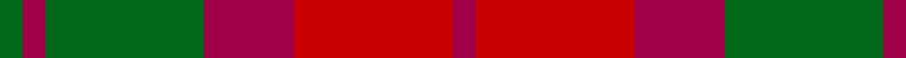

In pattern [GRGRRR](/patterns/grgrrr/).

This was sourced from register-of-tartans.  It is a [6 stripes tartan](/stripes/stripes6/).

Original link https://www.tartanregister.gov.uk/tartanDetails.aspx?ref=2665

## Thread count
Gb/4 R4 Gb28 R16 Ra28 R/4

## Palette
Each colour and its ΔE from the base-6 reference it is a variant of.

| Colour | Shade | Base | ΔE (OKLab) |
|---|---|---|---|
| G | <code style="background-color:#285800;">#285800</code> `#285800` | G <code style="background-color:#006100;">#006100</code> | 0.03 |
| Ga | <code style="background-color:#289C18;">#289C18</code> `#289C18` | G <code style="background-color:#006100;">#006100</code> | 0.19 |
| Gb | <code style="background-color:#006818;">#006818</code> `#006818` | G <code style="background-color:#006100;">#006100</code> | 0.02 |
| R | <code style="background-color:#A00048;">#A00048</code> `#A00048` | R <code style="background-color:#CC0000;">#CC0000</code> | 0.12 |
| Ra | <code style="background-color:#C80000;">#C80000</code> `#C80000` | R <code style="background-color:#CC0000;">#CC0000</code> | 0.01 |

# Sample pattern

## Nearest tartans

The nearest existing variants by ΔTartan distance.

1. [MacNab, Variant](/setts/s6/g1r1g7r4ra7r1x4~g008000-r900030-rac00000/) — ΔT 0.56
1. [Dewar (Name)](/setts/s6/g1r1g7r4ra7r1x6~g285800-ra00000-rac80000/) — ΔT 0.98
1. [Harmony 8](/setts/s5/b2g10r15b10g2x4~b401000-g808080-r906030/) — ΔT 1.13
1. [Unidentified Artifact Tartan Tartan Number: 463. Earliest known date: 0 Wilson's of Bannockburn 'New Broad Sett' perhaps. See products available Copyright © Blair Urquhart, Comrie, 2015](/setts/s6/b4r3b26r26g26r4x2~b780078-g006818-rc80000/) — ΔT 1.20
1. [Unidentified 16](/setts/s6/b4r3b26r26g26r4x2~b800080-g008000-rc00000/) — ΔT 1.26
1. [Moray of Abercairney](/setts/s5/r8ra1g4ra1b4x2~b304080-g008000-rc00000-rad03030/) — ΔT 1.27
1. [Moray of Abercairney](/setts/s6/r8ra1g4ra1g1b2x2~b5480b0-g008000-rc00000-rad03030/) — ΔT 1.32
1. [Moray of Abercairney](/setts/s6/r8ra1g4ra1g1b2x2~b3c82af-g005020-rdc0000-rac82828/) — ΔT 1.39
1. [MacFadyen, MacBean (Old)](/setts/s7/b3r25b17r5g22r9b3x2~b304080-g008000-rc00000/) — ΔT 1.41
1. [Glen Esk (1993)](/setts/s7/g2r1g8r5ga5r1ga2x4~g005020-ga5c6428-rdc0000/) — ΔT 1.42

## Neighbour map

Every grey dot is one of 15726 variants placed by the first two principal components of the ΔTartan feature space (44% of its variance). Red is this tartan; blue dots are its nearest — click one to open its page.

<svg viewBox="0 0 640 380" role="img" style="max-width:100%;height:auto;border:1px solid #e0e0e0;border-radius:4px;display:block" xmlns="http://www.w3.org/2000/svg"><image href="/nn/cloud.v1.png" width="640" height="380"/><a href="/setts/s6/g1r1g7r4ra7r1x4~g008000-r900030-rac00000/"><circle cx="251.4" cy="246.8" r="4" fill="#3465a4"><title>MacNab, Variant</title></circle></a><a href="/setts/s6/g1r1g7r4ra7r1x6~g285800-ra00000-rac80000/"><circle cx="285.8" cy="258.9" r="4" fill="#3465a4"><title>Dewar (Name)</title></circle></a><a href="/setts/s5/b2g10r15b10g2x4~b401000-g808080-r906030/"><circle cx="256.1" cy="273.1" r="4" fill="#3465a4"><title>Harmony 8</title></circle></a><a href="/setts/s6/b4r3b26r26g26r4x2~b780078-g006818-rc80000/"><circle cx="249.0" cy="235.8" r="4" fill="#3465a4"><title>Unidentified Artifact Tartan Tartan Number: 463. Earliest known date: 0 Wilson's of Bannockburn 'New Broad Sett' perhaps. See products available Copyright © Blair Urquhart, Comrie, 2015</title></circle></a><a href="/setts/s6/b4r3b26r26g26r4x2~b800080-g008000-rc00000/"><circle cx="239.5" cy="232.0" r="4" fill="#3465a4"><title>Unidentified 16</title></circle></a><a href="/setts/s5/r8ra1g4ra1b4x2~b304080-g008000-rc00000-rad03030/"><circle cx="241.8" cy="234.2" r="4" fill="#3465a4"><title>Moray of Abercairney</title></circle></a><a href="/setts/s6/r8ra1g4ra1g1b2x2~b5480b0-g008000-rc00000-rad03030/"><circle cx="278.1" cy="213.1" r="4" fill="#3465a4"><title>Moray of Abercairney</title></circle></a><a href="/setts/s6/r8ra1g4ra1g1b2x2~b3c82af-g005020-rdc0000-rac82828/"><circle cx="271.4" cy="208.3" r="4" fill="#3465a4"><title>Moray of Abercairney</title></circle></a><a href="/setts/s7/b3r25b17r5g22r9b3x2~b304080-g008000-rc00000/"><circle cx="267.4" cy="235.9" r="4" fill="#3465a4"><title>MacFadyen, MacBean (Old)</title></circle></a><a href="/setts/s7/g2r1g8r5ga5r1ga2x4~g005020-ga5c6428-rdc0000/"><circle cx="270.1" cy="253.4" r="4" fill="#3465a4"><title>Glen Esk (1993)</title></circle></a><circle cx="261.3" cy="249.2" r="5" fill="#c00000"/></svg>

ID: /setts/s6/g1r1g7r4ra7r1x4~g006818-ra00048-rac80000/
