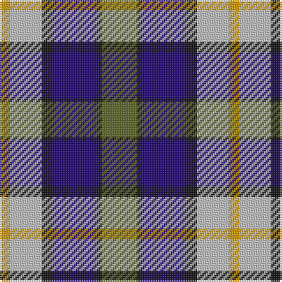

In pattern [GKBKWY](/patterns/gkbkwy/).

This was sourced from register-of-tartans.  It is a [6 stripes tartan](/stripes/stripes6/).

Original link https://www.tartanregister.gov.uk/tartanDetails.aspx?ref=1838

## Attestations

This cloth appears in 2 source records; the oldest owns this page.

- 01/01/2002 — Inverary (register-of-tartans, [record](https://www.tartanregister.gov.uk/tartanDetails.aspx?ref=1838))
- pre 2002 — Inverary (District) (tartans-authority, [record](http://www.tartansauthority.com/tartan-ferret/display/772/))

## Thread count
DY/6 N18 K6 DB26 K2 G/20

## Palette
Each colour and its ΔE from the base-6 reference it is a variant of.

| Colour | Shade | Base | ΔE (OKLab) |
|---|---|---|---|
| DB | <code style="background-color:#1C0070;">#1C0070</code> `#1C0070` | B <code style="background-color:#2C4084;">#2C4084</code> | 0.14 |
| DR | <code style="background-color:#880000;">#880000</code> `#880000` | R <code style="background-color:#C80000;">#C80000</code> | 0.14 |
| DY | <code style="background-color:#D09800;">#D09800</code> `#D09800` | Y <code style="background-color:#E8C000;">#E8C000</code> | 0.11 |
| G | <code style="background-color:#5C6428;">#5C6428</code> `#5C6428` | G <code style="background-color:#006400;">#006400</code> | 0.09 |
| K | <code style="background-color:#101010;">#101010</code> `#101010` | K <code style="background-color:#000000;">#000000</code> | 0.17 |
| N | <code style="background-color:#C0C0C0;">#C0C0C0</code> `#C0C0C0` | W <code style="background-color:#F4F4F0;">#F4F4F0</code> | 0.16 |

# Sample pattern

## Nearest tartans

The nearest existing variants by ΔTartan distance.

1. [Inverary Clan Tartan Tartan Number: 772. Earliest known date: pre 2003 From a miniature of Elizabeth Innes at (sic) Edingight from Adam See products available Copyright © Blair Urquhart, Comrie, 2015](/setts/s6/g20k2b26k6w18y6-b2c2c80-g006428-k101010-we0e0e0-ye8c000/) — ΔT 0.67
1. [Inverary](/setts/s6/g20k2b26k6w18y6-b304080-g006030-k000000-we0e0e0-yf0c000/) — ΔT 0.76
1. [Monaghan County Crest (Fashion)](/setts/s8/y30b4ya16ba42w4b42ba12w14-b2c2c80-ba1c1c50-we0e0e0-ybc8c00-yaa0a0a0/) — ΔT 0.87
1. [Clunie (Name)](/setts/s6/w12b48k14r22k4y12-b202060-k101010-r888888-wf8f8f8-ye8c000/) — ΔT 0.91
1. [McEachern, Andrew](/setts/s6/b28w4r24ba40g40w4-b404040-ba000080-g00643c-rc8002c-wfffff0/) — ΔT 0.94
1. [Commonwealth Games Council (Corp.)](/setts/s6/r6k34b22r4ra40w4-b484848-k101010-rb468ac-ra888888-we0e0e0/) — ΔT 1.03
1. [Soroptimist International (Corporate](/setts/s6/w4k2r20k12b24y4-b1870a4-k101010-r9c68a4-we0e0e0-ybc8c00/) — ΔT 1.07
1. [Antigonish Centennial](/setts/s9/k8w4b10w14b18g28r8g2r8-b1c0070-g006818-k101010-r888888-wc0c0c0/) — ΔT 1.10
1. [Kuznetsov (2014)](/setts/s7/b49y12r12y12g32w8b3-b000064-g003820-rdc0000-wffffff-yfccc00/) — ΔT 1.12
1. [Kuznetsov (2014)](/setts/s7/b49y12r12y12g32w8b3-b202060-g003820-rc80000-wfcfcfc-ye8c000/) — ΔT 1.13

## Neighbour map

Every grey dot is one of 15726 variants placed by the first two principal components of the ΔTartan feature space (44% of its variance). Red is this tartan; blue dots are its nearest — click one to open its page.

<svg viewBox="0 0 640 380" role="img" style="max-width:100%;height:auto;border:1px solid #e0e0e0;border-radius:4px;display:block" xmlns="http://www.w3.org/2000/svg"><image href="/nn/cloud.v1.png" width="640" height="380"/><a href="/setts/s6/g20k2b26k6w18y6-b2c2c80-g006428-k101010-we0e0e0-ye8c000/"><circle cx="103.1" cy="181.1" r="4" fill="#3465a4"><title>Inverary Clan Tartan Tartan Number: 772. Earliest known date: pre 2003 From a miniature of Elizabeth Innes at (sic) Edingight from Adam See products available Copyright © Blair Urquhart, Comrie, 2015</title></circle></a><a href="/setts/s6/g20k2b26k6w18y6-b304080-g006030-k000000-we0e0e0-yf0c000/"><circle cx="99.5" cy="180.1" r="4" fill="#3465a4"><title>Inverary</title></circle></a><a href="/setts/s8/y30b4ya16ba42w4b42ba12w14-b2c2c80-ba1c1c50-we0e0e0-ybc8c00-yaa0a0a0/"><circle cx="105.9" cy="177.6" r="4" fill="#3465a4"><title>Monaghan County Crest (Fashion)</title></circle></a><a href="/setts/s6/w12b48k14r22k4y12-b202060-k101010-r888888-wf8f8f8-ye8c000/"><circle cx="151.4" cy="176.8" r="4" fill="#3465a4"><title>Clunie (Name)</title></circle></a><a href="/setts/s6/b28w4r24ba40g40w4-b404040-ba000080-g00643c-rc8002c-wfffff0/"><circle cx="100.6" cy="207.9" r="4" fill="#3465a4"><title>McEachern, Andrew</title></circle></a><a href="/setts/s6/r6k34b22r4ra40w4-b484848-k101010-rb468ac-ra888888-we0e0e0/"><circle cx="156.8" cy="190.0" r="4" fill="#3465a4"><title>Commonwealth Games Council (Corp.)</title></circle></a><a href="/setts/s6/w4k2r20k12b24y4-b1870a4-k101010-r9c68a4-we0e0e0-ybc8c00/"><circle cx="160.4" cy="186.7" r="4" fill="#3465a4"><title>Soroptimist International (Corporate</title></circle></a><a href="/setts/s9/k8w4b10w14b18g28r8g2r8-b1c0070-g006818-k101010-r888888-wc0c0c0/"><circle cx="95.5" cy="170.7" r="4" fill="#3465a4"><title>Antigonish Centennial</title></circle></a><a href="/setts/s7/b49y12r12y12g32w8b3-b000064-g003820-rdc0000-wffffff-yfccc00/"><circle cx="153.0" cy="152.8" r="4" fill="#3465a4"><title>Kuznetsov (2014)</title></circle></a><a href="/setts/s7/b49y12r12y12g32w8b3-b202060-g003820-rc80000-wfcfcfc-ye8c000/"><circle cx="163.5" cy="154.4" r="4" fill="#3465a4"><title>Kuznetsov (2014)</title></circle></a><circle cx="113.8" cy="184.4" r="5" fill="#c00000"/></svg>

ID: /setts/s6/g20k2b26k6w18y6-b1c0070-g5c6428-k101010-wc0c0c0-yd09800/
