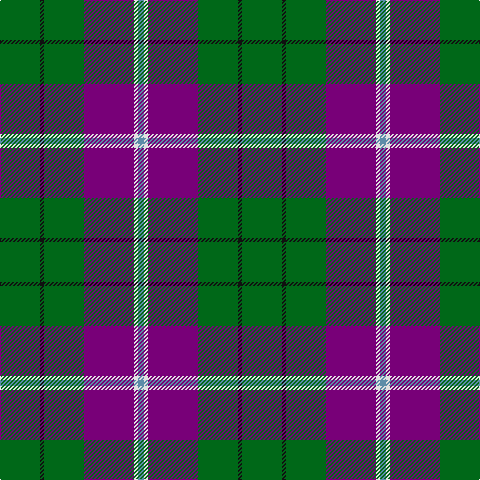

In pattern [BWBGKG](/stripes/bwbgkg/).

This was sourced from tartans-authority.  It is a [6 stripe tartan](/stripes/stripes6/).

Original link http://www.tartansauthority.com/tartan-ferret/display/10375/

## Thread count
G/40 K4 G40 P50 LN4 B/6

## Palette
Each colour and its ΔE from the base-6 reference it is a variant of.

| Colour | Shade | Base | ΔE (OKLab) |
|---|---|---|---|
| B | <code style="background-color:#5C8CA8;">#5C8CA8</code> `#5C8CA8` | B <code style="background-color:#2A418A;">#2A418A</code> | 0.23 |
| G | <code style="background-color:#006818;">#006818</code> `#006818` | G <code style="background-color:#006100;">#006100</code> | 0.02 |
| K | <code style="background-color:#101010;">#101010</code> `#101010` | K <code style="background-color:#000000;">#000000</code> | 0.17 |
| LN | <code style="background-color:#E0E0E0;">#E0E0E0</code> `#E0E0E0` | W <code style="background-color:#F7F7F7;">#F7F7F7</code> | 0.07 |
| P | <code style="background-color:#780078;">#780078</code> `#780078` | B <code style="background-color:#2A418A;">#2A418A</code> | 0.17 |

# Sample pattern

## Nearest tartans

The nearest existing variants by ΔTartan distance.

1. [Taylor Family Tartan Tartan Number: 809. Earliest known date: 1955 Some similarity to the Cameron recorded in the Vestiarium Scoticum, which may be connected with the name of the designer, Lt Col Iain Cameron Taylor, or to the Clan Cameron warrior Taillear dubh na Tuaighe (Black Taylor of the Axe) who lived in the seventeenth century. The pink stripe is described as 'coral'. The tartan is recognised by the Cameron of Lochiel. See products available Copyright © Blair Urquhart, Comrie, 2015](/setts/s8/g8k2g13r4g12dp22g5ly3~x2/) — ΔT 0.80
1. [Lossiemouth/Hersbruck](/setts/s6/g26db3g12k10dp15w2~x2/) — ΔT 0.81
1. [Vance (Family Association)](/setts/s6/r4db24w2g13db2k3~x4/) — ΔT 1.14
1. [Asheville Firefighters, The](/setts/s6/k17dg48ly4r10lb12dg4/) — ΔT 1.20
1. [MacNamara](/setts/s7/ly4n17k11r17n27k2w3~x2/) — ΔT 1.22
1. [Bryan Wedding (Personal)](/setts/s6/dy30ly5b10k10w2k2~x2/) — ΔT 1.25
1. [Wellington (Wilson 122)](/setts/s8/g14dp11t3k2t3dp11g14ly1~x2/) — ΔT 1.26
1. [Highlands of Durham (Corporate)](/setts/s6/r6dt4w2g27dt37ly2~x2/) — ΔT 1.26
1. [Lee (Personal)](/setts/s7/dg2k1dg12r4dg3db9lb2~x4/) — ΔT 1.30
1. [MacIntyre, Inglis](/setts/s6/w4g28db18r4db18ly3~x2/) — ΔT 1.30

## Neighbour map

Every grey dot is one of 14299 variants placed by the first two principal components of the ΔTartan feature space (44% of its variance). Red is this tartan; blue dots are its nearest — click one to open its page.

<svg viewBox="0 0 640 380" role="img" style="max-width:100%;height:auto;border:1px solid #e0e0e0;border-radius:4px;display:block" xmlns="http://www.w3.org/2000/svg"><image href="/nn/cloud.v1.png" width="640" height="380"/><a href="/setts/s8/g8k2g13r4g12dp22g5ly3~x2/"><circle cx="274.7" cy="193.7" r="4" fill="#3465a4"><title>Taylor Family Tartan Tartan Number: 809. Earliest known date: 1955 Some similarity to the Cameron recorded in the Vestiarium Scoticum, which may be connected with the name of the designer, Lt Col Iain Cameron Taylor, or to the Clan Cameron warrior Taillear dubh na Tuaighe (Black Taylor of the Axe) who lived in the seventeenth century. The pink stripe is described as 'coral'. The tartan is recognised by the Cameron of Lochiel. See products available Copyright © Blair Urquhart, Comrie, 2015</title></circle></a><a href="/setts/s6/g26db3g12k10dp15w2~x2/"><circle cx="275.6" cy="207.4" r="4" fill="#3465a4"><title>Lossiemouth/Hersbruck</title></circle></a><a href="/setts/s6/r4db24w2g13db2k3~x4/"><circle cx="277.3" cy="178.6" r="4" fill="#3465a4"><title>Vance (Family Association)</title></circle></a><a href="/setts/s6/k17dg48ly4r10lb12dg4/"><circle cx="262.0" cy="178.0" r="4" fill="#3465a4"><title>Asheville Firefighters, The</title></circle></a><a href="/setts/s7/ly4n17k11r17n27k2w3~x2/"><circle cx="263.8" cy="180.8" r="4" fill="#3465a4"><title>MacNamara</title></circle></a><a href="/setts/s6/dy30ly5b10k10w2k2~x2/"><circle cx="267.9" cy="171.8" r="4" fill="#3465a4"><title>Bryan Wedding (Personal)</title></circle></a><a href="/setts/s8/g14dp11t3k2t3dp11g14ly1~x2/"><circle cx="245.5" cy="189.3" r="4" fill="#3465a4"><title>Wellington (Wilson 122)</title></circle></a><a href="/setts/s6/r6dt4w2g27dt37ly2~x2/"><circle cx="301.7" cy="159.2" r="4" fill="#3465a4"><title>Highlands of Durham (Corporate)</title></circle></a><a href="/setts/s7/dg2k1dg12r4dg3db9lb2~x4/"><circle cx="248.5" cy="194.8" r="4" fill="#3465a4"><title>Lee (Personal)</title></circle></a><a href="/setts/s6/w4g28db18r4db18ly3~x2/"><circle cx="224.0" cy="206.3" r="4" fill="#3465a4"><title>MacIntyre, Inglis</title></circle></a><circle cx="303.8" cy="197.3" r="5" fill="#c00000"/></svg>

ID: /setts/s6/g20k2g20dp25w2t3~x2/
