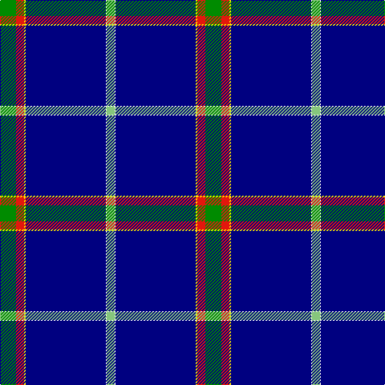

In pattern [GRYBWY](/patterns/grybwy/).

This was sourced from register-of-tartans.  It is a [6 stripes tartan](/stripes/stripes6/).

Original link https://www.tartanregister.gov.uk/tartanDetails.aspx?ref=10756

## Thread count
G/20 R10 Y2 DB100 W1 LG/10

## Palette
Each colour and its ΔE from the base-6 reference it is a variant of.

| Colour | Shade | Base | ΔE (OKLab) |
|---|---|---|---|
| DB | <code style="background-color:#000080;">#000080</code> `#000080` | B <code style="background-color:#2A418A;">#2A418A</code> | 0.14 |
| G | <code style="background-color:#008B00;">#008B00</code> `#008B00` | G <code style="background-color:#006100;">#006100</code> | 0.13 |
| LG | <code style="background-color:#86C67C;">#86C67C</code> `#86C67C` | Y <code style="background-color:#F2BF00;">#F2BF00</code> | 0.15 |
| R | <code style="background-color:#E3170D;">#E3170D</code> `#E3170D` | R <code style="background-color:#CC0000;">#CC0000</code> | 0.05 |
| W | <code style="background-color:#FFFFFF;">#FFFFFF</code> `#FFFFFF` | W <code style="background-color:#F7F7F7;">#F7F7F7</code> | 0.02 |
| Y | <code style="background-color:#FFE600;">#FFE600</code> `#FFE600` | Y <code style="background-color:#F2BF00;">#F2BF00</code> | 0.10 |

# Sample pattern

## Nearest tartans

The nearest existing variants by ΔTartan distance.

1. [Dress Blue](/setts/s7/r8w32k6b88r2wa6y4-b000080-k101010-re3170d-w82cffd-waffffff-yffe700/) — ΔT 1.58
1. [Cumnock](/setts/s8/g6b32k6ba4k90r2k4y6-b0000cd-baaa00ff-g008b00-k101010-rff0000-yffa500/) — ΔT 1.65
1. [Nunavut Territory (District)](/setts/s7/b120w2y8k8w2wa16w4-b1c1c50-k101010-we0e0e0-wac49cd8-ye8c000/) — ΔT 1.68
1. [Dress Blue (Fashion)](/setts/s7/r8w32k6b88r2wa6y4-b1c0070-k101010-rc80000-w98c8e8-wafcfcfc-ybc8c00/) — ΔT 1.69
1. [Special Air Service](/setts/s5/b52w12g2r2wa4-b202060-g006818-rc80000-wa8ace8-wafcfcfc/) — ΔT 1.72
1. [Ravetta (Name)](/setts/s6/g20r10y2b100w1ga10-b202060-g006818-ga789484-r880000-wfcfcfc-yfccc00/) — ΔT 1.78
1. [Special Air Service](/setts/s5/b52ba12g2r2w4-b141e46-ba5c8ca8-g005020-r660000-wf8f4d0/) — ΔT 1.79
1. [Parr](/setts/s10/b124r2b4r2b8k28g8w4g12k8-b304080-g008000-k000000-rc00000-we0e0e0/) — ΔT 1.79
1. [X Marks the Scot](/setts/s10/w12b64r6b6r2b6r4ba8b2y4-b202060-ba2c2c80-r888888-we0e0e0-ye8c000/) — ΔT 1.81
1. [Stratford (Ontario), City of](/setts/s10/b168w20b4w4y36b4g8w4b4r4-b000080-g008b00-rff0000-wffffff-yffe700/) — ΔT 1.81

## Neighbour map

Every grey dot is one of 15726 variants placed by the first two principal components of the ΔTartan feature space (44% of its variance). Red is this tartan; blue dots are its nearest — click one to open its page.

<svg viewBox="0 0 640 380" role="img" style="max-width:100%;height:auto;border:1px solid #e0e0e0;border-radius:4px;display:block" xmlns="http://www.w3.org/2000/svg"><image href="/nn/cloud.v1.png" width="640" height="380"/><a href="/setts/s7/r8w32k6b88r2wa6y4-b000080-k101010-re3170d-w82cffd-waffffff-yffe700/"><circle cx="322.4" cy="75.3" r="4" fill="#3465a4"><title>Dress Blue</title></circle></a><a href="/setts/s8/g6b32k6ba4k90r2k4y6-b0000cd-baaa00ff-g008b00-k101010-rff0000-yffa500/"><circle cx="410.5" cy="83.6" r="4" fill="#3465a4"><title>Cumnock</title></circle></a><a href="/setts/s7/b120w2y8k8w2wa16w4-b1c1c50-k101010-we0e0e0-wac49cd8-ye8c000/"><circle cx="493.9" cy="84.8" r="4" fill="#3465a4"><title>Nunavut Territory (District)</title></circle></a><a href="/setts/s7/r8w32k6b88r2wa6y4-b1c0070-k101010-rc80000-w98c8e8-wafcfcfc-ybc8c00/"><circle cx="332.0" cy="74.4" r="4" fill="#3465a4"><title>Dress Blue (Fashion)</title></circle></a><a href="/setts/s5/b52w12g2r2wa4-b202060-g006818-rc80000-wa8ace8-wafcfcfc/"><circle cx="437.1" cy="136.7" r="4" fill="#3465a4"><title>Special Air Service</title></circle></a><a href="/setts/s6/g20r10y2b100w1ga10-b202060-g006818-ga789484-r880000-wfcfcfc-yfccc00/"><circle cx="466.0" cy="104.6" r="4" fill="#3465a4"><title>Ravetta (Name)</title></circle></a><a href="/setts/s5/b52ba12g2r2w4-b141e46-ba5c8ca8-g005020-r660000-wf8f4d0/"><circle cx="450.6" cy="147.1" r="4" fill="#3465a4"><title>Special Air Service</title></circle></a><a href="/setts/s10/b124r2b4r2b8k28g8w4g12k8-b304080-g008000-k000000-rc00000-we0e0e0/"><circle cx="446.1" cy="75.0" r="4" fill="#3465a4"><title>Parr</title></circle></a><a href="/setts/s10/w12b64r6b6r2b6r4ba8b2y4-b202060-ba2c2c80-r888888-we0e0e0-ye8c000/"><circle cx="410.2" cy="89.9" r="4" fill="#3465a4"><title>X Marks the Scot</title></circle></a><a href="/setts/s10/b168w20b4w4y36b4g8w4b4r4-b000080-g008b00-rff0000-wffffff-yffe700/"><circle cx="416.9" cy="59.0" r="4" fill="#3465a4"><title>Stratford (Ontario), City of</title></circle></a><circle cx="417.5" cy="89.4" r="5" fill="#c00000"/></svg>

ID: /setts/s6/g20r10y2b100w1ya10-b000080-g008b00-re3170d-wffffff-yffe600-ya86c67c/
