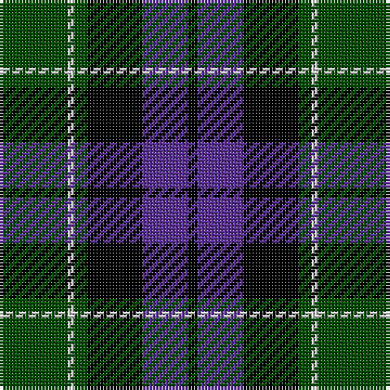

In pattern [GWGKBK](/patterns/gwgkbk/).

This was sourced from weddslist.  It is a [6 stripes tartan](/stripes/stripes6/).

Original link http://www.weddslist.com/cgi-bin/tartans/pg.pl?source=rb

## Thread count
G/21 N2 G4 K17 P14 K/3

## Palette
Each colour and its ΔE from the base-6 reference it is a variant of.

| Colour | Shade | Base | ΔE (OKLab) |
|---|---|---|---|
| G | <code style="background-color:#004C00;">#004C00</code> `#004C00` | G <code style="background-color:#006400;">#006400</code> | 0.08 |
| K | <code style="background-color:#000000;">#000000</code> `#000000` | K <code style="background-color:#000000;">#000000</code> | 0.00 |
| N | <code style="background-color:#D0D0D0;">#D0D0D0</code> `#D0D0D0` | W <code style="background-color:#F4F4F0;">#F4F4F0</code> | 0.11 |
| P | <code style="background-color:#5A3094;">#5A3094</code> `#5A3094` | B <code style="background-color:#2C4084;">#2C4084</code> | 0.08 |

# Sample pattern

## Nearest tartans

The nearest existing variants by ΔTartan distance.

1. [Mowat](/setts/s7/b48k6b10k46y4k22g43-b304080-g008000-k000000-yf0c000/) — ΔT 0.56
1. [Melville](/setts/s6/k5w2g18k17b16k3-b5a3094-g004c00-k000000-wd0d0d0/) — ΔT 0.57
1. [Melville](/setts/s6/k10y4g36k34b32k6-b6e5058-g11450d-k000000-yaaaaaa/) — ΔT 0.61
1. [Melville](/setts/s6/k5y2g18k17b16k3-b6e5058-g11450d-k000000-yaaaaaa/) — ΔT 0.61
1. [National Galleries, of Scotland](/setts/s7/k14g44k44b12r4b30r4-b000050-g008000-k000000-rc00000/) — ΔT 0.65
1. [Graham W](/setts/s6/g42y4g8k34b28k6-b6e5058-g11450d-k000000-yaaaaaa/) — ΔT 0.66
1. [Graham W](/setts/s6/g21y2g4k17b14k3-b6e5058-g11450d-k000000-yaaaaaa/) — ΔT 0.66
1. [Reid Taylor, "House Check"](/setts/s7/b4k2r2b18k18g20k4-b304080-g008000-k000000-rc00000/) — ΔT 0.74
1. [Fletcher](/setts/s7/b12k2b12k16r2g16k4-b304080-g008000-k000000-rc00000/) — ΔT 0.78
1. [Unnamed, No 59](/setts/s6/b2ba22k22g22k4b2-b5480b0-ba304080-g008000-k000000/) — ΔT 0.79

## Neighbour map

Every grey dot is one of 15726 variants placed by the first two principal components of the ΔTartan feature space (44% of its variance). Red is this tartan; blue dots are its nearest — click one to open its page.

<svg viewBox="0 0 640 380" role="img" style="max-width:100%;height:auto;border:1px solid #e0e0e0;border-radius:4px;display:block" xmlns="http://www.w3.org/2000/svg"><image href="/nn/cloud.v1.png" width="640" height="380"/><a href="/setts/s7/b48k6b10k46y4k22g43-b304080-g008000-k000000-yf0c000/"><circle cx="189.0" cy="209.0" r="4" fill="#3465a4"><title>Mowat</title></circle></a><a href="/setts/s6/k5w2g18k17b16k3-b5a3094-g004c00-k000000-wd0d0d0/"><circle cx="184.3" cy="230.2" r="4" fill="#3465a4"><title>Melville</title></circle></a><a href="/setts/s6/k10y4g36k34b32k6-b6e5058-g11450d-k000000-yaaaaaa/"><circle cx="192.5" cy="232.9" r="4" fill="#3465a4"><title>Melville</title></circle></a><a href="/setts/s6/k5y2g18k17b16k3-b6e5058-g11450d-k000000-yaaaaaa/"><circle cx="192.5" cy="232.9" r="4" fill="#3465a4"><title>Melville</title></circle></a><a href="/setts/s7/k14g44k44b12r4b30r4-b000050-g008000-k000000-rc00000/"><circle cx="173.2" cy="211.4" r="4" fill="#3465a4"><title>National Galleries, of Scotland</title></circle></a><a href="/setts/s6/g42y4g8k34b28k6-b6e5058-g11450d-k000000-yaaaaaa/"><circle cx="208.9" cy="224.7" r="4" fill="#3465a4"><title>Graham W</title></circle></a><a href="/setts/s6/g21y2g4k17b14k3-b6e5058-g11450d-k000000-yaaaaaa/"><circle cx="208.9" cy="224.7" r="4" fill="#3465a4"><title>Graham W</title></circle></a><a href="/setts/s7/b4k2r2b18k18g20k4-b304080-g008000-k000000-rc00000/"><circle cx="166.1" cy="206.3" r="4" fill="#3465a4"><title>Reid Taylor, &quot;House Check&quot;</title></circle></a><a href="/setts/s7/b12k2b12k16r2g16k4-b304080-g008000-k000000-rc00000/"><circle cx="154.8" cy="230.8" r="4" fill="#3465a4"><title>Fletcher</title></circle></a><a href="/setts/s6/b2ba22k22g22k4b2-b5480b0-ba304080-g008000-k000000/"><circle cx="163.5" cy="210.8" r="4" fill="#3465a4"><title>Unnamed, No 59</title></circle></a><circle cx="197.4" cy="220.6" r="5" fill="#c00000"/></svg>

ID: /setts/s6/g21w2g4k17b14k3-b5a3094-g004c00-k000000-wd0d0d0/
