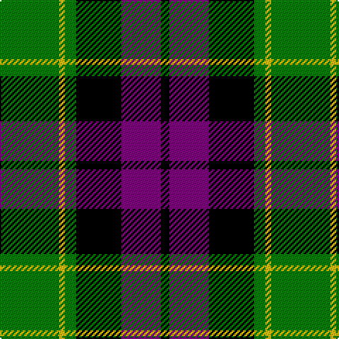

In pattern [GYGKBK](/patterns/gygkbk/).

This was sourced from weddslist.  It is a [6 stripes tartan](/stripes/stripes6/).

Original link http://www.weddslist.com/cgi-bin/tartans/pg.pl?source=sts

## Thread count
G/42 Y4 G8 K32 P28 K/6

## Palette
Each colour and its ΔE from the base-6 reference it is a variant of.

| Colour | Shade | Base | ΔE (OKLab) |
|---|---|---|---|
| G | <code style="background-color:#008000;">#008000</code> `#008000` | G <code style="background-color:#006100;">#006100</code> | 0.10 |
| K | <code style="background-color:#000000;">#000000</code> `#000000` | K <code style="background-color:#000000;">#000000</code> | 0.00 |
| P | <code style="background-color:#800080;">#800080</code> `#800080` | B <code style="background-color:#2A418A;">#2A418A</code> | 0.17 |
| Y | <code style="background-color:#F0C000;">#F0C000</code> `#F0C000` | Y <code style="background-color:#F2BF00;">#F2BF00</code> | 0.00 |

# Sample pattern

## Nearest tartans

The nearest existing variants by ΔTartan distance.

1. [Wilson's No 158](/setts/s6/g21w2g4k17b14k3x2~b800080-g008000-k000000-we0e0e0/) — ΔT 0.14
1. [Wilson's, No 150 "Coburg"](/setts/s6/g18b2g4k14ba12k3x2~b5480b0-ba800080-g008000-k000000/) — ΔT 0.35
1. [MacArthur of Milton, hunting](/setts/s6/g14b2g2k8ba9k2x2~b304080-ba800080-g008000-k000000/) — ΔT 0.69
1. [Wilson's, No 100](/setts/s6/g3b17k18y2g17k3x2~b800080-g008000-k000000-yf0c000/) — ΔT 0.80
1. [United Distillers (Corporate)](/setts/s6/r2k14r1ka14r14y2x2~k000000-ka101010-r948860-ye8c000/) — ΔT 0.82
1. [Wilson's, No 76](/setts/s6/g3b17k18w2g17k3x2~b800080-g008000-k000000-we0e0e0/) — ΔT 0.85
1. [Melville](/setts/s6/k4w2g18k13b12k2x2~b304080-g008000-k000000-we0e0e0/) — ΔT 0.86
1. [Graham of Montrose](/setts/s6/g4b15w2k16g19k4x2~b304080-g008000-k000000-we0e0e0/) — ΔT 0.87
1. [Gunn](/setts/s6/r2g12k12g1b12g1x2~b304080-g008000-k000000-rc00000/) — ΔT 0.93
1. [MacNeil 1](/setts/s6/w1b9k9g9k2w1x4~b304080-g008000-k000000-we0e0e0/) — ΔT 0.95

## Neighbour map

Every grey dot is one of 15726 variants placed by the first two principal components of the ΔTartan feature space (44% of its variance). Red is this tartan; blue dots are its nearest — click one to open its page.

<svg viewBox="0 0 640 380" role="img" style="max-width:100%;height:auto;border:1px solid #e0e0e0;border-radius:4px;display:block" xmlns="http://www.w3.org/2000/svg"><image href="/nn/cloud.v1.png" width="640" height="380"/><a href="/setts/s6/g21w2g4k17b14k3x2~b800080-g008000-k000000-we0e0e0/"><circle cx="178.7" cy="210.7" r="4" fill="#3465a4"><title>Wilson's No 158</title></circle></a><a href="/setts/s6/g18b2g4k14ba12k3x2~b5480b0-ba800080-g008000-k000000/"><circle cx="173.6" cy="222.1" r="4" fill="#3465a4"><title>Wilson's, No 150 &quot;Coburg&quot;</title></circle></a><a href="/setts/s6/g14b2g2k8ba9k2x2~b304080-ba800080-g008000-k000000/"><circle cx="174.5" cy="226.4" r="4" fill="#3465a4"><title>MacArthur of Milton, hunting</title></circle></a><a href="/setts/s6/g3b17k18y2g17k3x2~b800080-g008000-k000000-yf0c000/"><circle cx="152.5" cy="214.8" r="4" fill="#3465a4"><title>Wilson's, No 100</title></circle></a><a href="/setts/s6/r2k14r1ka14r14y2x2~k000000-ka101010-r948860-ye8c000/"><circle cx="176.7" cy="194.8" r="4" fill="#3465a4"><title>United Distillers (Corporate)</title></circle></a><a href="/setts/s6/g3b17k18w2g17k3x2~b800080-g008000-k000000-we0e0e0/"><circle cx="151.5" cy="214.5" r="4" fill="#3465a4"><title>Wilson's, No 76</title></circle></a><a href="/setts/s6/k4w2g18k13b12k2x2~b304080-g008000-k000000-we0e0e0/"><circle cx="155.7" cy="222.4" r="4" fill="#3465a4"><title>Melville</title></circle></a><a href="/setts/s6/g4b15w2k16g19k4x2~b304080-g008000-k000000-we0e0e0/"><circle cx="158.2" cy="225.0" r="4" fill="#3465a4"><title>Graham of Montrose</title></circle></a><a href="/setts/s6/r2g12k12g1b12g1x2~b304080-g008000-k000000-rc00000/"><circle cx="169.2" cy="206.0" r="4" fill="#3465a4"><title>Gunn</title></circle></a><a href="/setts/s6/w1b9k9g9k2w1x4~b304080-g008000-k000000-we0e0e0/"><circle cx="142.4" cy="217.5" r="4" fill="#3465a4"><title>MacNeil 1</title></circle></a><circle cx="181.8" cy="211.0" r="5" fill="#c00000"/></svg>

ID: /setts/s6/g21y2g4k16b14k3x2~b800080-g008000-k000000-yf0c000/
