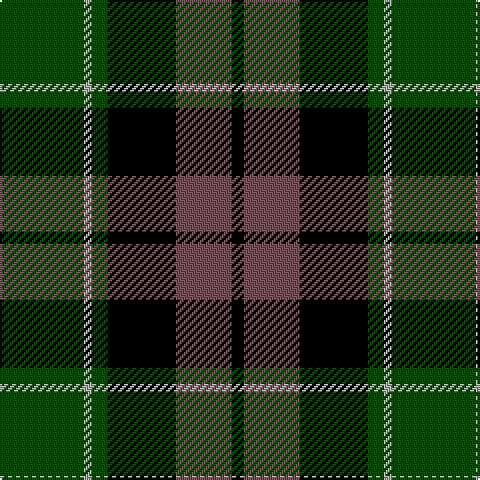

In pattern [GYGKBK](/patterns/gygkbk/).

This was sourced from weddslist.  It is a [6 stripes tartan](/stripes/stripes6/).

Original link http://www.weddslist.com/cgi-bin/tartans/pg.pl?source=tinsel

## Thread count
DG/42 Na4 DG8 K34 N28 K/6

## Palette
Each colour and its ΔE from the base-6 reference it is a variant of.

| Colour | Shade | Base | ΔE (OKLab) |
|---|---|---|---|
| DG | <code style="background-color:#11450D;">#11450D</code> `#11450D` | G <code style="background-color:#006100;">#006100</code> | 0.09 |
| K | <code style="background-color:#000000;">#000000</code> `#000000` | K <code style="background-color:#000000;">#000000</code> | 0.00 |
| N | <code style="background-color:#6E5058;">#6E5058</code> `#6E5058` | B <code style="background-color:#2A418A;">#2A418A</code> | 0.15 |
| Na | <code style="background-color:#AAAAAA;">#AAAAAA</code> `#AAAAAA` | Y <code style="background-color:#F2BF00;">#F2BF00</code> | 0.19 |

# Sample pattern

## Nearest tartans

The nearest existing variants by ΔTartan distance.

1. [Graham W](/setts/s6/g21y2g4k17b14k3~b6e5058-g11450d-k000000-yaaaaaa/) — ΔT 0.00
1. [Melville](/setts/s6/k5y2g18k17b16k3~b6e5058-g11450d-k000000-yaaaaaa~x2/) — ΔT 0.52
1. [Melville](/setts/s6/k5y2g18k17b16k3~b6e5058-g11450d-k000000-yaaaaaa/) — ΔT 0.52
1. [Graham W](/setts/s6/g21w2g4k17b14k3~b5a3094-g004c00-k000000-wd0d0d0/) — ΔT 0.66
1. [MacCallum](/setts/s7/g8k2w1g4k6b6k1~b00004c-g004c00-k000000-wd0d0d0~x2/) — ΔT 1.00
1. [National Galleries, of Scotland](/setts/s7/k7g22k22b6r2b15r2~b000050-g008000-k000000-rc00000~x2/) — ΔT 1.01
1. [Wilson's, No 150 "Coburg"](/setts/s6/g18b2g4k14ba12k3~b5480b0-ba800080-g008000-k000000~x2/) — ΔT 1.03
1. [Mowat](/setts/s7/b48k6b10k46y4k22g43~b304080-g008000-k000000-yf0c000/) — ΔT 1.05
1. [Gunn](/setts/s6/g2b12g1k12g12r2~b000064-g004c00-k000000-rc80000~x2/) — ΔT 1.05
1. [Ferguson of Balquhidder](/setts/s6/g2b12r1k12g12k2~b304080-g008000-k000000-rc00000~x2/) — ΔT 1.06

## Neighbour map

Every grey dot is one of 15726 variants placed by the first two principal components of the ΔTartan feature space (44% of its variance). Red is this tartan; blue dots are its nearest — click one to open its page.

<svg viewBox="0 0 640 380" role="img" style="max-width:100%;height:auto;border:1px solid #e0e0e0;border-radius:4px;display:block" xmlns="http://www.w3.org/2000/svg"><image href="/nn/cloud.v1.png" width="640" height="380"/><a href="/setts/s6/g21y2g4k17b14k3~b6e5058-g11450d-k000000-yaaaaaa/"><circle cx="208.8" cy="225.9" r="4" fill="#3465a4"><title>Graham W</title></circle></a><a href="/setts/s6/k5y2g18k17b16k3~b6e5058-g11450d-k000000-yaaaaaa~x2/"><circle cx="192.1" cy="234.3" r="4" fill="#3465a4"><title>Melville</title></circle></a><a href="/setts/s6/k5y2g18k17b16k3~b6e5058-g11450d-k000000-yaaaaaa/"><circle cx="192.1" cy="234.3" r="4" fill="#3465a4"><title>Melville</title></circle></a><a href="/setts/s6/g21w2g4k17b14k3~b5a3094-g004c00-k000000-wd0d0d0/"><circle cx="197.2" cy="222.2" r="4" fill="#3465a4"><title>Graham W</title></circle></a><a href="/setts/s7/g8k2w1g4k6b6k1~b00004c-g004c00-k000000-wd0d0d0~x2/"><circle cx="190.5" cy="243.2" r="4" fill="#3465a4"><title>MacCallum</title></circle></a><a href="/setts/s7/k7g22k22b6r2b15r2~b000050-g008000-k000000-rc00000~x2/"><circle cx="173.3" cy="212.8" r="4" fill="#3465a4"><title>National Galleries, of Scotland</title></circle></a><a href="/setts/s6/g18b2g4k14ba12k3~b5480b0-ba800080-g008000-k000000~x2/"><circle cx="173.6" cy="222.1" r="4" fill="#3465a4"><title>Wilson's, No 150 &quot;Coburg&quot;</title></circle></a><a href="/setts/s7/b48k6b10k46y4k22g43~b304080-g008000-k000000-yf0c000/"><circle cx="188.8" cy="210.8" r="4" fill="#3465a4"><title>Mowat</title></circle></a><a href="/setts/s6/g2b12g1k12g12r2~b000064-g004c00-k000000-rc80000~x2/"><circle cx="199.8" cy="225.3" r="4" fill="#3465a4"><title>Gunn</title></circle></a><a href="/setts/s6/g2b12r1k12g12k2~b304080-g008000-k000000-rc00000~x2/"><circle cx="167.5" cy="211.8" r="4" fill="#3465a4"><title>Ferguson of Balquhidder</title></circle></a><circle cx="208.8" cy="225.9" r="5" fill="#c00000"/></svg>

ID: /setts/s6/g21y2g4k17b14k3~b6e5058-g11450d-k000000-yaaaaaa~x2/
