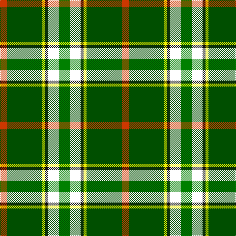

In pattern [GWKYGR](/patterns/gwkygr/).

This was sourced from register-of-tartans.  It is a [6 stripes tartan](/stripes/stripes6/).

Original link https://www.tartanregister.gov.uk/tartanDetails.aspx?ref=10161

## Thread count
DO/14 G72 Y6 K6 W22 Ga/22

## Palette
Each colour and its ΔE from the base-6 reference it is a variant of.

| Colour | Shade | Base | ΔE (OKLab) |
|---|---|---|---|
| DO | <code style="background-color:#CD3700;">#CD3700</code> `#CD3700` | R <code style="background-color:#C80000;">#C80000</code> | 0.05 |
| G | <code style="background-color:#004F00;">#004F00</code> `#004F00` | G <code style="background-color:#006400;">#006400</code> | 0.07 |
| Ga | <code style="background-color:#008000;">#008000</code> `#008000` | G <code style="background-color:#006400;">#006400</code> | 0.09 |
| K | <code style="background-color:#101010;">#101010</code> `#101010` | K <code style="background-color:#000000;">#000000</code> | 0.17 |
| W | <code style="background-color:#FFFFFF;">#FFFFFF</code> `#FFFFFF` | W <code style="background-color:#F4F4F0;">#F4F4F0</code> | 0.03 |
| Y | <code style="background-color:#EEEE00;">#EEEE00</code> `#EEEE00` | Y <code style="background-color:#E8C000;">#E8C000</code> | 0.12 |

# Sample pattern

ID: /setts/s6/g22w22k6y6ga72r14-g008000-ga004f00-k101010-rcd3700-wffffff-yeeee00/
