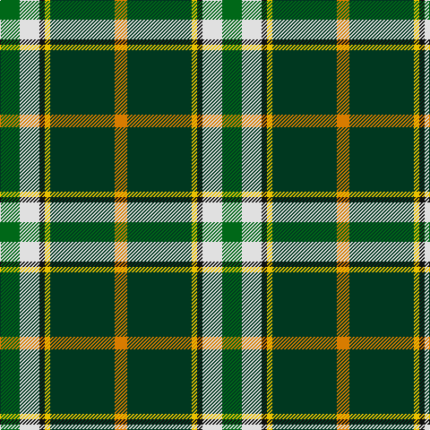

In pattern [GWKYGY](/patterns/gwkygy/).

This was sourced from tartans-authority.  It is a [6 stripes tartan](/stripes/stripes6/).

Original link http://www.tartansauthority.com/tartan-ferret/display/10161/

## Thread count
G/22 LN22 K6 Y6 DG72 O/14

## Palette
Each colour and its ΔE from the base-6 reference it is a variant of.

| Colour | Shade | Base | ΔE (OKLab) |
|---|---|---|---|
| DG | <code style="background-color:#003820;">#003820</code> `#003820` | G <code style="background-color:#006400;">#006400</code> | 0.16 |
| G | <code style="background-color:#006818;">#006818</code> `#006818` | G <code style="background-color:#006400;">#006400</code> | 0.02 |
| K | <code style="background-color:#101010;">#101010</code> `#101010` | K <code style="background-color:#000000;">#000000</code> | 0.17 |
| LN | <code style="background-color:#E0E0E0;">#E0E0E0</code> `#E0E0E0` | W <code style="background-color:#F4F4F0;">#F4F4F0</code> | 0.06 |
| O | <code style="background-color:#D87C00;">#D87C00</code> `#D87C00` | Y <code style="background-color:#E8C000;">#E8C000</code> | 0.17 |
| Y | <code style="background-color:#E8C000;">#E8C000</code> `#E8C000` | Y <code style="background-color:#E8C000;">#E8C000</code> | 0.00 |

# Sample pattern

## Nearest tartans

The nearest existing variants by ΔTartan distance.

1. [Lethcoe (Thousand Oaks) (Personal)](/setts/s6/k64w16y8g124b16ba16-b5f749c-ba433a5a-g649848-k000000-wf9f5ef-yf8e38c/) — ΔT 0.77
1. [Driver, RC](/setts/s6/g22w22k6y6ga72r14-g008000-ga004f00-k101010-rcd3700-wffffff-yeeee00/) — ΔT 0.83
1. [Shawlands International (Commem.)](/setts/s6/k6g88b54y12r20w6-b1c0070-g006818-k101010-rc80000-we0e0e0-yfccc00/) — ΔT 0.91
1. [Carleton College Rugby](/setts/s6/r10b60w6g30y16ra8-b003c64-g004c00-rb07430-rac80000-wf8f8f8-yfccc00/) — ΔT 0.96
1. [Mellor (Name)](/setts/s6/w16k32g64b6y10w10-b003c64-g006818-k101010-we0e0e0-ybc8c00/) — ΔT 0.99
1. [Royal British Legion, The](/setts/s7/r12b4g40k6ba16ga4b8-b8080d0-ba304080-g008000-ga30a010-k000000-rc00000/) — ΔT 1.04
1. [Royal British Legion (Corporate)](/setts/s7/r6w4g40k6b16ga4w4-b2c2c80-g006818-ga289c18-k101010-rc80000-w98c8e8/) — ΔT 1.12
1. [East Lothian](/setts/s7/b12ba34bb8ba4k22g66y8-b5480b0-ba304080-bb800080-g008000-k000000-yf0c000/) — ΔT 1.19
1. [Official Glasgow 2014, The](/setts/s6/k6g88b54y12r20w6-b0000cd-g2a8a0f-k101010-rff0000-wffffff-yffe600/) — ΔT 1.20
1. [Louth County Crest (Fashion)](/setts/s9/y16ya5k8ya8k68g46w8k8r8-g006818-k101010-re87878-we0e0e0-ye8c000-yabc8c00/) — ΔT 1.21

## Neighbour map

Every grey dot is one of 15726 variants placed by the first two principal components of the ΔTartan feature space (44% of its variance). Red is this tartan; blue dots are its nearest — click one to open its page.

<svg viewBox="0 0 640 380" role="img" style="max-width:100%;height:auto;border:1px solid #e0e0e0;border-radius:4px;display:block" xmlns="http://www.w3.org/2000/svg"><image href="/nn/cloud.v1.png" width="640" height="380"/><a href="/setts/s6/k64w16y8g124b16ba16-b5f749c-ba433a5a-g649848-k000000-wf9f5ef-yf8e38c/"><circle cx="204.2" cy="134.1" r="4" fill="#3465a4"><title>Lethcoe (Thousand Oaks) (Personal)</title></circle></a><a href="/setts/s6/g22w22k6y6ga72r14-g008000-ga004f00-k101010-rcd3700-wffffff-yeeee00/"><circle cx="191.2" cy="150.5" r="4" fill="#3465a4"><title>Driver, RC</title></circle></a><a href="/setts/s6/k6g88b54y12r20w6-b1c0070-g006818-k101010-rc80000-we0e0e0-yfccc00/"><circle cx="207.1" cy="149.2" r="4" fill="#3465a4"><title>Shawlands International (Commem.)</title></circle></a><a href="/setts/s6/r10b60w6g30y16ra8-b003c64-g004c00-rb07430-rac80000-wf8f8f8-yfccc00/"><circle cx="168.3" cy="167.1" r="4" fill="#3465a4"><title>Carleton College Rugby</title></circle></a><a href="/setts/s6/w16k32g64b6y10w10-b003c64-g006818-k101010-we0e0e0-ybc8c00/"><circle cx="184.1" cy="178.5" r="4" fill="#3465a4"><title>Mellor (Name)</title></circle></a><a href="/setts/s7/r12b4g40k6ba16ga4b8-b8080d0-ba304080-g008000-ga30a010-k000000-rc00000/"><circle cx="164.5" cy="162.2" r="4" fill="#3465a4"><title>Royal British Legion, The</title></circle></a><a href="/setts/s7/r6w4g40k6b16ga4w4-b2c2c80-g006818-ga289c18-k101010-rc80000-w98c8e8/"><circle cx="214.8" cy="157.8" r="4" fill="#3465a4"><title>Royal British Legion (Corporate)</title></circle></a><a href="/setts/s7/b12ba34bb8ba4k22g66y8-b5480b0-ba304080-bb800080-g008000-k000000-yf0c000/"><circle cx="165.6" cy="142.7" r="4" fill="#3465a4"><title>East Lothian</title></circle></a><a href="/setts/s6/k6g88b54y12r20w6-b0000cd-g2a8a0f-k101010-rff0000-wffffff-yffe600/"><circle cx="187.5" cy="140.5" r="4" fill="#3465a4"><title>Official Glasgow 2014, The</title></circle></a><a href="/setts/s9/y16ya5k8ya8k68g46w8k8r8-g006818-k101010-re87878-we0e0e0-ye8c000-yabc8c00/"><circle cx="193.8" cy="123.8" r="4" fill="#3465a4"><title>Louth County Crest (Fashion)</title></circle></a><circle cx="198.5" cy="154.4" r="5" fill="#c00000"/></svg>

ID: /setts/s6/g22w22k6y6ga72ya14-g006818-ga003820-k101010-we0e0e0-ye8c000-yad87c00/
