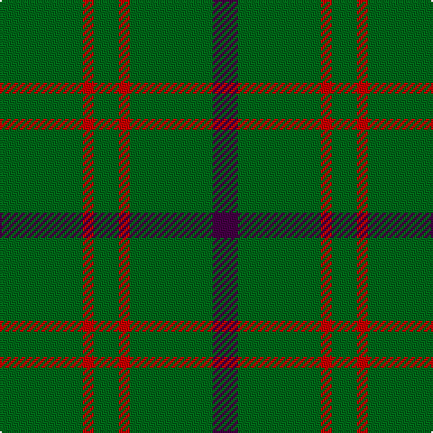

This page is one **sett** — a single exact thread-count. It belongs to the [tartan](/tartans/g23r3g7r3g23dp7/)
(the same proportion at any scale), whose colour order is pattern [BGRGRG](/stripes/bgrgrg/).

Sourced from register-of-tartans.  It is a [6 stripe tartan](/stripes/stripes6/).

Original link https://www.tartanregister.gov.uk/tartanDetails.aspx?ref=1721

## Also known as

This cloth is also recorded under:

- Highland Spring Corporate Prom

2 attestations — the source records this cloth was collapsed from (oldest owns this page)

<ul>
<li>01/01/1996 — Highland Spring (1997) (register-of-tartans, <a href="https://www.tartanregister.gov.uk/tartanDetails.aspx?ref=1721">record</a>)</li>
<li>undated — Highland Spring (Green) Corporate Prom Tartan Tartan Number: 2322. Earliest known date: 1997 Tartan Society notes say "Second tartan for Highland Spring. It is a straight substitution of colours in the original sett (#130). On the relaunch of their packaging a second tartan was needed. It had been found that the 'green' image of the Highlands carried in tartan, increased their product's competitiveness." See products available Copyright © Blair Urquhart, Comrie, 2015 (house-of-tartan, <a href="http://www.house-of-tartan.scotland.net/house/TartanViewjs.asp?colr=Def&tnam=2322">record</a>)</li>
</ul>

## Register references

External register numbers recorded for this tartan.

- Scottish Register of Tartans: [1721](https://www.tartanregister.gov.uk/tartanDetails.aspx?ref=1721)
- Scottish Tartans Authority (ITI): 2322
- Scottish Tartans World Register: 2322

## Thread count
G/46 R6 G14 R6 G46 DP/14

## Palette
Each colour and the base-6 reference it is a variant of.

| Colour | Shade | Base |
|---|---|---|
| DG | <code style="background-color:#003820;">#003820</code> `oklch(30.0% 0.070 158.3)` <small>#003820</small> | G <code style="background-color:#006100;">#006100</code> |
| DP | <code style="background-color:#440044;">#440044</code> `oklch(27.1% 0.125 328.4)` <small>#440044</small> | B <code style="background-color:#2A418A;">#2A418A</code> |
| G | <code style="background-color:#006818;">#006818</code> `oklch(45.0% 0.142 145.0)` <small>#006818</small> | G <code style="background-color:#006100;">#006100</code> |
| R | <code style="background-color:#C80000;">#C80000</code> `oklch(52.3% 0.215 29.2)` <small>#C80000</small> | R <code style="background-color:#CC0000;">#CC0000</code> |

# Sample pattern

## Nearest tartans

The nearest existing variants by ΔTartan distance, with this tartan at the top so the swatches line up against it.

ΔTartan

Tartan

Sett

—

<a href="/ttd/edit/#slug=g23r3g7r3g23dp7~x2">Highland Spring (1997)</a> <a class="nn-out" href="/setts/s6/g23r3g7r3g23dp7~x2/" title="open its dictionary page">↗</a>

1.22

<a href="/ttd/edit/#slug=dp7g23r3g7~x2">Highland Spring (1997) (Corporate)</a> <a class="nn-out" href="/setts/s4/dp7g23r3g7~x2/" title="open its dictionary page">↗</a>

1.34

<a href="/ttd/edit/#slug=g7r3g23m7~x2">Highland Spring (Green)</a> <a class="nn-out" href="/setts/s4/g7r3g23m7~x2/" title="open its dictionary page">↗</a>

1.54

<a href="/setts/s8/k8g3k4g20r3~x2/">MacArthur-Fox (Personal)</a>

1.71

<a href="/ttd/edit/#slug=dy9t3dy6t3dy20ly2~x2">Oman RAF, Sultanate of (Military)</a> <a class="nn-out" href="/setts/s6/dy9t3dy6t3dy20ly2~x2/" title="open its dictionary page">↗</a>

1.73

<a href="/ttd/edit/#slug=g9n1g2k4g2~x4">Peterhead (Personal)</a> <a class="nn-out" href="/setts/s5/g9n1g2k4g2~x4/" title="open its dictionary page">↗</a>

1.82

<a href="/ttd/edit/#slug=g46o20g9o20g46lg5~x2">O'Neill, Red</a> <a class="nn-out" href="/setts/s6/g46o20g9o20g46lg5~x2/" title="open its dictionary page">↗</a>

1.85

<a href="/ttd/edit/#slug=g2db2g6db4g3db4g18ly2~x4">Crow (Name)</a> <a class="nn-out" href="/setts/s8/g2db2g6db4g3db4g18ly2~x4/" title="open its dictionary page">↗</a>

1.86

<a href="/setts/s8/r8g3r4g44w4~x2/">Welsh National</a>

1.88

<a href="/ttd/edit/#slug=g34m4g4m4g4m12g20w5~x2">Leeds, University of (Dance)</a> <a class="nn-out" href="/setts/s8/g34m4g4m4g4m12g20w5~x2/" title="open its dictionary page">↗</a>

1.97

<a href="/ttd/edit/#slug=g16k11g16r2~x4">Kincaid of Kincaid</a> <a class="nn-out" href="/setts/s4/g16k11g16r2~x4/" title="open its dictionary page">↗</a>

## Neighbour map

Every grey dot is one of 14299 variants placed by the first two principal components of the ΔTartan feature space (44% of its variance). Red is this tartan; blue dots are its nearest — click one to open its page.

<svg viewBox="0 0 640 380" role="img" style="max-width:100%;height:auto;border:1px solid #e0e0e0;border-radius:4px;display:block" xmlns="http://www.w3.org/2000/svg"><image href="/nn/cloud.v1.png" width="640" height="380"/><a href="/setts/s4/dp7g23r3g7~x2/"><circle cx="471.7" cy="289.2" r="4" fill="#3465a4"><title>Highland Spring (1997) (Corporate)</title></circle></a><a href="/setts/s4/g7r3g23m7~x2/"><circle cx="474.2" cy="288.5" r="4" fill="#3465a4"><title>Highland Spring (Green)</title></circle></a><a href="/setts/s8/k8g3k4g20r3~x2/"><circle cx="436.1" cy="263.1" r="4" fill="#3465a4"><title>MacArthur-Fox (Personal)</title></circle></a><a href="/setts/s6/dy9t3dy6t3dy20ly2~x2/"><circle cx="559.0" cy="256.1" r="4" fill="#3465a4"><title>Oman RAF, Sultanate of (Military)</title></circle></a><a href="/setts/s5/g9n1g2k4g2~x4/"><circle cx="461.6" cy="274.4" r="4" fill="#3465a4"><title>Peterhead (Personal)</title></circle></a><a href="/setts/s6/g46o20g9o20g46lg5~x2/"><circle cx="455.5" cy="286.0" r="4" fill="#3465a4"><title>O'Neill, Red</title></circle></a><a href="/setts/s8/g2db2g6db4g3db4g18ly2~x4/"><circle cx="439.5" cy="235.0" r="4" fill="#3465a4"><title>Crow (Name)</title></circle></a><a href="/setts/s8/r8g3r4g44w4~x2/"><circle cx="576.1" cy="207.4" r="4" fill="#3465a4"><title>Welsh National</title></circle></a><a href="/setts/s8/g34m4g4m4g4m12g20w5~x2/"><circle cx="430.4" cy="226.3" r="4" fill="#3465a4"><title>Leeds, University of (Dance)</title></circle></a><a href="/setts/s4/g16k11g16r2~x4/"><circle cx="424.7" cy="321.6" r="4" fill="#3465a4"><title>Kincaid of Kincaid</title></circle></a><circle cx="515.8" cy="278.0" r="5" fill="#c00000"/></svg>

ID: /setts/s6/g23r3g7r3g23dp7~x2/
