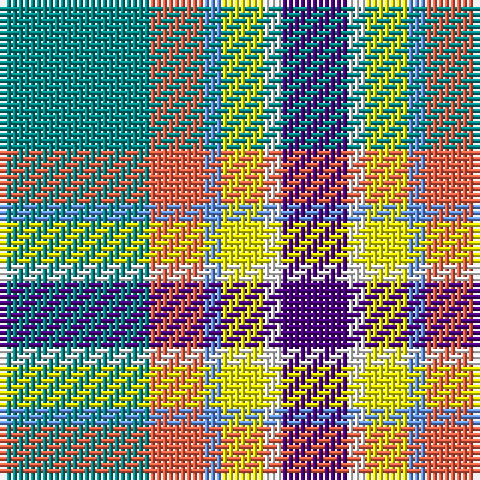

In pattern [BWYBRG](/stripes/bwybrg/).

This was sourced from register-of-tartans.  It is a [6 stripe tartan](/stripes/stripes6/).

Original link https://www.tartanregister.gov.uk/tartanDetails.aspx?ref=10085

## Register references

External register numbers recorded for this tartan.

- Scottish Register of Tartans: [10085](https://www.tartanregister.gov.uk/tartanDetails.aspx?ref=10085)

## Thread count
Ba/25 O9 B3 Y7 W3 P/11

## Palette
Each colour and the base-6 reference it is a variant of.

| Colour | Shade | Base |
|---|---|---|
| B | <code style="background-color:#6495ED;">#6495ED</code> `oklch(67.5% 0.141 261.3)` <small>#6495ED</small> | B <code style="background-color:#2A418A;">#2A418A</code> |
| Ba | <code style="background-color:#008B8B;">#008B8B</code> `oklch(57.7% 0.098 194.8)` <small>#008B8B</small> | G <code style="background-color:#006100;">#006100</code> |
| O | <code style="background-color:#FF6347;">#FF6347</code> `oklch(69.6% 0.196 32.3)` <small>#FF6347</small> | R <code style="background-color:#CC0000;">#CC0000</code> |
| P | <code style="background-color:#4B0082;">#4B0082</code> `oklch(33.9% 0.179 301.7)` <small>#4B0082</small> | B <code style="background-color:#2A418A;">#2A418A</code> |
| W | <code style="background-color:#FFFFFF;">#FFFFFF</code> `oklch(100.0% 0.000 89.9)` <small>#FFFFFF</small> | W <code style="background-color:#F7F7F7;">#F7F7F7</code> |
| Y | <code style="background-color:#FFFF00;">#FFFF00</code> `oklch(96.8% 0.211 109.8)` <small>#FFFF00</small> | Y <code style="background-color:#F2BF00;">#F2BF00</code> |

# Sample pattern

## Nearest tartans

The nearest existing variants by ΔTartan distance.

1. [Barbour -Modern](/setts/s7/lb4ly2lb21k11w2n21r2~x2/) — ΔT 0.95
1. [MacGregor-Ryan (Personal)](/setts/s6/lb67k13dy17dy13w40t20~x2/) — ΔT 1.12
1. [SCH '67 Class](/setts/s6/db3r2lr15w10k2lo3~x2/) — ΔT 1.15
1. [Crofters (Personal)](/setts/s7/db20r2g9w6ly4k2g8~x2/) — ΔT 1.18
1. [Game Fair (Corporate)](/setts/s7/dg3b12dg12w12dg2w12dg3~x2/) — ΔT 1.21
1. [MacLaren Dress](/setts/s8/db2w12k8g8r2g8k1lo2~x2/) — ΔT 1.23
1. [Alexander of Menstry Hunting](/setts/s8/m5g2m2g26k9lr9lb13w5~x2/) — ΔT 1.23
1. [Sirens & Swords](/setts/s6/dt36y20dg6w12k6r3~x2/) — ΔT 1.25
1. [Thomson Dress (Grey) (Fashion)](/setts/s6/r4o25k6w12k11ly3~x2/) — ΔT 1.26
1. [MacTavish of Dunardry (Clan)](/setts/s7/t8w28lo3g3t8k9t4~x2/) — ΔT 1.27

## Neighbour map

Every grey dot is one of 14299 variants placed by the first two principal components of the ΔTartan feature space (44% of its variance). Red is this tartan; blue dots are its nearest — click one to open its page.

<svg viewBox="0 0 640 380" role="img" style="max-width:100%;height:auto;border:1px solid #e0e0e0;border-radius:4px;display:block" xmlns="http://www.w3.org/2000/svg"><image href="/nn/cloud.v1.png" width="640" height="380"/><a href="/setts/s7/lb4ly2lb21k11w2n21r2~x2/"><circle cx="148.7" cy="143.3" r="4" fill="#3465a4"><title>Barbour -Modern</title></circle></a><a href="/setts/s6/lb67k13dy17dy13w40t20~x2/"><circle cx="90.1" cy="190.8" r="4" fill="#3465a4"><title>MacGregor-Ryan (Personal)</title></circle></a><a href="/setts/s6/db3r2lr15w10k2lo3~x2/"><circle cx="133.2" cy="155.9" r="4" fill="#3465a4"><title>SCH '67 Class</title></circle></a><a href="/setts/s7/db20r2g9w6ly4k2g8~x2/"><circle cx="130.5" cy="163.7" r="4" fill="#3465a4"><title>Crofters (Personal)</title></circle></a><a href="/setts/s7/dg3b12dg12w12dg2w12dg3~x2/"><circle cx="87.0" cy="193.6" r="4" fill="#3465a4"><title>Game Fair (Corporate)</title></circle></a><a href="/setts/s8/db2w12k8g8r2g8k1lo2~x2/"><circle cx="98.0" cy="144.7" r="4" fill="#3465a4"><title>MacLaren Dress</title></circle></a><a href="/setts/s8/m5g2m2g26k9lr9lb13w5~x2/"><circle cx="132.4" cy="145.8" r="4" fill="#3465a4"><title>Alexander of Menstry Hunting</title></circle></a><a href="/setts/s6/dt36y20dg6w12k6r3~x2/"><circle cx="154.2" cy="162.6" r="4" fill="#3465a4"><title>Sirens &amp; Swords</title></circle></a><a href="/setts/s6/r4o25k6w12k11ly3~x2/"><circle cx="141.3" cy="185.0" r="4" fill="#3465a4"><title>Thomson Dress (Grey) (Fashion)</title></circle></a><a href="/setts/s7/t8w28lo3g3t8k9t4~x2/"><circle cx="177.0" cy="161.3" r="4" fill="#3465a4"><title>MacTavish of Dunardry (Clan)</title></circle></a><circle cx="127.0" cy="167.9" r="5" fill="#c00000"/></svg>

ID: /setts/s6/g25r9b3ly7w3dp11/
