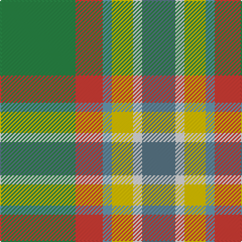

This page is one **sett** — a single exact thread-count. It belongs to the [tartan](/tartans/g25r9t3ly7w3n11/)
(the same proportion at any scale), whose colour order is pattern [BWYBRG](/stripes/bwybrg/).

Sourced from tartans-authority.  It is a [6 stripe tartan](/stripes/stripes6/).

Original link http://www.tartansauthority.com/tartan-ferret/display/10085/

## Register references

External register numbers recorded for this tartan.

- Scottish Tartans Authority (ITI): 10085

## Thread count
G/75 R27 Ba9 Y21 LN9 B/33

## Palette

Palette: <strong>Tartan Register</strong> <small style="color:#888">(2 of 6 colours)</small>
<table><thead><tr><th>Colour</th><th>Threads</th><th>Shade</th><th>Base</th><th>OKLCh</th></tr></thead><tbody><tr><td>G/</td><td style="text-align:right;font-variant-numeric:tabular-nums">75</td><td><code style="background-color:#288444;">#288444</code> <small style="color:#888">#288444</small></td><td>G <code style="background-color:#006100;">#006100</code></td><td><small style="color:#888">oklch(54.4% 0.130 149.7)</small></td></tr><tr><td>R</td><td style="text-align:right;font-variant-numeric:tabular-nums">27</td><td><code style="background-color:#CC3C34;">#CC3C34</code> <small style="color:#888">#CC3C34</small></td><td>R <code style="background-color:#CC0000;">#CC0000</code></td><td><small style="color:#888">oklch(56.8% 0.182 27.7)</small></td></tr><tr><td>Ba</td><td style="text-align:right;font-variant-numeric:tabular-nums">9</td><td><code style="background-color:#6898B0;">#6898B0</code> <small style="color:#888">#6898B0</small></td><td>B <code style="background-color:#2A418A;">#2A418A</code></td><td><small style="color:#888">oklch(65.4% 0.063 230.6)</small></td></tr><tr><td>Y</td><td style="text-align:right;font-variant-numeric:tabular-nums">21</td><td><code style="background-color:#E8C000;">#E8C000</code> <small style="color:#888">#E8C000</small></td><td>Y <code style="background-color:#F2BF00;">#F2BF00</code></td><td><small style="color:#888">oklch(81.9% 0.168 93.7)</small></td></tr><tr><td>LN</td><td style="text-align:right;font-variant-numeric:tabular-nums">9</td><td><code style="background-color:#E0E0E0;">#E0E0E0</code> <small style="color:#888">#E0E0E0</small></td><td>W <code style="background-color:#F7F7F7;">#F7F7F7</code></td><td><small style="color:#888">oklch(90.7% 0.000 89.9)</small></td></tr><tr><td>B/</td><td style="text-align:right;font-variant-numeric:tabular-nums">33</td><td><code style="background-color:#587484;">#587484</code> <small style="color:#888">#587484</small></td><td>B <code style="background-color:#2A418A;">#2A418A</code></td><td><small style="color:#888">oklch(54.3% 0.041 233.6)</small></td></tr></tbody></table>

# Sample pattern

## Nearest tartans

The nearest existing variants by ΔTartan distance, with this tartan at the top so the swatches line up against it.

ΔTartan

Tartan

Sett

—

<a href="/ttd/edit/#slug=g25r9t3ly7w3n11~x3">Montessori School of Denver (School)</a> <a class="nn-out" href="/setts/s6/g25r9t3ly7w3n11~x3/" title="open its dictionary page">↗</a>

0.76

<a href="/ttd/edit/#slug=w1y1p2y7g1gi5ly1~x4">Deeside</a> <a class="nn-out" href="/setts/s7/w1y1p2y7g1gi5ly1~x4/" title="open its dictionary page">↗</a>

1.12

<a href="/ttd/edit/#slug=o3lb2g19lb6g2lb6oi14m4w2~x2">Royal Pharmaceutical, Society</a> <a class="nn-out" href="/setts/s9/o3lb2g19lb6g2lb6oi14m4w2~x2/" title="open its dictionary page">↗</a>

1.18

<a href="/ttd/edit/#slug=lo5g23b21loi30k10loi4g4loi16lb3~x2">State Seal of Kansas (Fashion)</a> <a class="nn-out" href="/setts/s9/lo5g23b21loi30k10loi4g4loi16lb3~x2/" title="open its dictionary page">↗</a>

1.51

<a href="/ttd/edit/#slug=lo6t16lb3y3o3g3w2~x4">Atikokan (District)</a> <a class="nn-out" href="/setts/s7/lo6t16lb3y3o3g3w2~x4/" title="open its dictionary page">↗</a>

1.54

<a href="/ttd/edit/#slug=g9lb2g9k2dy14ly4lb2r2~x4">McShane (Personal)</a> <a class="nn-out" href="/setts/s8/g9lb2g9k2dy14ly4lb2r2~x4/" title="open its dictionary page">↗</a>

1.54

<a href="/ttd/edit/#slug=o17y5db2w12db2ly4g7~x2">Ontario, Northern</a> <a class="nn-out" href="/setts/s7/o17y5db2w12db2ly4g7~x2/" title="open its dictionary page">↗</a>

1.57

<a href="/ttd/edit/#slug=b30ly3dy11ly3g33r6~x2">Balfour Hunting</a> <a class="nn-out" href="/setts/s6/b30ly3dy11ly3g33r6~x2/" title="open its dictionary page">↗</a>

1.58

<a href="/ttd/edit/#slug=r4g3o8w3o4g18ly3~x2">Newfoundland</a> <a class="nn-out" href="/setts/s7/r4g3o8w3o4g18ly3~x2/" title="open its dictionary page">↗</a>

1.60

<a href="/ttd/edit/#slug=db4k1g18dy2g11dy11lg18k1r4~x2">Morgan in Maryland (USA) (Name)</a> <a class="nn-out" href="/setts/s9/db4k1g18dy2g11dy11lg18k1r4~x2/" title="open its dictionary page">↗</a>

1.61

<a href="/ttd/edit/#slug=gi2lo1gi12lb6g12r1~x4">City of Vancouver (Commemorative)</a> <a class="nn-out" href="/setts/s6/gi2lo1gi12lb6g12r1~x4/" title="open its dictionary page">↗</a>

## Neighbour map

Every grey dot is one of 14359 variants placed by the first two principal components of the ΔTartan feature space (44% of its variance). Red is this tartan; blue dots are its nearest — click one to open its page.

<svg viewBox="0 0 640 380" role="img" style="max-width:100%;height:auto;border:1px solid #e0e0e0;border-radius:4px;display:block" xmlns="http://www.w3.org/2000/svg"><image href="/nn/cloud.v1.png" width="640" height="380"/><a href="/setts/s7/w1y1p2y7g1gi5ly1~x4/"><circle cx="189.6" cy="188.7" r="4" fill="#3465a4"><title>Deeside</title></circle></a><a href="/setts/s9/o3lb2g19lb6g2lb6oi14m4w2~x2/"><circle cx="154.6" cy="165.0" r="4" fill="#3465a4"><title>Royal Pharmaceutical, Society</title></circle></a><a href="/setts/s9/lo5g23b21loi30k10loi4g4loi16lb3~x2/"><circle cx="174.3" cy="180.7" r="4" fill="#3465a4"><title>State Seal of Kansas (Fashion)</title></circle></a><a href="/setts/s7/lo6t16lb3y3o3g3w2~x4/"><circle cx="167.6" cy="168.1" r="4" fill="#3465a4"><title>Atikokan (District)</title></circle></a><a href="/setts/s8/g9lb2g9k2dy14ly4lb2r2~x4/"><circle cx="156.1" cy="190.0" r="4" fill="#3465a4"><title>McShane (Personal)</title></circle></a><a href="/setts/s7/o17y5db2w12db2ly4g7~x2/"><circle cx="104.5" cy="174.6" r="4" fill="#3465a4"><title>Ontario, Northern</title></circle></a><a href="/setts/s6/b30ly3dy11ly3g33r6~x2/"><circle cx="216.8" cy="209.7" r="4" fill="#3465a4"><title>Balfour Hunting</title></circle></a><a href="/setts/s7/r4g3o8w3o4g18ly3~x2/"><circle cx="224.5" cy="215.3" r="4" fill="#3465a4"><title>Newfoundland</title></circle></a><a href="/setts/s9/db4k1g18dy2g11dy11lg18k1r4~x2/"><circle cx="198.8" cy="146.7" r="4" fill="#3465a4"><title>Morgan in Maryland (USA) (Name)</title></circle></a><a href="/setts/s6/gi2lo1gi12lb6g12r1~x4/"><circle cx="246.1" cy="215.0" r="4" fill="#3465a4"><title>City of Vancouver (Commemorative)</title></circle></a><circle cx="182.3" cy="200.9" r="5" fill="#c00000"/></svg>

ID: /setts/s6/g25r9t3ly7w3n11~x3/
