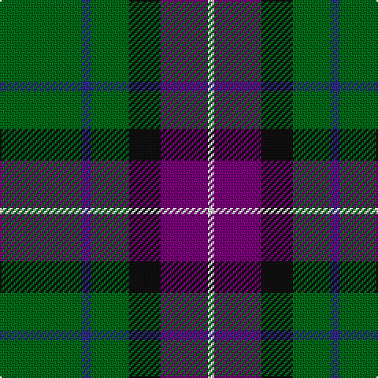

This page is one **sett** — a single exact thread-count. It belongs to the [tartan](/tartans/g26db3g12k10dp15w2/)
(the same proportion at any scale), whose colour order is pattern [GBGKBW](/stripes/gbgkbw/).

Sourced from register-of-tartans.  It is a [6 stripe tartan](/stripes/stripes6/).

Original link https://www.tartanregister.gov.uk/tartanDetails.aspx?ref=2225

2 attestations — the source records this cloth was collapsed from (oldest owns this page)

<ul>
<li>01/04/1996 — Lossiemouth/Hersbruck (register-of-tartans, <a href="https://www.tartanregister.gov.uk/tartanDetails.aspx?ref=2225">record</a>)</li>
<li>pre 1997 — Lossiemouth/Hersbruck (Commem) (tartans-authority, <a href="http://www.tartansauthority.com/tartan-ferret/display/2311/">record</a>)</li>
</ul>

## Register references

External register numbers recorded for this tartan.

- Scottish Register of Tartans: [2225](https://www.tartanregister.gov.uk/tartanDetails.aspx?ref=2225)
- Scottish Tartans Authority (ITI): 2311
- Scottish Tartans World Register: 2311

## Thread count
G/52 DB6 G24 K20 P30 LN/4

## Palette

Palette: <strong>Tartan Register</strong>
<table><thead><tr><th>Colour</th><th>Threads</th><th>Shade</th><th>Base</th><th>OKLCh</th></tr></thead><tbody><tr><td>G/</td><td style="text-align:right;font-variant-numeric:tabular-nums">52</td><td><code style="background-color:#006818;">#006818</code> <small style="color:#888">#006818</small></td><td>G <code style="background-color:#006100;">#006100</code></td><td><small style="color:#888">oklch(45.0% 0.142 145.0)</small></td></tr><tr><td>DB</td><td style="text-align:right;font-variant-numeric:tabular-nums">6</td><td><code style="background-color:#2C2C80;">#2C2C80</code> <small style="color:#888">#2C2C80</small></td><td>B <code style="background-color:#2A418A;">#2A418A</code></td><td><small style="color:#888">oklch(35.0% 0.138 276.6)</small></td></tr><tr><td>G</td><td style="text-align:right;font-variant-numeric:tabular-nums">24</td><td><code style="background-color:#006818;">#006818</code> <small style="color:#888">#006818</small></td><td>G <code style="background-color:#006100;">#006100</code></td><td><small style="color:#888">oklch(45.0% 0.142 145.0)</small></td></tr><tr><td>K</td><td style="text-align:right;font-variant-numeric:tabular-nums">20</td><td><code style="background-color:#101010;">#101010</code> <small style="color:#888">#101010</small></td><td>K <code style="background-color:#000000;">#000000</code></td><td><small style="color:#888">oklch(17.3% 0.000 89.9)</small></td></tr><tr><td>P</td><td style="text-align:right;font-variant-numeric:tabular-nums">30</td><td><code style="background-color:#780078;">#780078</code> <small style="color:#888">#780078</small></td><td>B <code style="background-color:#2A418A;">#2A418A</code></td><td><small style="color:#888">oklch(40.2% 0.185 328.4)</small></td></tr><tr><td>LN/</td><td style="text-align:right;font-variant-numeric:tabular-nums">4</td><td><code style="background-color:#E0E0E0;">#E0E0E0</code> <small style="color:#888">#E0E0E0</small></td><td>W <code style="background-color:#F7F7F7;">#F7F7F7</code></td><td><small style="color:#888">oklch(90.7% 0.000 89.9)</small></td></tr></tbody></table>

# Sample pattern

## Nearest tartans

The nearest existing variants by ΔTartan distance, with this tartan at the top so the swatches line up against it.

ΔTartan

Tartan

Sett

—

<a href="/ttd/edit/#slug=g26db3g12k10dp15w2~x2">Lossiemouth/Hersbruck</a> <a class="nn-out" href="/setts/s6/g26db3g12k10dp15w2~x2/" title="open its dictionary page">↗</a>

0.81

<a href="/ttd/edit/#slug=g20k2g20dp25w2t3~x2">Lawrence of Broughty Ferry (Corporat</a> <a class="nn-out" href="/setts/s6/g20k2g20dp25w2t3~x2/" title="open its dictionary page">↗</a>

0.95

<a href="/ttd/edit/#slug=g8k2g13r4g12dp22g5ly3~x2">Taylor Family Tartan Tartan Number: 809. Earliest known date: 1955 Some similarity to the Cameron recorded in the Vestiarium Scoticum, which may be connected with the name of the designer, Lt Col Iain Cameron Taylor, or to the Clan Cameron warrior Taillear dubh na Tuaighe (Black Taylor of the Axe) who lived in the seventeenth century. The pink stripe is described as 'coral'. The tartan is recognised by the Cameron of Lochiel. See products available Copyright © Blair Urquhart, Comrie, 2015</a> <a class="nn-out" href="/setts/s8/g8k2g13r4g12dp22g5ly3~x2/" title="open its dictionary page">↗</a>

0.96

<a href="/ttd/edit/#slug=dg2k1dg12r4dg3db9lb2~x4">Lee (Personal)</a> <a class="nn-out" href="/setts/s7/dg2k1dg12r4dg3db9lb2~x4/" title="open its dictionary page">↗</a>

1.09

<a href="/ttd/edit/#slug=k4g21w3g21db21r4~x2">Duncan</a> <a class="nn-out" href="/setts/s6/k4g21w3g21db21r4~x2/" title="open its dictionary page">↗</a>

1.12

<a href="/ttd/edit/#slug=k17g48ly4r10db12g4">Asheville Firefighters, The</a> <a class="nn-out" href="/setts/s6/k17g48ly4r10db12g4/" title="open its dictionary page">↗</a>

1.14

<a href="/ttd/edit/#slug=k17dg48ly4r10lb12dg4">Asheville Firefighters, The</a> <a class="nn-out" href="/setts/s6/k17dg48ly4r10lb12dg4/" title="open its dictionary page">↗</a>

1.15

<a href="/ttd/edit/#slug=r3k8g17ly2g17k8b8k2~x2">Aztec, New Mexico</a> <a class="nn-out" href="/setts/s8/r3k8g17ly2g17k8b8k2~x2/" title="open its dictionary page">↗</a>

1.19

<a href="/ttd/edit/#slug=dg3w1dg12r6dg3k3g2~x4">Arkansas</a> <a class="nn-out" href="/setts/s7/dg3w1dg12r6dg3k3g2~x4/" title="open its dictionary page">↗</a>

1.20

<a href="/ttd/edit/#slug=lo10w4dg30k22dg27n4lb2~x2">Aggreko Shepherd (Personal)</a> <a class="nn-out" href="/setts/s7/lo10w4dg30k22dg27n4lb2~x2/" title="open its dictionary page">↗</a>

1.22

<a href="/ttd/edit/#slug=g40k15b10k10ly3~x2">U.S. Border Patrol (Corporate)</a> <a class="nn-out" href="/setts/s5/g40k15b10k10ly3~x2/" title="open its dictionary page">↗</a>

## Neighbour map

Every grey dot is one of 14359 variants placed by the first two principal components of the ΔTartan feature space (44% of its variance). Red is this tartan; blue dots are its nearest — click one to open its page.

<svg viewBox="0 0 640 380" role="img" style="max-width:100%;height:auto;border:1px solid #e0e0e0;border-radius:4px;display:block" xmlns="http://www.w3.org/2000/svg"><image href="/nn/cloud.v1.png" width="640" height="380"/><a href="/setts/s6/g20k2g20dp25w2t3~x2/"><circle cx="303.1" cy="198.1" r="4" fill="#3465a4"><title>Lawrence of Broughty Ferry (Corporat</title></circle></a><a href="/setts/s8/g8k2g13r4g12dp22g5ly3~x2/"><circle cx="274.1" cy="194.5" r="4" fill="#3465a4"><title>Taylor Family Tartan Tartan Number: 809. Earliest known date: 1955 Some similarity to the Cameron recorded in the Vestiarium Scoticum, which may be connected with the name of the designer, Lt Col Iain Cameron Taylor, or to the Clan Cameron warrior Taillear dubh na Tuaighe (Black Taylor of the Axe) who lived in the seventeenth century. The pink stripe is described as 'coral'. The tartan is recognised by the Cameron of Lochiel. See products available Copyright © Blair Urquhart, Comrie, 2015</title></circle></a><a href="/setts/s7/dg2k1dg12r4dg3db9lb2~x4/"><circle cx="248.2" cy="195.7" r="4" fill="#3465a4"><title>Lee (Personal)</title></circle></a><a href="/setts/s6/k4g21w3g21db21r4~x2/"><circle cx="264.6" cy="235.8" r="4" fill="#3465a4"><title>Duncan</title></circle></a><a href="/setts/s6/k17g48ly4r10db12g4/"><circle cx="278.3" cy="190.3" r="4" fill="#3465a4"><title>Asheville Firefighters, The</title></circle></a><a href="/setts/s6/k17dg48ly4r10lb12dg4/"><circle cx="261.5" cy="178.8" r="4" fill="#3465a4"><title>Asheville Firefighters, The</title></circle></a><a href="/setts/s8/r3k8g17ly2g17k8b8k2~x2/"><circle cx="222.5" cy="208.6" r="4" fill="#3465a4"><title>Aztec, New Mexico</title></circle></a><a href="/setts/s7/dg3w1dg12r6dg3k3g2~x4/"><circle cx="294.4" cy="191.3" r="4" fill="#3465a4"><title>Arkansas</title></circle></a><a href="/setts/s7/lo10w4dg30k22dg27n4lb2~x2/"><circle cx="263.6" cy="171.3" r="4" fill="#3465a4"><title>Aggreko Shepherd (Personal)</title></circle></a><a href="/setts/s5/g40k15b10k10ly3~x2/"><circle cx="279.6" cy="217.3" r="4" fill="#3465a4"><title>U.S. Border Patrol (Corporate)</title></circle></a><circle cx="275.1" cy="208.3" r="5" fill="#c00000"/></svg>

ID: /setts/s6/g26db3g12k10dp15w2~x2/
