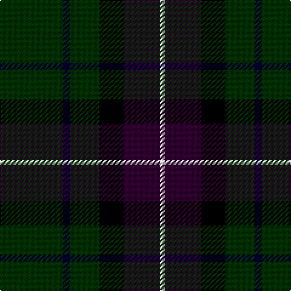

In pattern [GKGKBW](/patterns/gkgkbw/).

This was sourced from weddslist.  It is a [6 stripes tartan](/stripes/stripes6/).

Original link http://www.weddslist.com/cgi-bin/tartans/pg.pl?source=sts

## Thread count
DG/52 DB6 DG24 K20 DP30 LN/4

## Palette
Each colour and its ΔE from the base-6 reference it is a variant of.

| Colour | Shade | Base | ΔE (OKLab) |
|---|---|---|---|
| DB | <code style="background-color:#000030;">#000030</code> `#000030` | K <code style="background-color:#000000;">#000000</code> | 0.17 |
| DG | <code style="background-color:#003000;">#003000</code> `#003000` | G <code style="background-color:#006100;">#006100</code> | 0.17 |
| DP | <code style="background-color:#300030;">#300030</code> `#300030` | B <code style="background-color:#2A418A;">#2A418A</code> | 0.22 |
| K | <code style="background-color:#000000;">#000000</code> `#000000` | K <code style="background-color:#000000;">#000000</code> | 0.00 |
| LN | <code style="background-color:#E0E0E0;">#E0E0E0</code> `#E0E0E0` | W <code style="background-color:#F7F7F7;">#F7F7F7</code> | 0.07 |

# Sample pattern

## Nearest tartans

The nearest existing variants by ΔTartan distance.

1. [Joe Strummer Commemorative](/setts/s7/k3g3ga6k12gb1gc2g2x4~g572700-ga794400-gb675223-gc524e26-k00011f/) — ΔT 1.16
1. [Grass of Rasunda (Commemorative)](/setts/s7/k14g7k2ga8k4y2k1x4~g003820-ga5c6428-k101010-ye8c000/) — ΔT 1.18
1. [Grass of Rasunda (2009), The](/setts/s7/k14g7k2ga8k4y2k1x4~g052f14-ga5a601e-k120a01-ye0a126/) — ΔT 1.21
1. [Black Raven (Fashion)](/setts/s7/k62b15ba15g20y5b5k15x2~b2c2c80-ba1870a4-g604000-k101010-yc4bc68/) — ΔT 1.27
1. [Granger Family Tartan Tartan Number: 2226. Earliest known date: 1994 Designed by Steve Granger as a private family tartan. See products available Copyright © Blair Urquhart, Comrie, 2015](/setts/s6/k40b4k12b21g17k4x2~b1c1c1c-g00643c-k000000/) — ΔT 1.30
1. [Duncan](/setts/s6/k4g21y3g21b21r4x2~b000052-g11450d-k000000-raa0000-yaaaaaa/) — ΔT 1.33
1. [Duncan](/setts/s6/k4g21y3g21b21r4~b000052-g11450d-k000000-raa0000-yaaaaaa/) — ΔT 1.33
1. [Tolmie](/setts/s5/k8y1k8g13r2x4~g005020-k101010-rff0000-yd87c00/) — ΔT 1.34
1. [Gorman, George (Personal)](/setts/s6/g9ga1b2ga1k4r1x12~b450082-g003000-ga026306-k020031-rcb080c/) — ΔT 1.41
1. [O'Connell, William Benedict (Personal)](/setts/s10/k19g7k7b2g20ka9g6ka4g10w3x2~b3c82af-g003c14-k000028-ka101010-we0e0e0/) — ΔT 1.43

## Neighbour map

Every grey dot is one of 15726 variants placed by the first two principal components of the ΔTartan feature space (44% of its variance). Red is this tartan; blue dots are its nearest — click one to open its page.

<svg viewBox="0 0 640 380" role="img" style="max-width:100%;height:auto;border:1px solid #e0e0e0;border-radius:4px;display:block" xmlns="http://www.w3.org/2000/svg"><image href="/nn/cloud.v1.png" width="640" height="380"/><a href="/setts/s7/k3g3ga6k12gb1gc2g2x4~g572700-ga794400-gb675223-gc524e26-k00011f/"><circle cx="282.6" cy="201.6" r="4" fill="#3465a4"><title>Joe Strummer Commemorative</title></circle></a><a href="/setts/s7/k14g7k2ga8k4y2k1x4~g003820-ga5c6428-k101010-ye8c000/"><circle cx="310.5" cy="215.5" r="4" fill="#3465a4"><title>Grass of Rasunda (Commemorative)</title></circle></a><a href="/setts/s7/k14g7k2ga8k4y2k1x4~g052f14-ga5a601e-k120a01-ye0a126/"><circle cx="318.8" cy="218.2" r="4" fill="#3465a4"><title>Grass of Rasunda (2009), The</title></circle></a><a href="/setts/s7/k62b15ba15g20y5b5k15x2~b2c2c80-ba1870a4-g604000-k101010-yc4bc68/"><circle cx="302.2" cy="192.6" r="4" fill="#3465a4"><title>Black Raven (Fashion)</title></circle></a><a href="/setts/s6/k40b4k12b21g17k4x2~b1c1c1c-g00643c-k000000/"><circle cx="297.6" cy="247.5" r="4" fill="#3465a4"><title>Granger Family Tartan Tartan Number: 2226. Earliest known date: 1994 Designed by Steve Granger as a private family tartan. See products available Copyright © Blair Urquhart, Comrie, 2015</title></circle></a><a href="/setts/s6/k4g21y3g21b21r4x2~b000052-g11450d-k000000-raa0000-yaaaaaa/"><circle cx="275.1" cy="241.7" r="4" fill="#3465a4"><title>Duncan</title></circle></a><a href="/setts/s6/k4g21y3g21b21r4~b000052-g11450d-k000000-raa0000-yaaaaaa/"><circle cx="275.1" cy="241.7" r="4" fill="#3465a4"><title>Duncan</title></circle></a><a href="/setts/s5/k8y1k8g13r2x4~g005020-k101010-rff0000-yd87c00/"><circle cx="305.4" cy="243.6" r="4" fill="#3465a4"><title>Tolmie</title></circle></a><a href="/setts/s6/g9ga1b2ga1k4r1x12~b450082-g003000-ga026306-k020031-rcb080c/"><circle cx="273.7" cy="215.4" r="4" fill="#3465a4"><title>Gorman, George (Personal)</title></circle></a><a href="/setts/s10/k19g7k7b2g20ka9g6ka4g10w3x2~b3c82af-g003c14-k000028-ka101010-we0e0e0/"><circle cx="243.0" cy="215.1" r="4" fill="#3465a4"><title>O'Connell, William Benedict (Personal)</title></circle></a><circle cx="299.5" cy="224.4" r="5" fill="#c00000"/></svg>

ID: /setts/s6/g26k3g12ka10b15w2x2~b300030-g003000-k000030-ka000000-we0e0e0/
