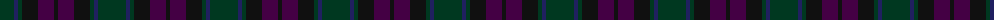

In pattern [GBGKBK](/patterns/gbgkbk/).

This was sourced from register-of-tartans.  It is a [6 stripes tartan](/stripes/stripes6/).

Original link https://www.tartanregister.gov.uk/tartanDetails.aspx?ref=2281

## Thread count
DG/28 DB4 DG4 K16 DP16 K/4

## Palette
Each colour and its ΔE from the base-6 reference it is a variant of.

| Colour | Shade | Base | ΔE (OKLab) |
|---|---|---|---|
| DB | <code style="background-color:#202060;">#202060</code> `#202060` | B <code style="background-color:#2C4084;">#2C4084</code> | 0.11 |
| DG | <code style="background-color:#003820;">#003820</code> `#003820` | G <code style="background-color:#006400;">#006400</code> | 0.16 |
| DP | <code style="background-color:#440044;">#440044</code> `#440044` | B <code style="background-color:#2C4084;">#2C4084</code> | 0.17 |
| K | <code style="background-color:#101010;">#101010</code> `#101010` | K <code style="background-color:#000000;">#000000</code> | 0.17 |

# Sample pattern

## Nearest tartans

The nearest existing variants by ΔTartan distance.

1. [Inneryne (Personal)](/setts/s7/b8k8b32k28g28r6g6-b141e46-g003c14-k101010-r781c38/) — ΔT 1.12
1. [Amazing Union (Personal)](/setts/s9/r8b60g48b8ba48b8g48b60ra8-b441800-ba101034-g003820-ra47800-raa80020/) — ΔT 1.52
1. [Williamson/Smart](/setts/s8/b20g6b20r6k42ga40k30r6-b1a2b47-g75786c-ga052f14-k120a01-r89051b/) — ΔT 1.62
1. [MacRae, Special Hunting](/setts/s8/b36ba4b10r4b10k42ka40k10-b002814-ba2c4084-k101010-ka000028-rdc0000/) — ΔT 1.66
1. [Calais (Fashion)](/setts/s7/b44ba16b24g44ba4k4g16-b085454-ba306084-g604000-k000000/) — ΔT 1.69
1. [Dempster Family Tartan Tartan Number: 2219. Earliest known date: 2001 Designed by Claire Donaldson of the House of Edgar. See products available Copyright © Blair Urquhart, Comrie, 2015](/setts/s7/b8g4ba32ba20g20b64bb6-b14283c-ba4c0000-bb5c5c5c-g285800/) — ΔT 1.74
1. [St. Mirren (Corporate)](/setts/s12/b10k4ba16k4ba10k16ba8k24ba28r3b4r3-b404040-ba343434-k101010-r880000/) — ΔT 1.77
1. [McWilliams (2014)](/setts/s12/b6k4b26k18ba6k4ba28k4ba6k18b30k6-b003c64-ba4c3428-k101010/) — ΔT 1.77
1. [Lochinvar Marine Harvest Corporate Tartan Tartan Number: 2102. Earliest known date: 1989 Colours represents the Scottish hills, the water, and the heather. See products available Copyright © Blair Urquhart, Comrie, 2015](/setts/s13/g20k4g4k4g4k14b16ba4b16k14g16k4g4-b202060-ba780078-g003820-k101010/) — ΔT 1.80
1. [MacAndreis](/setts/s10/k6g8b50k32g6k6g6k6g12r6-b383c60-g28442c-k101010-r883834/) — ΔT 1.82

## Neighbour map

Every grey dot is one of 15726 variants placed by the first two principal components of the ΔTartan feature space (44% of its variance). Red is this tartan; blue dots are its nearest — click one to open its page.

<svg viewBox="0 0 640 380" role="img" style="max-width:100%;height:auto;border:1px solid #e0e0e0;border-radius:4px;display:block" xmlns="http://www.w3.org/2000/svg"><image href="/nn/cloud.v1.png" width="640" height="380"/><a href="/setts/s7/b8k8b32k28g28r6g6-b141e46-g003c14-k101010-r781c38/"><circle cx="288.1" cy="316.1" r="4" fill="#3465a4"><title>Inneryne (Personal)</title></circle></a><a href="/setts/s9/r8b60g48b8ba48b8g48b60ra8-b441800-ba101034-g003820-ra47800-raa80020/"><circle cx="318.4" cy="264.3" r="4" fill="#3465a4"><title>Amazing Union (Personal)</title></circle></a><a href="/setts/s8/b20g6b20r6k42ga40k30r6-b1a2b47-g75786c-ga052f14-k120a01-r89051b/"><circle cx="261.5" cy="266.6" r="4" fill="#3465a4"><title>Williamson/Smart</title></circle></a><a href="/setts/s8/b36ba4b10r4b10k42ka40k10-b002814-ba2c4084-k101010-ka000028-rdc0000/"><circle cx="298.6" cy="258.4" r="4" fill="#3465a4"><title>MacRae, Special Hunting</title></circle></a><a href="/setts/s7/b44ba16b24g44ba4k4g16-b085454-ba306084-g604000-k000000/"><circle cx="366.3" cy="279.0" r="4" fill="#3465a4"><title>Calais (Fashion)</title></circle></a><a href="/setts/s7/b8g4ba32ba20g20b64bb6-b14283c-ba4c0000-bb5c5c5c-g285800/"><circle cx="380.4" cy="239.7" r="4" fill="#3465a4"><title>Dempster Family Tartan Tartan Number: 2219. Earliest known date: 2001 Designed by Claire Donaldson of the House of Edgar. See products available Copyright © Blair Urquhart, Comrie, 2015</title></circle></a><a href="/setts/s12/b10k4ba16k4ba10k16ba8k24ba28r3b4r3-b404040-ba343434-k101010-r880000/"><circle cx="386.4" cy="269.0" r="4" fill="#3465a4"><title>St. Mirren (Corporate)</title></circle></a><a href="/setts/s12/b6k4b26k18ba6k4ba28k4ba6k18b30k6-b003c64-ba4c3428-k101010/"><circle cx="329.1" cy="278.5" r="4" fill="#3465a4"><title>McWilliams (2014)</title></circle></a><a href="/setts/s13/g20k4g4k4g4k14b16ba4b16k14g16k4g4-b202060-ba780078-g003820-k101010/"><circle cx="279.0" cy="290.6" r="4" fill="#3465a4"><title>Lochinvar Marine Harvest Corporate Tartan Tartan Number: 2102. Earliest known date: 1989 Colours represents the Scottish hills, the water, and the heather. See products available Copyright © Blair Urquhart, Comrie, 2015</title></circle></a><a href="/setts/s10/k6g8b50k32g6k6g6k6g12r6-b383c60-g28442c-k101010-r883834/"><circle cx="304.0" cy="235.7" r="4" fill="#3465a4"><title>MacAndreis</title></circle></a><circle cx="341.7" cy="300.5" r="5" fill="#c00000"/></svg>

ID: /setts/s6/g28b4g4k16ba16k4-b202060-ba440044-g003820-k101010/
