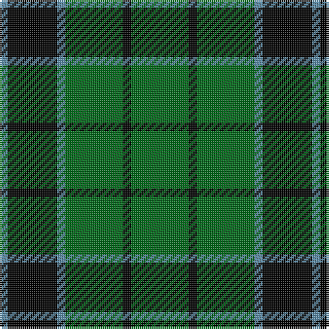

In pattern [BKBGKG](/patterns/bkbgkg/).

This was sourced from tartans-authority.  It is a [6 stripes tartan](/stripes/stripes6/).

Original link http://www.tartansauthority.com/tartan-ferret/display/235/

## Thread count
B/4 K24 B4 G28 K4 G/28

## Palette
Each colour and its ΔE from the base-6 reference it is a variant of.

| Colour | Shade | Base | ΔE (OKLab) |
|---|---|---|---|
| B | <code style="background-color:#5C8CA8;">#5C8CA8</code> `#5C8CA8` | B <code style="background-color:#2C4084;">#2C4084</code> | 0.23 |
| G | <code style="background-color:#006818;">#006818</code> `#006818` | G <code style="background-color:#006400;">#006400</code> | 0.02 |
| K | <code style="background-color:#000000;">#000000</code> `#000000` | K <code style="background-color:#000000;">#000000</code> | 0.00 |

# Sample pattern

## Nearest tartans

The nearest existing variants by ΔTartan distance.

1. [Innes](/setts/s6/g14k2g14b2k12b2-b5480b0-g008000-k000000/) — ΔT 0.62
1. [MacArthur-Fox](/setts/s5/k19g8k10g31r3-g008000-k000000-rc00000/) — ΔT 1.05
1. [MacArthur](/setts/s6/g36y4g36k8g4k30-g008000-k000000-yf0c000/) — ΔT 1.10
1. [MacArthur](/setts/s5/k36g12k12g48y8-g006818-k101010-ye8c000/) — ΔT 1.18
1. [Scotch Tape 2 (Corporate)](/setts/s4/k6g30k40y6-g006818-k101010-ye8c000/) — ΔT 1.22
1. [Granger](/setts/s6/g80k8g24k42g34w8-g006030-k000000-we0e0e0/) — ΔT 1.28
1. [MacArthur](/setts/s5/k32g6k12g30y3-g008000-k000000-yf0c000/) — ΔT 1.31
1. [MacLean of Duart Hunting](/setts/s8/g6k12w4k12g4k4g32k4-g006428-k101010-we0e0e0/) — ΔT 1.35
1. [Lauder](/setts/s6/g6b16g6k8g30r4-b304080-g008000-k000000-rc00000/) — ΔT 1.35
1. [Bumbee #1 (Fashion)](/setts/s4/g80k16b40g8-b300048-g006818-k000000/) — ΔT 1.40

## Neighbour map

Every grey dot is one of 15726 variants placed by the first two principal components of the ΔTartan feature space (44% of its variance). Red is this tartan; blue dots are its nearest — click one to open its page.

<svg viewBox="0 0 640 380" role="img" style="max-width:100%;height:auto;border:1px solid #e0e0e0;border-radius:4px;display:block" xmlns="http://www.w3.org/2000/svg"><image href="/nn/cloud.v1.png" width="640" height="380"/><a href="/setts/s6/g14k2g14b2k12b2-b5480b0-g008000-k000000/"><circle cx="297.4" cy="250.1" r="4" fill="#3465a4"><title>Innes</title></circle></a><a href="/setts/s5/k19g8k10g31r3-g008000-k000000-rc00000/"><circle cx="293.5" cy="248.7" r="4" fill="#3465a4"><title>MacArthur-Fox</title></circle></a><a href="/setts/s6/g36y4g36k8g4k30-g008000-k000000-yf0c000/"><circle cx="333.9" cy="242.6" r="4" fill="#3465a4"><title>MacArthur</title></circle></a><a href="/setts/s5/k36g12k12g48y8-g006818-k101010-ye8c000/"><circle cx="281.6" cy="277.0" r="4" fill="#3465a4"><title>MacArthur</title></circle></a><a href="/setts/s4/k6g30k40y6-g006818-k101010-ye8c000/"><circle cx="311.4" cy="277.6" r="4" fill="#3465a4"><title>Scotch Tape 2 (Corporate)</title></circle></a><a href="/setts/s6/g80k8g24k42g34w8-g006030-k000000-we0e0e0/"><circle cx="390.9" cy="245.1" r="4" fill="#3465a4"><title>Granger</title></circle></a><a href="/setts/s5/k32g6k12g30y3-g008000-k000000-yf0c000/"><circle cx="291.2" cy="245.2" r="4" fill="#3465a4"><title>MacArthur</title></circle></a><a href="/setts/s8/g6k12w4k12g4k4g32k4-g006428-k101010-we0e0e0/"><circle cx="318.8" cy="228.7" r="4" fill="#3465a4"><title>MacLean of Duart Hunting</title></circle></a><a href="/setts/s6/g6b16g6k8g30r4-b304080-g008000-k000000-rc00000/"><circle cx="286.7" cy="232.0" r="4" fill="#3465a4"><title>Lauder</title></circle></a><a href="/setts/s4/g80k16b40g8-b300048-g006818-k000000/"><circle cx="354.9" cy="262.0" r="4" fill="#3465a4"><title>Bumbee #1 (Fashion)</title></circle></a><circle cx="309.7" cy="255.1" r="5" fill="#c00000"/></svg>

ID: /setts/s6/g28k4g28b4k24b4-b5c8ca8-g006818-k000000/
