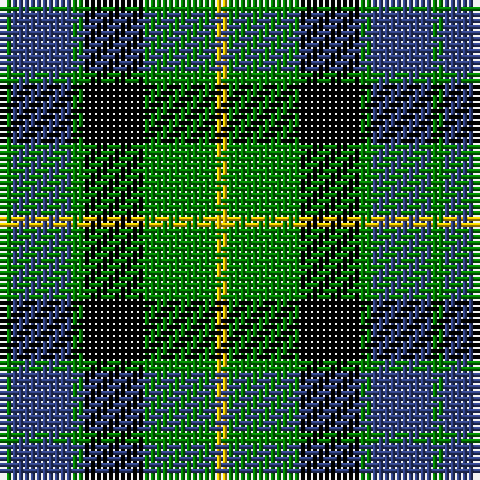

In pattern [GBGKGY](/patterns/gbgkgy/).

This was sourced from weddslist.  It is a [6 stripes tartan](/stripes/stripes6/).

Original link http://www.weddslist.com/cgi-bin/tartans/pg.pl?source=sts

## Thread count
G/2 B10 G2 K10 G12 Y/2

## Palette
Each colour and its ΔE from the base-6 reference it is a variant of.

| Colour | Shade | Base | ΔE (OKLab) |
|---|---|---|---|
| B | <code style="background-color:#304080;">#304080</code> `#304080` | B <code style="background-color:#2C4084;">#2C4084</code> | 0.01 |
| G | <code style="background-color:#008000;">#008000</code> `#008000` | G <code style="background-color:#006400;">#006400</code> | 0.09 |
| K | <code style="background-color:#000000;">#000000</code> `#000000` | K <code style="background-color:#000000;">#000000</code> | 0.00 |
| Y | <code style="background-color:#F0C000;">#F0C000</code> `#F0C000` | Y <code style="background-color:#E8C000;">#E8C000</code> | 0.01 |

# Sample pattern

## Nearest tartans

The nearest existing variants by ΔTartan distance.

1. [MacCallum](/setts/s7/g16k4b2g8k12ba12k2-b5480b0-ba304080-g008000-k000000/) — ΔT 0.69
1. [Graham of Menteith](/setts/s6/g36b4g8k28ba24k6-b5480b0-ba304080-g008000-k000000/) — ΔT 0.73
1. [Unnamed 3](/setts/s6/g4b8k12ba2g18k4-b8080d0-ba5480b0-g008000-k000000/) — ΔT 0.77
1. [Wellington, or Waterloo](/setts/s6/b6g12k12b8r2b2-b5480b0-g008000-k000000-rc00000/) — ΔT 0.84
1. [Graham of Montrose](/setts/s6/g8b30w4k32g38k8-b304080-g008000-k000000-we0e0e0/) — ΔT 0.86
1. [MacArthur of Milton, hunting](/setts/s6/g28b4g4k16ba18k4-b304080-ba800080-g008000-k000000/) — ΔT 0.92
1. [Melville](/setts/s6/k8w4g36k26b24k4-b304080-g008000-k000000-we0e0e0/) — ΔT 0.93
1. [Menteith](/setts/s6/g18w2g12k14b14k2-b304080-g008000-k000000-we0e0e0/) — ΔT 0.96
1. [Wellington, or Waterloo](/setts/s6/b6g24k28b22r6b6-b5480b0-g008000-k000000-rc00000/) — ΔT 0.97
1. [Murray](/setts/s6/b4k4b24k16g22r4-b304080-g008000-k000000-rc00000/) — ΔT 0.99

## Neighbour map

Every grey dot is one of 15726 variants placed by the first two principal components of the ΔTartan feature space (44% of its variance). Red is this tartan; blue dots are its nearest — click one to open its page.

<svg viewBox="0 0 640 380" role="img" style="max-width:100%;height:auto;border:1px solid #e0e0e0;border-radius:4px;display:block" xmlns="http://www.w3.org/2000/svg"><image href="/nn/cloud.v1.png" width="640" height="380"/><a href="/setts/s7/g16k4b2g8k12ba12k2-b5480b0-ba304080-g008000-k000000/"><circle cx="168.2" cy="230.0" r="4" fill="#3465a4"><title>MacCallum</title></circle></a><a href="/setts/s6/g36b4g8k28ba24k6-b5480b0-ba304080-g008000-k000000/"><circle cx="174.5" cy="226.9" r="4" fill="#3465a4"><title>Graham of Menteith</title></circle></a><a href="/setts/s6/g4b8k12ba2g18k4-b8080d0-ba5480b0-g008000-k000000/"><circle cx="187.2" cy="221.9" r="4" fill="#3465a4"><title>Unnamed 3</title></circle></a><a href="/setts/s6/b6g12k12b8r2b2-b5480b0-g008000-k000000-rc00000/"><circle cx="126.0" cy="243.8" r="4" fill="#3465a4"><title>Wellington, or Waterloo</title></circle></a><a href="/setts/s6/g8b30w4k32g38k8-b304080-g008000-k000000-we0e0e0/"><circle cx="158.8" cy="223.4" r="4" fill="#3465a4"><title>Graham of Montrose</title></circle></a><a href="/setts/s6/g28b4g4k16ba18k4-b304080-ba800080-g008000-k000000/"><circle cx="175.4" cy="224.5" r="4" fill="#3465a4"><title>MacArthur of Milton, hunting</title></circle></a><a href="/setts/s6/k8w4g36k26b24k4-b304080-g008000-k000000-we0e0e0/"><circle cx="156.2" cy="220.8" r="4" fill="#3465a4"><title>Melville</title></circle></a><a href="/setts/s6/g18w2g12k14b14k2-b304080-g008000-k000000-we0e0e0/"><circle cx="192.2" cy="235.5" r="4" fill="#3465a4"><title>Menteith</title></circle></a><a href="/setts/s6/b6g24k28b22r6b6-b5480b0-g008000-k000000-rc00000/"><circle cx="113.2" cy="248.3" r="4" fill="#3465a4"><title>Wellington, or Waterloo</title></circle></a><a href="/setts/s6/b4k4b24k16g22r4-b304080-g008000-k000000-rc00000/"><circle cx="149.3" cy="238.9" r="4" fill="#3465a4"><title>Murray</title></circle></a><circle cx="154.3" cy="237.3" r="5" fill="#c00000"/></svg>

ID: /setts/s6/g2b10g2k10g12y2-b304080-g008000-k000000-yf0c000/
