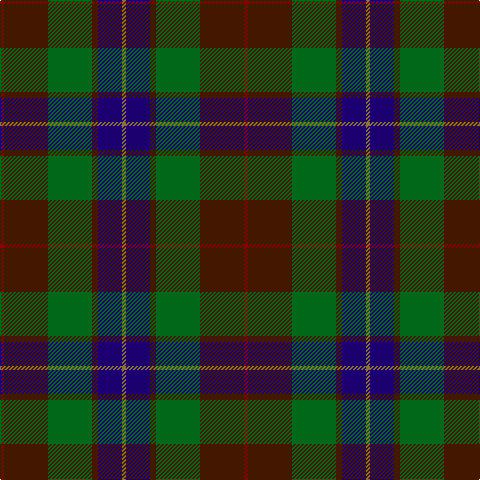

In pattern [GBBGBR](/patterns/gbbgbr/).

This was sourced from register-of-tartans.  It is a [6 stripes tartan](/stripes/stripes6/).

Original link https://www.tartanregister.gov.uk/tartanDetails.aspx?ref=2125

## Thread count
DRa/4 DR44 G44 DR6 DB24 LT/4

## Palette
Each colour and its ΔE from the base-6 reference it is a variant of.

| Colour | Shade | Base | ΔE (OKLab) |
|---|---|---|---|
| DB | <code style="background-color:#1C0070;">#1C0070</code> `#1C0070` | B <code style="background-color:#2A418A;">#2A418A</code> | 0.14 |
| DR | <code style="background-color:#441800;">#441800</code> `#441800` | B <code style="background-color:#2A418A;">#2A418A</code> | 0.23 |
| DRa | <code style="background-color:#880000;">#880000</code> `#880000` | R <code style="background-color:#CC0000;">#CC0000</code> | 0.15 |
| G | <code style="background-color:#006818;">#006818</code> `#006818` | G <code style="background-color:#006100;">#006100</code> | 0.02 |
| LT | <code style="background-color:#8C7038;">#8C7038</code> `#8C7038` | G <code style="background-color:#006100;">#006100</code> | 0.18 |

# Sample pattern

## Nearest tartans

The nearest existing variants by ΔTartan distance.

1. [Bailies of Bennachie Corporate Tartan Tartan Number: 3628. Earliest known date: 2002 The Bailes of Bennachie were founded in 1973 as caretakers of the mountain in Aberdeenshire, with the aim of 'preserving the amenity of the hill'. The tartan was produced on the occasion of the 25th anniversary to help create funds to continue their task. The colours reflect the autumn shades on the hill. See products available Copyright © Blair Urquhart, Comrie, 2015](/setts/s7/g27b2g4r15ba26k2ba6x2~b680028-ba002450-g48581c-k101010-ra44c00/) — ΔT 0.74
1. [MacPhedran/MacFadzean](/setts/s7/g3b12w1k12g13r2g2x2~b2c2c80-g285800-k101010-rc80000-wc0c0c0/) — ΔT 0.85
1. [Lyle and Scott](/setts/s6/g5b2g9ba19r9y2x2~b1474b4-ba003c64-g003820-ra00000-yfccc00/) — ΔT 0.89
1. [Loch Long One Design](/setts/s6/y4k28r2b22ba8b3x2~b3d3134-ba5f749c-k1c1714-rca2625-ye0a126/) — ΔT 0.90
1. [Andover (Fashion)](/setts/s6/r1b12k6y1ba10r1x4~b5c5c5c-ba4c3428-k101010-rc80000-yfccc00/) — ΔT 0.95
1. [Bailies of Bennachie (Corporate)](/setts/s7/g27r2g4ra15b26k2b6x2~b2c2c80-g006818-k101010-r880000-raa00000/) — ΔT 0.95
1. [Douglas, (Brown)](/setts/s5/k7b3g30ba30w3x2~b3c82af-ba141e46-g503c14-k101010-we0e0e0/) — ΔT 0.99
1. [Montrose (1983)](/setts/s6/g6y3g26k10b30w3x2~b5c5c5c-g004c2c-k101010-wc0c0c0-ybca010/) — ΔT 0.99
1. [Wcwm 9275-1410](/setts/s7/g3ga32g4w3g18b18y3x2~b6c0070-g006818-ga604000-wc0c0c0-yd09800/) — ΔT 1.01
1. [Eachaidh (Personal)](/setts/s6/k6b1r18ba6g18k2x2~b2888c4-ba2c2c80-g005c30-k101010-r880000/) — ΔT 1.07

## Neighbour map

Every grey dot is one of 15726 variants placed by the first two principal components of the ΔTartan feature space (44% of its variance). Red is this tartan; blue dots are its nearest — click one to open its page.

<svg viewBox="0 0 640 380" role="img" style="max-width:100%;height:auto;border:1px solid #e0e0e0;border-radius:4px;display:block" xmlns="http://www.w3.org/2000/svg"><image href="/nn/cloud.v1.png" width="640" height="380"/><a href="/setts/s7/g27b2g4r15ba26k2ba6x2~b680028-ba002450-g48581c-k101010-ra44c00/"><circle cx="259.1" cy="199.0" r="4" fill="#3465a4"><title>Bailies of Bennachie Corporate Tartan Tartan Number: 3628. Earliest known date: 2002 The Bailes of Bennachie were founded in 1973 as caretakers of the mountain in Aberdeenshire, with the aim of 'preserving the amenity of the hill'. The tartan was produced on the occasion of the 25th anniversary to help create funds to continue their task. The colours reflect the autumn shades on the hill. See products available Copyright © Blair Urquhart, Comrie, 2015</title></circle></a><a href="/setts/s7/g3b12w1k12g13r2g2x2~b2c2c80-g285800-k101010-rc80000-wc0c0c0/"><circle cx="217.6" cy="197.7" r="4" fill="#3465a4"><title>MacPhedran/MacFadzean</title></circle></a><a href="/setts/s6/g5b2g9ba19r9y2x2~b1474b4-ba003c64-g003820-ra00000-yfccc00/"><circle cx="217.9" cy="219.4" r="4" fill="#3465a4"><title>Lyle and Scott</title></circle></a><a href="/setts/s6/y4k28r2b22ba8b3x2~b3d3134-ba5f749c-k1c1714-rca2625-ye0a126/"><circle cx="263.3" cy="195.8" r="4" fill="#3465a4"><title>Loch Long One Design</title></circle></a><a href="/setts/s6/r1b12k6y1ba10r1x4~b5c5c5c-ba4c3428-k101010-rc80000-yfccc00/"><circle cx="239.9" cy="201.2" r="4" fill="#3465a4"><title>Andover (Fashion)</title></circle></a><a href="/setts/s7/g27r2g4ra15b26k2b6x2~b2c2c80-g006818-k101010-r880000-raa00000/"><circle cx="238.3" cy="189.3" r="4" fill="#3465a4"><title>Bailies of Bennachie (Corporate)</title></circle></a><a href="/setts/s5/k7b3g30ba30w3x2~b3c82af-ba141e46-g503c14-k101010-we0e0e0/"><circle cx="257.1" cy="222.7" r="4" fill="#3465a4"><title>Douglas, (Brown)</title></circle></a><a href="/setts/s6/g6y3g26k10b30w3x2~b5c5c5c-g004c2c-k101010-wc0c0c0-ybca010/"><circle cx="252.0" cy="219.9" r="4" fill="#3465a4"><title>Montrose (1983)</title></circle></a><a href="/setts/s7/g3ga32g4w3g18b18y3x2~b6c0070-g006818-ga604000-wc0c0c0-yd09800/"><circle cx="234.0" cy="193.1" r="4" fill="#3465a4"><title>Wcwm 9275-1410</title></circle></a><a href="/setts/s6/k6b1r18ba6g18k2x2~b2888c4-ba2c2c80-g005c30-k101010-r880000/"><circle cx="235.5" cy="191.3" r="4" fill="#3465a4"><title>Eachaidh (Personal)</title></circle></a><circle cx="238.6" cy="211.4" r="5" fill="#c00000"/></svg>

ID: /setts/s6/g2b12ba3ga22ba22r2x2~b1c0070-ba441800-g8c7038-ga006818-r880000/
