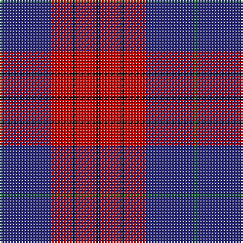

In pattern [GBRKRK](/patterns/gbrkrk/).

This was sourced from house-of-tartan.  It is a [6 stripes tartan](/stripes/stripes6/).

Original link http://www.house-of-tartan.scotland.net/house/TartanViewjs.asp?colr=Def&tnam=739

## Thread count
G/2 DB32 R14 K2 R14 K/2

## Palette
Each colour and its ΔE from the base-6 reference it is a variant of.

| Colour | Shade | Base | ΔE (OKLab) |
|---|---|---|---|
| DB | <code style="background-color:#2C2C80;">#2C2C80</code> `#2C2C80` | B <code style="background-color:#2C4084;">#2C4084</code> | 0.05 |
| G | <code style="background-color:#006818;">#006818</code> `#006818` | G <code style="background-color:#006400;">#006400</code> | 0.02 |
| K | <code style="background-color:#101010;">#101010</code> `#101010` | K <code style="background-color:#000000;">#000000</code> | 0.17 |
| R | <code style="background-color:#C80000;">#C80000</code> `#C80000` | R <code style="background-color:#C80000;">#C80000</code> | 0.00 |

# Sample pattern

## Nearest tartans

The nearest existing variants by ΔTartan distance.

1. [Robinson Dress (Pendleton) #1](/setts/s6/g4b64r28k4r28k4-b2c2c80-g006818-k101010-rc80000/) — ΔT 0.00
1. [Robinson, dress](/setts/s6/g2b32r14k2r14k2-b304080-g008000-k000000-rc00000/) — ΔT 0.37
1. [Galloway Dress (Yellow Line)](/setts/s6/g4r2b32r32b2y4-b2c2c80-g285800-rc80000-ye8c000/) — ΔT 0.73
1. [Galloway Dress District Tartan Tartan Number: 850. Earliest known date: 1950 This sett is taken from a sample in MacGregor-Hastie Collection at the Scottish Tartans Museum. It is the more usual form of the dress version. See products available Copyright © Blair Urquhart, Comrie, 2015](/setts/s6/g4r2b32r32b2y4-b2c2c80-g006818-rc80000-ye8c000/) — ΔT 0.74
1. [Galloway, dress](/setts/s6/g2r2b32r32b2w2-b304080-g008000-rc00000-we0e0e0/) — ΔT 0.85
1. [Galloway dress](/setts/s6/g4r2b32r32b2y4-b304080-g008000-rc00000-yf0c000/) — ΔT 0.93
1. [Galloway Red](/setts/s6/g6r4b44r44b4w6-b2c2c80-g006818-rc80000-wfcfcfc/) — ΔT 1.05
1. [Masai Shuka 17 (Artefact)](/setts/s6/k8b64r60b4w10k4-b4444bc-k101010-rc80000-we0e0e0/) — ΔT 1.12
1. [MacGregor, Modern](/setts/s6/b72r36b8r12k4ra4-b1c1c50-k101010-rc80000-ra888888/) — ΔT 1.13
1. [Wicks (Personal)](/setts/s5/y6g16r40b60y4-b780078-g003820-r888888-ye8c000/) — ΔT 1.18

## Neighbour map

Every grey dot is one of 15726 variants placed by the first two principal components of the ΔTartan feature space (44% of its variance). Red is this tartan; blue dots are its nearest — click one to open its page.

<svg viewBox="0 0 640 380" role="img" style="max-width:100%;height:auto;border:1px solid #e0e0e0;border-radius:4px;display:block" xmlns="http://www.w3.org/2000/svg"><image href="/nn/cloud.v1.png" width="640" height="380"/><a href="/setts/s6/g4b64r28k4r28k4-b2c2c80-g006818-k101010-rc80000/"><circle cx="327.6" cy="181.1" r="4" fill="#3465a4"><title>Robinson Dress (Pendleton) #1</title></circle></a><a href="/setts/s6/g2b32r14k2r14k2-b304080-g008000-k000000-rc00000/"><circle cx="323.4" cy="180.4" r="4" fill="#3465a4"><title>Robinson, dress</title></circle></a><a href="/setts/s6/g4r2b32r32b2y4-b2c2c80-g285800-rc80000-ye8c000/"><circle cx="307.0" cy="167.0" r="4" fill="#3465a4"><title>Galloway Dress (Yellow Line)</title></circle></a><a href="/setts/s6/g4r2b32r32b2y4-b2c2c80-g006818-rc80000-ye8c000/"><circle cx="305.9" cy="166.7" r="4" fill="#3465a4"><title>Galloway Dress District Tartan Tartan Number: 850. Earliest known date: 1950 This sett is taken from a sample in MacGregor-Hastie Collection at the Scottish Tartans Museum. It is the more usual form of the dress version. See products available Copyright © Blair Urquhart, Comrie, 2015</title></circle></a><a href="/setts/s6/g2r2b32r32b2w2-b304080-g008000-rc00000-we0e0e0/"><circle cx="352.2" cy="169.4" r="4" fill="#3465a4"><title>Galloway, dress</title></circle></a><a href="/setts/s6/g4r2b32r32b2y4-b304080-g008000-rc00000-yf0c000/"><circle cx="315.2" cy="171.3" r="4" fill="#3465a4"><title>Galloway dress</title></circle></a><a href="/setts/s6/g6r4b44r44b4w6-b2c2c80-g006818-rc80000-wfcfcfc/"><circle cx="276.2" cy="179.5" r="4" fill="#3465a4"><title>Galloway Red</title></circle></a><a href="/setts/s6/k8b64r60b4w10k4-b4444bc-k101010-rc80000-we0e0e0/"><circle cx="283.0" cy="162.8" r="4" fill="#3465a4"><title>Masai Shuka 17 (Artefact)</title></circle></a><a href="/setts/s6/b72r36b8r12k4ra4-b1c1c50-k101010-rc80000-ra888888/"><circle cx="389.2" cy="174.4" r="4" fill="#3465a4"><title>MacGregor, Modern</title></circle></a><a href="/setts/s5/y6g16r40b60y4-b780078-g003820-r888888-ye8c000/"><circle cx="279.1" cy="193.8" r="4" fill="#3465a4"><title>Wicks (Personal)</title></circle></a><circle cx="327.6" cy="181.1" r="5" fill="#c00000"/></svg>

ID: /setts/s6/g2b32r14k2r14k2-b2c2c80-g006818-k101010-rc80000/
