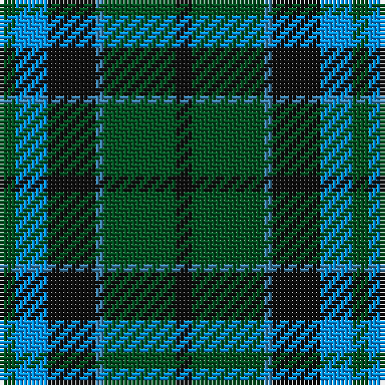

In pattern [GBKBGK](/patterns/gbkbgk/).

This was sourced from register-of-tartans.  It is a [6 stripes tartan](/stripes/stripes6/).

Original link https://www.tartanregister.gov.uk/tartanDetails.aspx?ref=4229

## Thread count
G/4 Ba8 K12 B2 G18 K/4

## Palette
Each colour and its ΔE from the base-6 reference it is a variant of.

| Colour | Shade | Base | ΔE (OKLab) |
|---|---|---|---|
| B | <code style="background-color:#3C82AF;">#3C82AF</code> `#3C82AF` | B <code style="background-color:#2A418A;">#2A418A</code> | 0.19 |
| Ba | <code style="background-color:#0596FA;">#0596FA</code> `#0596FA` | B <code style="background-color:#2A418A;">#2A418A</code> | 0.27 |
| G | <code style="background-color:#005020;">#005020</code> `#005020` | G <code style="background-color:#006100;">#006100</code> | 0.07 |
| K | <code style="background-color:#101010;">#101010</code> `#101010` | K <code style="background-color:#000000;">#000000</code> | 0.17 |

# Sample pattern

## Nearest tartans

The nearest existing variants by ΔTartan distance.

1. [Trafalgar (Fashion)](/setts/s6/g3b1g8b7k3y1x2~b2c2c80-g006818-k101010-ye8c000/) — ΔT 0.53
1. [Menteith](/setts/s6/g9w1g6k7b7k1x4~b1c0070-g006818-k101010-wc0c0c0/) — ΔT 0.54
1. [Redland](/setts/s6/g52w7g9k35b35k7~b2c2c80-g006818-k101010-w98c8e8/) — ΔT 0.57
1. [Menteith District Tartan Tartan Number: 929. Earliest known date: Mid 19th century Menteith lies in the upper reaches of the River Forth. The tartan is similar to the Graham of Mentieth sett recorded by Logan in 1831. The proportions of colours are quite distinct, however, and the azure stipe in the family tartan is replaced by white in the district. The Menteith district tartan was rescued from oblivion in 1941 by Graeme Menteith who wrote to MacGregor-Hastie about it. (STS archives) See products available Copyright © Blair Urquhart, Comrie, 2015](/setts/s6/g9w1g6k7b7k1x2~b2c2c80-g006818-k101010-we0e0e0/) — ΔT 0.59
1. [Blaylock Annandale](/setts/s7/g24b6w3k6b12k15g4x2~b1f5aba-g10712e-k101010-w9eafdb/) — ΔT 0.75
1. [Graham of Menteith Clan Tartan Tartan Number: 698. Earliest known date: 1831 Logan describes the broad blue stripe as 'smalt', in his book, 'The Scottish Gael' published in 1831. Smibert also records this sett in 1850. However, in the text for McIan's Costume of the Clans (1845-47), Logan admits that this sett's antiquity is questionable. Menteith is the name given to the western branch of the Graham family. The Menteith District tartan is similar but the azure stripe is white. (See also Montrose, Menteith.) See products available Copyright © Blair Urquhart, Comrie, 2015](/setts/s6/g18b2g4k14ba12k3x2~b5c8ca8-ba2c2c80-g006818-k101010/) — ΔT 0.83
1. [MacCallum Clan Tartan Tartan Number: 767. Earliest known date: 1893 D. W. Stewart wrote, "It is believed that the family (MacCallum), having lost trace of the old sett 50 or 60 years ago (i.e. 1832 - 1843), had the modern design prepared from the recollection of old people in Argyllshire; but the recovery of the original design shows that considerable deviation had been made." 'Old and Rare Scottish Tartans' recorded just 45 tartans, specially woven in silk, of particular interest or antiquity. Copies of the book are now valuable collectors items. See products available Copyright © Blair Urquhart, Comrie, 2015](/setts/s7/g8k2b1g4k6ba6k1x2~b5c8ca8-ba2c2c80-g006818-k101010/) — ΔT 0.89
1. [Triad Highland Games Proposed](/setts/s7/r1b8k8r1k8g8r1x4~b2888c4-g006818-k101010-re87878/) — ΔT 0.96
1. [Flower of Scotland](/setts/s6/b3g28b3k16b28r3~b304080-g008000-k000000-rc00000/) — ΔT 0.98
1. [Blaylock Annandale (Name)](/setts/s7/g24b6ba3k6b12k15g4x2~b2c2c80-ba5c8ca8-g006818-k101010/) — ΔT 0.98

## Neighbour map

Every grey dot is one of 15726 variants placed by the first two principal components of the ΔTartan feature space (44% of its variance). Red is this tartan; blue dots are its nearest — click one to open its page.

<svg viewBox="0 0 640 380" role="img" style="max-width:100%;height:auto;border:1px solid #e0e0e0;border-radius:4px;display:block" xmlns="http://www.w3.org/2000/svg"><image href="/nn/cloud.v1.png" width="640" height="380"/><a href="/setts/s6/g3b1g8b7k3y1x2~b2c2c80-g006818-k101010-ye8c000/"><circle cx="245.7" cy="244.5" r="4" fill="#3465a4"><title>Trafalgar (Fashion)</title></circle></a><a href="/setts/s6/g9w1g6k7b7k1x4~b1c0070-g006818-k101010-wc0c0c0/"><circle cx="229.7" cy="252.1" r="4" fill="#3465a4"><title>Menteith</title></circle></a><a href="/setts/s6/g52w7g9k35b35k7~b2c2c80-g006818-k101010-w98c8e8/"><circle cx="204.1" cy="243.3" r="4" fill="#3465a4"><title>Redland</title></circle></a><a href="/setts/s6/g9w1g6k7b7k1x2~b2c2c80-g006818-k101010-we0e0e0/"><circle cx="230.7" cy="251.5" r="4" fill="#3465a4"><title>Menteith District Tartan Tartan Number: 929. Earliest known date: Mid 19th century Menteith lies in the upper reaches of the River Forth. The tartan is similar to the Graham of Mentieth sett recorded by Logan in 1831. The proportions of colours are quite distinct, however, and the azure stipe in the family tartan is replaced by white in the district. The Menteith district tartan was rescued from oblivion in 1941 by Graeme Menteith who wrote to MacGregor-Hastie about it. (STS archives) See products available Copyright © Blair Urquhart, Comrie, 2015</title></circle></a><a href="/setts/s7/g24b6w3k6b12k15g4x2~b1f5aba-g10712e-k101010-w9eafdb/"><circle cx="185.9" cy="232.7" r="4" fill="#3465a4"><title>Blaylock Annandale</title></circle></a><a href="/setts/s6/g18b2g4k14ba12k3x2~b5c8ca8-ba2c2c80-g006818-k101010/"><circle cx="224.8" cy="246.5" r="4" fill="#3465a4"><title>Graham of Menteith Clan Tartan Tartan Number: 698. Earliest known date: 1831 Logan describes the broad blue stripe as 'smalt', in his book, 'The Scottish Gael' published in 1831. Smibert also records this sett in 1850. However, in the text for McIan's Costume of the Clans (1845-47), Logan admits that this sett's antiquity is questionable. Menteith is the name given to the western branch of the Graham family. The Menteith District tartan is similar but the azure stripe is white. (See also Montrose, Menteith.) See products available Copyright © Blair Urquhart, Comrie, 2015</title></circle></a><a href="/setts/s7/g8k2b1g4k6ba6k1x2~b5c8ca8-ba2c2c80-g006818-k101010/"><circle cx="218.8" cy="249.7" r="4" fill="#3465a4"><title>MacCallum Clan Tartan Tartan Number: 767. Earliest known date: 1893 D. W. Stewart wrote, &quot;It is believed that the family (MacCallum), having lost trace of the old sett 50 or 60 years ago (i.e. 1832 - 1843), had the modern design prepared from the recollection of old people in Argyllshire; but the recovery of the original design shows that considerable deviation had been made.&quot; 'Old and Rare Scottish Tartans' recorded just 45 tartans, specially woven in silk, of particular interest or antiquity. Copies of the book are now valuable collectors items. See products available Copyright © Blair Urquhart, Comrie, 2015</title></circle></a><a href="/setts/s7/r1b8k8r1k8g8r1x4~b2888c4-g006818-k101010-re87878/"><circle cx="191.7" cy="225.2" r="4" fill="#3465a4"><title>Triad Highland Games Proposed</title></circle></a><a href="/setts/s6/b3g28b3k16b28r3~b304080-g008000-k000000-rc00000/"><circle cx="203.5" cy="215.8" r="4" fill="#3465a4"><title>Flower of Scotland</title></circle></a><a href="/setts/s7/g24b6ba3k6b12k15g4x2~b2c2c80-ba5c8ca8-g006818-k101010/"><circle cx="209.5" cy="242.8" r="4" fill="#3465a4"><title>Blaylock Annandale (Name)</title></circle></a><circle cx="225.8" cy="240.1" r="5" fill="#c00000"/></svg>

ID: /setts/s6/g2b4k6ba1g9k2x2~b0596fa-ba3c82af-g005020-k101010/
