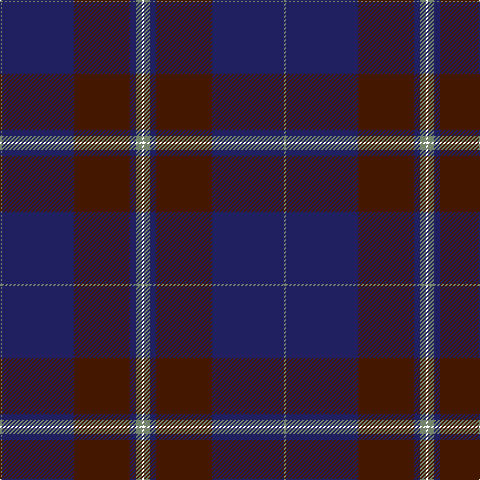

In pattern [GBBBGK](/patterns/gbbbgk/).

This was sourced from register-of-tartans.  It is a [6 stripes tartan](/stripes/stripes6/).

Original link https://www.tartanregister.gov.uk/tartanDetails.aspx?ref=3364

## Thread count
N/2 DB72 DR56 DB6 N6 YY/2

## Palette
Each colour and its ΔE from the base-6 reference it is a variant of.

| Colour | Shade | Base | ΔE (OKLab) |
|---|---|---|---|
| DB | <code style="background-color:#202060;">#202060</code> `#202060` | B <code style="background-color:#2C4084;">#2C4084</code> | 0.11 |
| DR | <code style="background-color:#441800;">#441800</code> `#441800` | B <code style="background-color:#2C4084;">#2C4084</code> | 0.22 |
| N | <code style="background-color:#74846C;">#74846C</code> `#74846C` | G <code style="background-color:#006400;">#006400</code> | 0.19 |

# Sample pattern

ID: /setts/s6/g2b72ba56b6g6k2-b202060-ba441800-g74846c-k000000/
