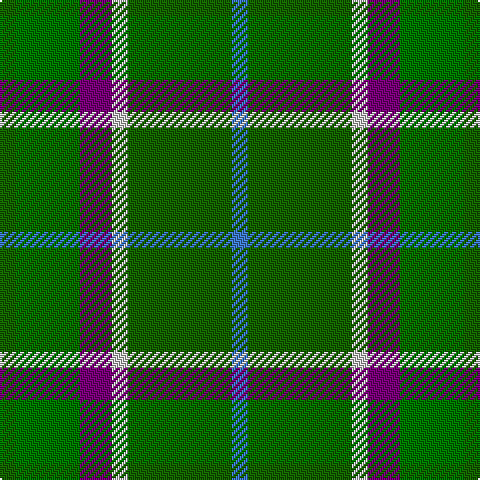

**Bands:** [GGBWGB](/stripes/ggbwgb/) · **Stripes:** [G G DP LB G B](/stripes/stripes6/) G G DP LB G B

This was sourced from register-of-tartans.  It is a [6 band tartan](/bands/bands6/).

Original link https://www.tartanregister.gov.uk/tartanDetails.aspx?ref=1099

## Register references

External register numbers recorded for this tartan.

- Scottish Register of Tartans: [1099](https://www.tartanregister.gov.uk/tartanDetails.aspx?ref=1099)
- Scottish Tartans Authority (ITI): 4804

## Thread count
G/8 Ga32 P16 N8 G52 B/8

## Palette
Each colour and its ΔE from the base-6 reference it is a variant of.

| Colour | Shade | Base | ΔE (OKLab) |
|---|---|---|---|
| B | <code style="background-color:#3C78C8;">#3C78C8</code> `#3C78C8` | B <code style="background-color:#2A418A;">#2A418A</code> | 0.17 |
| G | <code style="background-color:#146400;">#146400</code> `#146400` | G <code style="background-color:#006100;">#006100</code> | 0.01 |
| Ga | <code style="background-color:#007800;">#007800</code> `#007800` | G <code style="background-color:#006100;">#006100</code> | 0.07 |
| N | <code style="background-color:#C8C8C8;">#C8C8C8</code> `#C8C8C8` | W <code style="background-color:#F7F7F7;">#F7F7F7</code> | 0.14 |
| P | <code style="background-color:#780078;">#780078</code> `#780078` | B <code style="background-color:#2A418A;">#2A418A</code> | 0.17 |

# Sample pattern

## Nearest tartans

The nearest existing variants by ΔTartan distance.

1. [Simple Technology (Corporate)](/setts/s5/r3g28db9dg18w3~x2/) — ΔT 1.11
1. [City of Vancouver (Commemorative)](/setts/s6/g2lo1g12lb6g12r1~x4/) — ΔT 1.30
1. [New Mexico](/setts/s7/g10db42r5dg42g42ly5g10/) — ΔT 1.32
1. [Simple Technology](/setts/s8/g28db9dg18w3dg18db9g28r3~x2/) — ΔT 1.35
1. [Balfour Hunting](/setts/s6/b30ly3dy11ly3g33r6~x2/) — ΔT 1.39
1. [Newfoundland](/setts/s7/r4g3o8w3o4g18ly3~x2/) — ΔT 1.39
1. [Newfoundland District Tartan Tartan Number: 1543. Earliest known date: 1972 The colours of the Newfoundland tartan are related to the 'Ode to Newfoundland', the second anthem of the province. Gold for the sun, green for the pine clad hill, white for the snow, brown for the minerals under the earth and red to denote her British origins. In 1972, the Minute of Provincial Affairs of the Province petitioned the Lord Lyon to record the tartan in the Writs section of the Lyon Court Books. This was done on the 3rd of September, 1973. See products available Copyright © Blair Urquhart, Comrie, 2015](/setts/s7/r4g3dy8w3dy4g18ly3~x2/) — ΔT 1.42
1. [Wilson's No.122](/setts/s8/g14dt11y3k5y3dt11g14ly2~x2/) — ΔT 1.46
1. [Reidy Wedding](/setts/s7/g31dg7lo3dg14g8db18dp5~x2/) — ΔT 1.46
1. [Wcwm 1716](/setts/s6/g6ly3g26dg10dt30lb3~x2/) — ΔT 1.46

## Neighbour map

Every grey dot is one of 14299 variants placed by the first two principal components of the ΔTartan feature space (44% of its variance). Red is this tartan; blue dots are its nearest — click one to open its page.

<svg viewBox="0 0 640 380" role="img" style="max-width:100%;height:auto;border:1px solid #e0e0e0;border-radius:4px;display:block" xmlns="http://www.w3.org/2000/svg"><image href="/nn/cloud.v1.png" width="640" height="380"/><a href="/setts/s5/r3g28db9dg18w3~x2/"><circle cx="234.8" cy="231.6" r="4" fill="#3465a4"><title>Simple Technology (Corporate)</title></circle></a><a href="/setts/s6/g2lo1g12lb6g12r1~x4/"><circle cx="246.3" cy="214.5" r="4" fill="#3465a4"><title>City of Vancouver (Commemorative)</title></circle></a><a href="/setts/s7/g10db42r5dg42g42ly5g10/"><circle cx="187.9" cy="218.1" r="4" fill="#3465a4"><title>New Mexico</title></circle></a><a href="/setts/s8/g28db9dg18w3dg18db9g28r3~x2/"><circle cx="252.9" cy="239.9" r="4" fill="#3465a4"><title>Simple Technology</title></circle></a><a href="/setts/s6/b30ly3dy11ly3g33r6~x2/"><circle cx="216.9" cy="209.0" r="4" fill="#3465a4"><title>Balfour Hunting</title></circle></a><a href="/setts/s7/r4g3o8w3o4g18ly3~x2/"><circle cx="225.0" cy="214.5" r="4" fill="#3465a4"><title>Newfoundland</title></circle></a><a href="/setts/s7/r4g3dy8w3dy4g18ly3~x2/"><circle cx="220.1" cy="213.6" r="4" fill="#3465a4"><title>Newfoundland District Tartan Tartan Number: 1543. Earliest known date: 1972 The colours of the Newfoundland tartan are related to the 'Ode to Newfoundland', the second anthem of the province. Gold for the sun, green for the pine clad hill, white for the snow, brown for the minerals under the earth and red to denote her British origins. In 1972, the Minute of Provincial Affairs of the Province petitioned the Lord Lyon to record the tartan in the Writs section of the Lyon Court Books. This was done on the 3rd of September, 1973. See products available Copyright © Blair Urquhart, Comrie, 2015</title></circle></a><a href="/setts/s8/g14dt11y3k5y3dt11g14ly2~x2/"><circle cx="200.1" cy="241.9" r="4" fill="#3465a4"><title>Wilson's No.122</title></circle></a><a href="/setts/s7/g31dg7lo3dg14g8db18dp5~x2/"><circle cx="245.7" cy="231.1" r="4" fill="#3465a4"><title>Reidy Wedding</title></circle></a><a href="/setts/s6/g6ly3g26dg10dt30lb3~x2/"><circle cx="216.4" cy="211.9" r="4" fill="#3465a4"><title>Wcwm 1716</title></circle></a><circle cx="234.2" cy="239.3" r="5" fill="#c00000"/></svg>

ID: /setts/s6/g2g8dp4lb2g13b2~x4/
