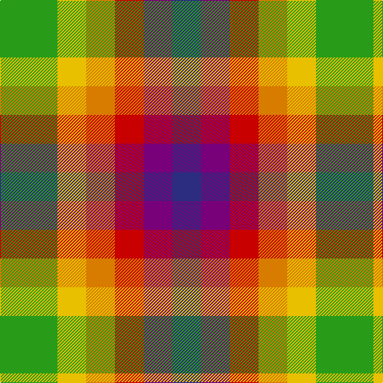

This page is one **sett** — a single exact thread-count. It belongs to the [tartan](/tartans/g2ly1lo1r1dp1db1/)
(the same proportion at any scale), whose colour order is pattern [BBRYYG](/stripes/bbryyg/).

Sourced from tartans-authority.  It is a [6 stripe tartan](/stripes/stripes6/).

Original link http://www.tartansauthority.com/tartan-ferret/display/2647/

2 attestations — the source records this cloth was collapsed from (oldest owns this page)

<ul>
<li>1999 — Rainbow (Fashion) (tartans-authority, <a href="http://www.tartansauthority.com/tartan-ferret/display/2647/">record</a>)</li>
<li>01/09/2000 — Rainbow (Gay Community) (register-of-tartans, <a href="https://www.tartanregister.gov.uk/tartanDetails.aspx?ref=3445">record</a>)</li>
</ul>

## Register references

External register numbers recorded for this tartan.

- Scottish Register of Tartans: [3445](https://www.tartanregister.gov.uk/tartanDetails.aspx?ref=3445)
- Scottish Tartans Authority (ITI): 2647
- Scottish Tartans World Register: 2647

## Thread count
G/72 Y36 O36 R36 P36 DB/36

## Palette

Palette: <strong>Tartan Register</strong>
<table><thead><tr><th>Colour</th><th>Threads</th><th>Shade</th><th>Base</th><th>OKLCh</th></tr></thead><tbody><tr><td>G/</td><td style="text-align:right;font-variant-numeric:tabular-nums">72</td><td><code style="background-color:#289C18;">#289C18</code> <small style="color:#888">#289C18</small></td><td>G <code style="background-color:#006100;">#006100</code></td><td><small style="color:#888">oklch(60.6% 0.191 141.6)</small></td></tr><tr><td>Y</td><td style="text-align:right;font-variant-numeric:tabular-nums">36</td><td><code style="background-color:#E8C000;">#E8C000</code> <small style="color:#888">#E8C000</small></td><td>Y <code style="background-color:#F2BF00;">#F2BF00</code></td><td><small style="color:#888">oklch(81.9% 0.168 93.7)</small></td></tr><tr><td>O</td><td style="text-align:right;font-variant-numeric:tabular-nums">36</td><td><code style="background-color:#D87C00;">#D87C00</code> <small style="color:#888">#D87C00</small></td><td>Y <code style="background-color:#F2BF00;">#F2BF00</code></td><td><small style="color:#888">oklch(67.3% 0.155 61.8)</small></td></tr><tr><td>R</td><td style="text-align:right;font-variant-numeric:tabular-nums">36</td><td><code style="background-color:#C80000;">#C80000</code> <small style="color:#888">#C80000</small></td><td>R <code style="background-color:#CC0000;">#CC0000</code></td><td><small style="color:#888">oklch(52.3% 0.215 29.2)</small></td></tr><tr><td>P</td><td style="text-align:right;font-variant-numeric:tabular-nums">36</td><td><code style="background-color:#780078;">#780078</code> <small style="color:#888">#780078</small></td><td>B <code style="background-color:#2A418A;">#2A418A</code></td><td><small style="color:#888">oklch(40.2% 0.185 328.4)</small></td></tr><tr><td>DB/</td><td style="text-align:right;font-variant-numeric:tabular-nums">36</td><td><code style="background-color:#2C2C80;">#2C2C80</code> <small style="color:#888">#2C2C80</small></td><td>B <code style="background-color:#2A418A;">#2A418A</code></td><td><small style="color:#888">oklch(35.0% 0.138 276.6)</small></td></tr></tbody></table>

# Sample pattern

## Nearest tartans

The nearest existing variants by ΔTartan distance, with this tartan at the top so the swatches line up against it.

ΔTartan

Tartan

Sett

—

<a href="/ttd/edit/#slug=g2ly1lo1r1dp1db1~x36">Rainbow (Fashion)</a> <a class="nn-out" href="/setts/s6/g2ly1lo1r1dp1db1~x36/" title="open its dictionary page">↗</a>

0.24

<a href="/ttd/edit/#slug=g2ly1lo1r1p1db1~x36">Rainbow</a> <a class="nn-out" href="/setts/s6/g2ly1lo1r1p1db1~x36/" title="open its dictionary page">↗</a>

1.51

<a href="/ttd/edit/#slug=dg2g1o1dg1g1g1o1w1lr2~x20">Stirling</a> <a class="nn-out" href="/setts/s9/dg2g1o1dg1g1g1o1w1lr2~x20/" title="open its dictionary page">↗</a>

1.54

<a href="/ttd/edit/#slug=ly2o1ly1o3o3db3ly2lr2db1~x4">Titanic</a> <a class="nn-out" href="/setts/s9/ly2o1ly1o3o3db3ly2lr2db1~x4/" title="open its dictionary page">↗</a>

1.72

<a href="/ttd/edit/#slug=lp2w1y1g1g1dg1y1g1dg1~x20">Stirling Millennium</a> <a class="nn-out" href="/setts/s9/lp2w1y1g1g1dg1y1g1dg1~x20/" title="open its dictionary page">↗</a>

1.80

<a href="/ttd/edit/#slug=lr12lo8r5k6lr7g5~x4">Mitchell, Martin (Personal)</a> <a class="nn-out" href="/setts/s6/lr12lo8r5k6lr7g5~x4/" title="open its dictionary page">↗</a>

1.80

<a href="/ttd/edit/#slug=dg4r5db4ly4do2o4r4~x5">Krifa-Jean (Personal)</a> <a class="nn-out" href="/setts/s7/dg4r5db4ly4do2o4r4~x5/" title="open its dictionary page">↗</a>

1.87

<a href="/ttd/edit/#slug=k1o3lr3o3db3o3g3k1~x4">Stewarton (Fashion)</a> <a class="nn-out" href="/setts/s8/k1o3lr3o3db3o3g3k1~x4/" title="open its dictionary page">↗</a>

1.92

<a href="/ttd/edit/#slug=n2k2n2k2w1o1w1o1w1o1r2~x8">Unidentified (2103)</a> <a class="nn-out" href="/setts/s11/n2k2n2k2w1o1w1o1w1o1r2~x8/" title="open its dictionary page">↗</a>

1.93

<a href="/ttd/edit/#slug=dg4r5ly4db4dy2k4r4~x10">Krifa-Jean (Personal)</a> <a class="nn-out" href="/setts/s7/dg4r5ly4db4dy2k4r4~x10/" title="open its dictionary page">↗</a>

1.94

<a href="/ttd/edit/#slug=db2m3g3o6ly2~x2">Dunoon Burgh Hall Trust</a> <a class="nn-out" href="/setts/s5/db2m3g3o6ly2~x2/" title="open its dictionary page">↗</a>

## Neighbour map

Every grey dot is one of 14299 variants placed by the first two principal components of the ΔTartan feature space (44% of its variance). Red is this tartan; blue dots are its nearest — click one to open its page.

<svg viewBox="0 0 640 380" role="img" style="max-width:100%;height:auto;border:1px solid #e0e0e0;border-radius:4px;display:block" xmlns="http://www.w3.org/2000/svg"><image href="/nn/cloud.v1.png" width="640" height="380"/><a href="/setts/s6/g2ly1lo1r1p1db1~x36/"><circle cx="14.0" cy="271.3" r="4" fill="#3465a4"><title>Rainbow</title></circle></a><a href="/setts/s9/dg2g1o1dg1g1g1o1w1lr2~x20/"><circle cx="14.0" cy="263.7" r="4" fill="#3465a4"><title>Stirling</title></circle></a><a href="/setts/s9/ly2o1ly1o3o3db3ly2lr2db1~x4/"><circle cx="14.0" cy="243.3" r="4" fill="#3465a4"><title>Titanic</title></circle></a><a href="/setts/s9/lp2w1y1g1g1dg1y1g1dg1~x20/"><circle cx="14.0" cy="274.5" r="4" fill="#3465a4"><title>Stirling Millennium</title></circle></a><a href="/setts/s6/lr12lo8r5k6lr7g5~x4/"><circle cx="80.1" cy="287.3" r="4" fill="#3465a4"><title>Mitchell, Martin (Personal)</title></circle></a><a href="/setts/s7/dg4r5db4ly4do2o4r4~x5/"><circle cx="14.0" cy="260.2" r="4" fill="#3465a4"><title>Krifa-Jean (Personal)</title></circle></a><a href="/setts/s8/k1o3lr3o3db3o3g3k1~x4/"><circle cx="14.0" cy="263.0" r="4" fill="#3465a4"><title>Stewarton (Fashion)</title></circle></a><a href="/setts/s11/n2k2n2k2w1o1w1o1w1o1r2~x8/"><circle cx="14.0" cy="258.8" r="4" fill="#3465a4"><title>Unidentified (2103)</title></circle></a><a href="/setts/s7/dg4r5ly4db4dy2k4r4~x10/"><circle cx="14.0" cy="255.7" r="4" fill="#3465a4"><title>Krifa-Jean (Personal)</title></circle></a><a href="/setts/s5/db2m3g3o6ly2~x2/"><circle cx="63.7" cy="266.7" r="4" fill="#3465a4"><title>Dunoon Burgh Hall Trust</title></circle></a><circle cx="14.0" cy="273.5" r="5" fill="#c00000"/></svg>

ID: /setts/s6/g2ly1lo1r1dp1db1~x36/
