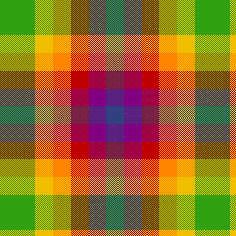

This page is one **sett** — a single exact thread-count. It belongs to the [tartan](/tartans/g2ly1lo1r1p1db1/)
(the same proportion at any scale), whose colour order is pattern [BBRYYG](/stripes/bbryyg/).

Sourced from weddslist.  It is a [6 stripe tartan](/stripes/stripes6/).

Original link http://www.weddslist.com/cgi-bin/tartans/pg.pl?source=sts

## Thread count
G/72 Y36 O36 R36 P36 B/36

## Palette

Palette: <strong>custom</strong>
<table><thead><tr><th>Colour</th><th>Threads</th><th>Shade</th><th>Base</th><th>OKLCh</th></tr></thead><tbody><tr><td>G/</td><td style="text-align:right;font-variant-numeric:tabular-nums">72</td><td><code style="background-color:#30A010;">#30A010</code> <small style="color:#888">#30A010</small></td><td>G <code style="background-color:#006100;">#006100</code></td><td><small style="color:#888">oklch(61.9% 0.195 140.5)</small></td></tr><tr><td>Y</td><td style="text-align:right;font-variant-numeric:tabular-nums">36</td><td><code style="background-color:#F0C000;">#F0C000</code> <small style="color:#888">#F0C000</small></td><td>Y <code style="background-color:#F2BF00;">#F2BF00</code></td><td><small style="color:#888">oklch(82.7% 0.169 90.5)</small></td></tr><tr><td>O</td><td style="text-align:right;font-variant-numeric:tabular-nums">36</td><td><code style="background-color:#FF8500;">#FF8500</code> <small style="color:#888">#FF8500</small></td><td>Y <code style="background-color:#F2BF00;">#F2BF00</code></td><td><small style="color:#888">oklch(74.0% 0.183 55.1)</small></td></tr><tr><td>R</td><td style="text-align:right;font-variant-numeric:tabular-nums">36</td><td><code style="background-color:#C00000;">#C00000</code> <small style="color:#888">#C00000</small></td><td>R <code style="background-color:#CC0000;">#CC0000</code></td><td><small style="color:#888">oklch(50.7% 0.208 29.2)</small></td></tr><tr><td>P</td><td style="text-align:right;font-variant-numeric:tabular-nums">36</td><td><code style="background-color:#800080;">#800080</code> <small style="color:#888">#800080</small></td><td>B <code style="background-color:#2A418A;">#2A418A</code></td><td><small style="color:#888">oklch(42.1% 0.193 328.4)</small></td></tr><tr><td>B/</td><td style="text-align:right;font-variant-numeric:tabular-nums">36</td><td><code style="background-color:#304080;">#304080</code> <small style="color:#888">#304080</small></td><td>B <code style="background-color:#2A418A;">#2A418A</code></td><td><small style="color:#888">oklch(39.4% 0.109 270.2)</small></td></tr></tbody></table>

# Sample pattern

## Nearest tartans

The nearest existing variants by ΔTartan distance, with this tartan at the top so the swatches line up against it.

ΔTartan

Tartan

Sett

—

<a href="/ttd/edit/#slug=g2ly1lo1r1p1db1~x36">Rainbow</a> <a class="nn-out" href="/setts/s6/g2ly1lo1r1p1db1~x36/" title="open its dictionary page">↗</a>

0.24

<a href="/ttd/edit/#slug=g2ly1lo1r1dp1db1~x36">Rainbow (Fashion)</a> <a class="nn-out" href="/setts/s6/g2ly1lo1r1dp1db1~x36/" title="open its dictionary page">↗</a>

1.53

<a href="/ttd/edit/#slug=ly2oi1ly1o3oi3db3ly2lr2db1~x4">Titanic</a> <a class="nn-out" href="/setts/s9/ly2oi1ly1o3oi3db3ly2lr2db1~x4/" title="open its dictionary page">↗</a>

1.58

<a href="/ttd/edit/#slug=dg2gi1o1dg1g1gi1o1w1lr2~x20">Stirling</a> <a class="nn-out" href="/setts/s9/dg2gi1o1dg1g1gi1o1w1lr2~x20/" title="open its dictionary page">↗</a>

1.82

<a href="/ttd/edit/#slug=lp2w1y1g1gi1dg1y1g1dg1~x20">Stirling Millennium</a> <a class="nn-out" href="/setts/s9/lp2w1y1g1gi1dg1y1g1dg1~x20/" title="open its dictionary page">↗</a>

1.84

<a href="/ttd/edit/#slug=dg4r5db4ly4do2o4r4~x5">Krifa-Jean (Personal)</a> <a class="nn-out" href="/setts/s7/dg4r5db4ly4do2o4r4~x5/" title="open its dictionary page">↗</a>

1.85

<a href="/ttd/edit/#slug=lr12lo8r5k6lr7g5~x4">Mitchell, Martin (Personal)</a> <a class="nn-out" href="/setts/s6/lr12lo8r5k6lr7g5~x4/" title="open its dictionary page">↗</a>

2.00

<a href="/ttd/edit/#slug=db2m3g3o6ly2~x2">Dunoon Burgh Hall Trust</a> <a class="nn-out" href="/setts/s5/db2m3g3o6ly2~x2/" title="open its dictionary page">↗</a>

2.01

<a href="/ttd/edit/#slug=k13w13r26lo13r20dt13r26g22w13k13">Nassau County Firefighters (P&amp;D)</a> <a class="nn-out" href="/setts/s10/k13w13r26lo13r20dt13r26g22w13k13/" title="open its dictionary page">↗</a>

2.02

<a href="/ttd/edit/#slug=dg4ri5ly4db4dy2k4r4~x10">Krifa-Jean (Personal)</a> <a class="nn-out" href="/setts/s7/dg4ri5ly4db4dy2k4r4~x10/" title="open its dictionary page">↗</a>

2.02

<a href="/ttd/edit/#slug=lo17ly17o17g26b5~x2">Wild Mustard Dreams</a> <a class="nn-out" href="/setts/s5/lo17ly17o17g26b5~x2/" title="open its dictionary page">↗</a>

## Neighbour map

Every grey dot is one of 14359 variants placed by the first two principal components of the ΔTartan feature space (44% of its variance). Red is this tartan; blue dots are its nearest — click one to open its page.

<svg viewBox="0 0 640 380" role="img" style="max-width:100%;height:auto;border:1px solid #e0e0e0;border-radius:4px;display:block" xmlns="http://www.w3.org/2000/svg"><image href="/nn/cloud.v1.png" width="640" height="380"/><a href="/setts/s6/g2ly1lo1r1dp1db1~x36/"><circle cx="14.0" cy="275.3" r="4" fill="#3465a4"><title>Rainbow (Fashion)</title></circle></a><a href="/setts/s9/ly2oi1ly1o3oi3db3ly2lr2db1~x4/"><circle cx="14.0" cy="244.9" r="4" fill="#3465a4"><title>Titanic</title></circle></a><a href="/setts/s9/dg2gi1o1dg1g1gi1o1w1lr2~x20/"><circle cx="14.0" cy="265.3" r="4" fill="#3465a4"><title>Stirling</title></circle></a><a href="/setts/s9/lp2w1y1g1gi1dg1y1g1dg1~x20/"><circle cx="14.0" cy="276.2" r="4" fill="#3465a4"><title>Stirling Millennium</title></circle></a><a href="/setts/s7/dg4r5db4ly4do2o4r4~x5/"><circle cx="14.0" cy="262.1" r="4" fill="#3465a4"><title>Krifa-Jean (Personal)</title></circle></a><a href="/setts/s6/lr12lo8r5k6lr7g5~x4/"><circle cx="79.6" cy="289.0" r="4" fill="#3465a4"><title>Mitchell, Martin (Personal)</title></circle></a><a href="/setts/s5/db2m3g3o6ly2~x2/"><circle cx="63.3" cy="268.3" r="4" fill="#3465a4"><title>Dunoon Burgh Hall Trust</title></circle></a><a href="/setts/s10/k13w13r26lo13r20dt13r26g22w13k13/"><circle cx="15.1" cy="248.3" r="4" fill="#3465a4"><title>Nassau County Firefighters (P&amp;D)</title></circle></a><a href="/setts/s7/dg4ri5ly4db4dy2k4r4~x10/"><circle cx="14.0" cy="257.7" r="4" fill="#3465a4"><title>Krifa-Jean (Personal)</title></circle></a><a href="/setts/s5/lo17ly17o17g26b5~x2/"><circle cx="66.1" cy="254.7" r="4" fill="#3465a4"><title>Wild Mustard Dreams</title></circle></a><circle cx="14.0" cy="273.0" r="5" fill="#c00000"/></svg>

ID: /setts/s6/g2ly1lo1r1p1db1~x36/
