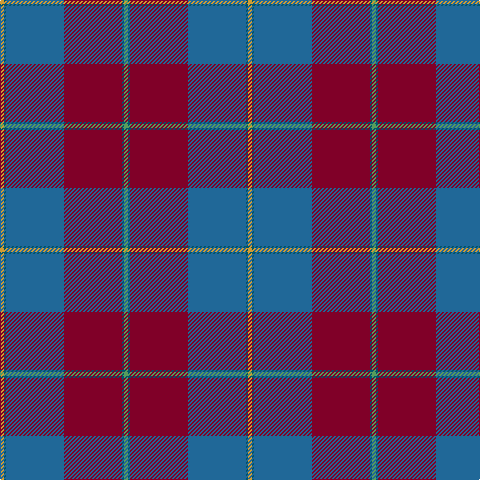

In pattern [GBRBBY](/stripes/gbrbby/).

This was sourced from register-of-tartans.  It is a [6 stripe tartan](/stripes/stripes6/).

Original link https://www.tartanregister.gov.uk/tartanDetails.aspx?ref=3471

## Attestations

This cloth appears in 2 source records; the oldest owns this page.

- 01/01/2005 — Reagan (register-of-tartans, [record](https://www.tartanregister.gov.uk/tartanDetails.aspx?ref=3471))
- 2005 Jan — Reagan (Clan?) (tartans-authority, [record](http://www.tartansauthority.com/tartan-ferret/display/6427/))

## Register references

External register numbers recorded for this tartan.

- Scottish Register of Tartans: [3471](https://www.tartanregister.gov.uk/tartanDetails.aspx?ref=3471)
- Scottish Tartans Authority (ITI): 6427

## Thread count
O/4 DB2 B58 DR58 DB2 LG/4

## Palette
Each colour and the base-6 reference it is a variant of.

| Colour | Shade | Base |
|---|---|---|
| B | <code style="background-color:#206898;">#206898</code> `oklch(49.7% 0.103 242.7)` <small>#206898</small> | B <code style="background-color:#2A418A;">#2A418A</code> |
| DB | <code style="background-color:#00546C;">#00546C</code> `oklch(41.5% 0.079 225.4)` <small>#00546C</small> | B <code style="background-color:#2A418A;">#2A418A</code> |
| DR | <code style="background-color:#800028;">#800028</code> `oklch(38.2% 0.152 14.5)` <small>#800028</small> | R <code style="background-color:#CC0000;">#CC0000</code> |
| LG | <code style="background-color:#589C5C;">#589C5C</code> `oklch(63.1% 0.117 145.3)` <small>#589C5C</small> | G <code style="background-color:#006100;">#006100</code> |
| O | <code style="background-color:#D09C34;">#D09C34</code> `oklch(72.4% 0.131 80.7)` <small>#D09C34</small> | Y <code style="background-color:#F2BF00;">#F2BF00</code> |

# Sample pattern

## Nearest tartans

The nearest existing variants by ΔTartan distance, with this tartan at the top so the swatches line up against it.

ΔTartan

Tartan

Sett

—

<a href="/ttd/edit/#slug=g2n1r29b29n1lo2~x2">Reagan</a> <a class="nn-out" href="/setts/s6/g2n1r29b29n1lo2~x2/" title="open its dictionary page">↗</a>

1.16

<a href="/setts/s10/g2n1r29b29n1lo2~x2/">Reagan Clan Tartan Tartan Number: 6427. Earliest known date: 2004 Clan na Ua Riagain Debby Reagan, Secretary, 11 Bennett St., Sanford, ME 04073 U.S.A. See products available Copyright © Blair Urquhart, Comrie, 2015</a>

1.23

<a href="/ttd/edit/#slug=r32r2g2db30r1db2ly1~x2">Highland Prince (Fashion)</a> <a class="nn-out" href="/setts/s7/r32r2g2db30r1db2ly1~x2/" title="open its dictionary page">↗</a>

1.24

<a href="/ttd/edit/#slug=k2m1db17m17dt1ly2~x4">Murdoch</a> <a class="nn-out" href="/setts/s6/k2m1db17m17dt1ly2~x4/" title="open its dictionary page">↗</a>

1.25

<a href="/ttd/edit/#slug=m5ly2m35g6m2g6db38w4~x2">Scotland 2000</a> <a class="nn-out" href="/setts/s8/m5ly2m35g6m2g6db38w4~x2/" title="open its dictionary page">↗</a>

1.29

<a href="/ttd/edit/#slug=k2dr1dt17dr17db1ly2~x4">Murdoch (Geoffrey)</a> <a class="nn-out" href="/setts/s6/k2dr1dt17dr17db1ly2~x4/" title="open its dictionary page">↗</a>

1.43

<a href="/ttd/edit/#slug=r28r1b18ly2g6b18~x2">British Judo Association</a> <a class="nn-out" href="/setts/s6/r28r1b18ly2g6b18~x2/" title="open its dictionary page">↗</a>

1.44

<a href="/ttd/edit/#slug=lp4dy2dp4dy35n27r3~x2">Deeside, Royal</a> <a class="nn-out" href="/setts/s6/lp4dy2dp4dy35n27r3~x2/" title="open its dictionary page">↗</a>

1.45

<a href="/ttd/edit/#slug=m13dg16dg4dp4dg4dp34lo1dp1~x2">Heather Mead (Personal)</a> <a class="nn-out" href="/setts/s8/m13dg16dg4dp4dg4dp34lo1dp1~x2/" title="open its dictionary page">↗</a>

1.49

<a href="/ttd/edit/#slug=o37lo2r6lo2o8db49o3~x2">U.S. Merchant Marine Academy (Corpo</a> <a class="nn-out" href="/setts/s7/o37lo2r6lo2o8db49o3~x2/" title="open its dictionary page">↗</a>

1.52

<a href="/ttd/edit/#slug=w4dt38g6r2g6r38lo2r3~x2">21st Century (Fashion)</a> <a class="nn-out" href="/setts/s8/w4dt38g6r2g6r38lo2r3~x2/" title="open its dictionary page">↗</a>

## Neighbour map

Every grey dot is one of 14299 variants placed by the first two principal components of the ΔTartan feature space (44% of its variance). Red is this tartan; blue dots are its nearest — click one to open its page.

<svg viewBox="0 0 640 380" role="img" style="max-width:100%;height:auto;border:1px solid #e0e0e0;border-radius:4px;display:block" xmlns="http://www.w3.org/2000/svg"><image href="/nn/cloud.v1.png" width="640" height="380"/><a href="/setts/s10/g2n1r29b29n1lo2~x2/"><circle cx="368.4" cy="143.9" r="4" fill="#3465a4"><title>Reagan Clan Tartan Tartan Number: 6427. Earliest known date: 2004 Clan na Ua Riagain Debby Reagan, Secretary, 11 Bennett St., Sanford, ME 04073 U.S.A. See products available Copyright © Blair Urquhart, Comrie, 2015</title></circle></a><a href="/setts/s7/r32r2g2db30r1db2ly1~x2/"><circle cx="387.2" cy="136.0" r="4" fill="#3465a4"><title>Highland Prince (Fashion)</title></circle></a><a href="/setts/s6/k2m1db17m17dt1ly2~x4/"><circle cx="314.4" cy="171.7" r="4" fill="#3465a4"><title>Murdoch</title></circle></a><a href="/setts/s8/m5ly2m35g6m2g6db38w4~x2/"><circle cx="287.4" cy="148.4" r="4" fill="#3465a4"><title>Scotland 2000</title></circle></a><a href="/setts/s6/k2dr1dt17dr17db1ly2~x4/"><circle cx="327.8" cy="183.4" r="4" fill="#3465a4"><title>Murdoch (Geoffrey)</title></circle></a><a href="/setts/s6/r28r1b18ly2g6b18~x2/"><circle cx="318.8" cy="172.3" r="4" fill="#3465a4"><title>British Judo Association</title></circle></a><a href="/setts/s6/lp4dy2dp4dy35n27r3~x2/"><circle cx="337.9" cy="188.3" r="4" fill="#3465a4"><title>Deeside, Royal</title></circle></a><a href="/setts/s8/m13dg16dg4dp4dg4dp34lo1dp1~x2/"><circle cx="342.6" cy="143.2" r="4" fill="#3465a4"><title>Heather Mead (Personal)</title></circle></a><a href="/setts/s7/o37lo2r6lo2o8db49o3~x2/"><circle cx="346.5" cy="161.7" r="4" fill="#3465a4"><title>U.S. Merchant Marine Academy (Corpo</title></circle></a><a href="/setts/s8/w4dt38g6r2g6r38lo2r3~x2/"><circle cx="291.8" cy="145.3" r="4" fill="#3465a4"><title>21st Century (Fashion)</title></circle></a><circle cx="362.5" cy="151.9" r="5" fill="#c00000"/></svg>

ID: /setts/s6/g2n1r29b29n1lo2~x2/
