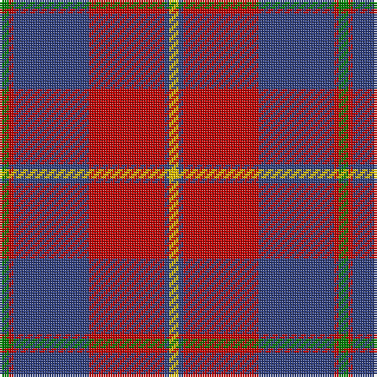

In pattern [GRBRBY](/stripes/grbrby/).

This was sourced from weddslist.  It is a [6 stripe tartan](/stripes/stripes6/).

Original link http://www.weddslist.com/cgi-bin/tartans/pg.pl?source=sts

## Also known as

This cloth is also recorded under:

- Galloway dress

## Attestations

This cloth appears in 2 source records; the oldest owns this page.

- undated — Galloway dress (weddslist, [record](http://www.weddslist.com/cgi-bin/tartans/pg.pl?source=sts))
- undated — Galloway Dress District Tartan Tartan Number: 850. Earliest known date: 1950 This sett is taken from a sample in MacGregor-Hastie Collection at the Scottish Tartans Museum. It is the more usual form of the dress version. See products available Copyright © Blair Urquhart, Comrie, 2015 (house-of-tartan, [record](http://www.house-of-tartan.scotland.net/house/TartanViewjs.asp?colr=Def&tnam=850))

## Thread count
Y/4 B2 R32 B32 R2 G/4

## Palette
Each colour and the base-6 reference it is a variant of.

| Colour | Shade | Base |
|---|---|---|
| B | <code style="background-color:#304080;">#304080</code> `oklch(39.4% 0.109 270.2)` <small>#304080</small> | B <code style="background-color:#2A418A;">#2A418A</code> |
| G | <code style="background-color:#008000;">#008000</code> `oklch(52.0% 0.177 142.5)` <small>#008000</small> | G <code style="background-color:#006100;">#006100</code> |
| R | <code style="background-color:#C00000;">#C00000</code> `oklch(50.7% 0.208 29.2)` <small>#C00000</small> | R <code style="background-color:#CC0000;">#CC0000</code> |
| Y | <code style="background-color:#F0C000;">#F0C000</code> `oklch(82.7% 0.169 90.5)` <small>#F0C000</small> | Y <code style="background-color:#F2BF00;">#F2BF00</code> |

# Sample pattern

## Nearest tartans

The nearest existing variants by ΔTartan distance, with this tartan at the top so the swatches line up against it.

ΔTartan

Tartan

Sett

—

<a href="/ttd/edit/#slug=g2r1db16r16db1ly2~x2">Galloway dress</a> <a class="nn-out" href="/setts/s6/g2r1db16r16db1ly2~x2/" title="open its dictionary page">↗</a>

0.53

<a href="/ttd/edit/#slug=dg2r1db16r16db1ly2~x2">Galloway Dress (Yellow Line)</a> <a class="nn-out" href="/setts/s6/dg2r1db16r16db1ly2~x2/" title="open its dictionary page">↗</a>

0.62

<a href="/ttd/edit/#slug=g1r1db16r16db1w1~x2">Galloway, dress</a> <a class="nn-out" href="/setts/s6/g1r1db16r16db1w1~x2/" title="open its dictionary page">↗</a>

0.72

<a href="/ttd/edit/#slug=k1r7k1r7db16g1~x2">Robinson, dress</a> <a class="nn-out" href="/setts/s6/k1r7k1r7db16g1~x2/" title="open its dictionary page">↗</a>

0.93

<a href="/ttd/edit/#slug=k1r7k1r7db16g1~x4">Robinson Dress (Pendleton) #1</a> <a class="nn-out" href="/setts/s6/k1r7k1r7db16g1~x4/" title="open its dictionary page">↗</a>

1.03

<a href="/ttd/edit/#slug=g3r2db22r22db2w3~x2">Galloway Red</a> <a class="nn-out" href="/setts/s6/g3r2db22r22db2w3~x2/" title="open its dictionary page">↗</a>

1.13

<a href="/ttd/edit/#slug=db1r16db6ly4db6w1~x4">Superfast Ferries (Corporate)</a> <a class="nn-out" href="/setts/s6/db1r16db6ly4db6w1~x4/" title="open its dictionary page">↗</a>

1.19

<a href="/ttd/edit/#slug=db2r2db28k11r27w2r2~x2">Americana - 1978 #2 (Fashion)</a> <a class="nn-out" href="/setts/s7/db2r2db28k11r27w2r2~x2/" title="open its dictionary page">↗</a>

1.19

<a href="/ttd/edit/#slug=r28db12r3dg20t2dg2r7~x2">Carrick (Strathmore) District Tartan Tartan Number: 3216. Earliest known date: c.1999 Sales help Princess Diana Memorial Trust See products available Copyright © Blair Urquhart, Comrie, 2015</a> <a class="nn-out" href="/setts/s7/r28db12r3dg20t2dg2r7~x2/" title="open its dictionary page">↗</a>

1.21

<a href="/ttd/edit/#slug=r2db12r2g12r24w1~x2">Fraser (1745)</a> <a class="nn-out" href="/setts/s6/r2db12r2g12r24w1~x2/" title="open its dictionary page">↗</a>

1.22

<a href="/ttd/edit/#slug=r1db6r1dg6r12w1~x2">Fraser Red Clan Tartan Tartan Number: 1424. Earliest known date: 1842 Early references include Wilson's of Bannockburn, but Wilson did not name the sett. D W Stewart contends that this is in fact an early Grant tartan which he traced to a portrait of Robert Grant of Lurg (1678-1771), hanging at Troup House before it was closed around 1894. It is undoubtedly the most popular Fraser pattern today. See products available Copyright © Blair Urquhart, Comrie, 2015</a> <a class="nn-out" href="/setts/s6/r1db6r1dg6r12w1~x2/" title="open its dictionary page">↗</a>

## Neighbour map

Every grey dot is one of 14299 variants placed by the first two principal components of the ΔTartan feature space (44% of its variance). Red is this tartan; blue dots are its nearest — click one to open its page.

<svg viewBox="0 0 640 380" role="img" style="max-width:100%;height:auto;border:1px solid #e0e0e0;border-radius:4px;display:block" xmlns="http://www.w3.org/2000/svg"><image href="/nn/cloud.v1.png" width="640" height="380"/><a href="/setts/s6/dg2r1db16r16db1ly2~x2/"><circle cx="308.4" cy="166.9" r="4" fill="#3465a4"><title>Galloway Dress (Yellow Line)</title></circle></a><a href="/setts/s6/g1r1db16r16db1w1~x2/"><circle cx="353.6" cy="170.4" r="4" fill="#3465a4"><title>Galloway, dress</title></circle></a><a href="/setts/s6/k1r7k1r7db16g1~x2/"><circle cx="324.9" cy="181.2" r="4" fill="#3465a4"><title>Robinson, dress</title></circle></a><a href="/setts/s6/k1r7k1r7db16g1~x4/"><circle cx="329.1" cy="182.1" r="4" fill="#3465a4"><title>Robinson Dress (Pendleton) #1</title></circle></a><a href="/setts/s6/g3r2db22r22db2w3~x2/"><circle cx="277.4" cy="178.6" r="4" fill="#3465a4"><title>Galloway Red</title></circle></a><a href="/setts/s6/db1r16db6ly4db6w1~x4/"><circle cx="279.6" cy="168.2" r="4" fill="#3465a4"><title>Superfast Ferries (Corporate)</title></circle></a><a href="/setts/s7/db2r2db28k11r27w2r2~x2/"><circle cx="270.5" cy="168.0" r="4" fill="#3465a4"><title>Americana - 1978 #2 (Fashion)</title></circle></a><a href="/setts/s7/r28db12r3dg20t2dg2r7~x2/"><circle cx="308.9" cy="185.2" r="4" fill="#3465a4"><title>Carrick (Strathmore) District Tartan Tartan Number: 3216. Earliest known date: c.1999 Sales help Princess Diana Memorial Trust See products available Copyright © Blair Urquhart, Comrie, 2015</title></circle></a><a href="/setts/s6/r2db12r2g12r24w1~x2/"><circle cx="333.4" cy="163.2" r="4" fill="#3465a4"><title>Fraser (1745)</title></circle></a><a href="/setts/s6/r1db6r1dg6r12w1~x2/"><circle cx="293.5" cy="188.1" r="4" fill="#3465a4"><title>Fraser Red Clan Tartan Tartan Number: 1424. Earliest known date: 1842 Early references include Wilson's of Bannockburn, but Wilson did not name the sett. D W Stewart contends that this is in fact an early Grant tartan which he traced to a portrait of Robert Grant of Lurg (1678-1771), hanging at Troup House before it was closed around 1894. It is undoubtedly the most popular Fraser pattern today. See products available Copyright © Blair Urquhart, Comrie, 2015</title></circle></a><circle cx="316.6" cy="172.0" r="5" fill="#c00000"/></svg>

ID: /setts/s6/g2r1db16r16db1ly2~x2/
