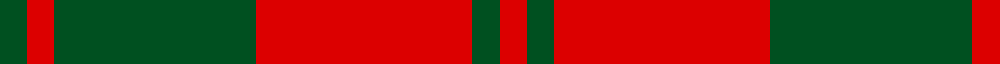

In pattern [GRGRGR](/patterns/grgrgr/).

This was sourced from register-of-tartans.  It is a [6 stripes tartan](/stripes/stripes6/).

Original link https://www.tartanregister.gov.uk/tartanDetails.aspx?ref=4335

## Thread count
G/4 R4 G30 R32 G4 R/4

## Palette
Each colour and its ΔE from the base-6 reference it is a variant of.

| Colour | Shade | Base | ΔE (OKLab) |
|---|---|---|---|
| G | <code style="background-color:#005020;">#005020</code> `#005020` | G <code style="background-color:#006100;">#006100</code> | 0.07 |
| R | <code style="background-color:#DC0000;">#DC0000</code> `#DC0000` | R <code style="background-color:#CC0000;">#CC0000</code> | 0.03 |

# Sample pattern

## Nearest tartans

The nearest existing variants by ΔTartan distance.

1. [Unidentified, NW Highlands](/setts/s6/g2r2g15r16g2r2~g008000-rc00000~x2/) — ΔT 1.01
1. [MacDonald Lord of the Isles #2](/setts/s5/g16r5g2r18k2~g005020-k101010-rdc0000~x2/) — ΔT 1.18
1. [MacDonald, Lord of The Isles (Artef)](/setts/s5/g16r5g2r18k2~g006818-k101010-rc80000~x2/) — ΔT 1.20
1. [Cameron](/setts/s6/r1g3r1g3r8y1~g006818-rc80000-ye8c000~x8/) — ΔT 1.25
1. [MacDonald, Lord of the Isles](/setts/s5/g16r5g2r18k2~g008000-k000000-rc00000~x2/) — ΔT 1.32
1. [MacGregor of Glenstrae](/setts/s5/g8r2g9r16g1~g005020-rdc0000~x2/) — ΔT 1.34
1. [MacDonald of Sleat](/setts/s5/g7r3g1r9k1~g004c00-k000000-rc80000~x2/) — ΔT 1.34
1. [MacQuarrie](/setts/s6/r16g1r1g1r4g12~g004c00-rc80000~x2/) — ΔT 1.37
1. [Cameron Clan D](/setts/s6/r1g6r1g6r15y1~g004c00-rc80000-yffc800~x2/) — ΔT 1.38
1. [MacQuarrie 7](/setts/s6/r16g1r1g1r4g12~g004010-rc00000~x2/) — ΔT 1.42

## Neighbour map

Every grey dot is one of 15726 variants placed by the first two principal components of the ΔTartan feature space (44% of its variance). Red is this tartan; blue dots are its nearest — click one to open its page.

<svg viewBox="0 0 640 380" role="img" style="max-width:100%;height:auto;border:1px solid #e0e0e0;border-radius:4px;display:block" xmlns="http://www.w3.org/2000/svg"><image href="/nn/cloud.v1.png" width="640" height="380"/><a href="/setts/s6/g2r2g15r16g2r2~g008000-rc00000~x2/"><circle cx="380.0" cy="245.0" r="4" fill="#3465a4"><title>Unidentified, NW Highlands</title></circle></a><a href="/setts/s5/g16r5g2r18k2~g005020-k101010-rdc0000~x2/"><circle cx="343.1" cy="237.3" r="4" fill="#3465a4"><title>MacDonald Lord of the Isles #2</title></circle></a><a href="/setts/s5/g16r5g2r18k2~g006818-k101010-rc80000~x2/"><circle cx="352.3" cy="243.1" r="4" fill="#3465a4"><title>MacDonald, Lord of The Isles (Artef)</title></circle></a><a href="/setts/s6/r1g3r1g3r8y1~g006818-rc80000-ye8c000~x8/"><circle cx="371.2" cy="230.3" r="4" fill="#3465a4"><title>Cameron</title></circle></a><a href="/setts/s5/g16r5g2r18k2~g008000-k000000-rc00000~x2/"><circle cx="333.3" cy="236.9" r="4" fill="#3465a4"><title>MacDonald, Lord of the Isles</title></circle></a><a href="/setts/s5/g8r2g9r16g1~g005020-rdc0000~x2/"><circle cx="381.3" cy="242.6" r="4" fill="#3465a4"><title>MacGregor of Glenstrae</title></circle></a><a href="/setts/s5/g7r3g1r9k1~g004c00-k000000-rc80000~x2/"><circle cx="354.7" cy="241.9" r="4" fill="#3465a4"><title>MacDonald of Sleat</title></circle></a><a href="/setts/s6/r16g1r1g1r4g12~g004c00-rc80000~x2/"><circle cx="452.4" cy="217.2" r="4" fill="#3465a4"><title>MacQuarrie</title></circle></a><a href="/setts/s6/r1g6r1g6r15y1~g004c00-rc80000-yffc800~x2/"><circle cx="394.6" cy="199.5" r="4" fill="#3465a4"><title>Cameron Clan D</title></circle></a><a href="/setts/s6/r16g1r1g1r4g12~g004010-rc00000~x2/"><circle cx="455.4" cy="219.4" r="4" fill="#3465a4"><title>MacQuarrie 7</title></circle></a><circle cx="374.7" cy="240.1" r="5" fill="#c00000"/></svg>

ID: /setts/s6/g2r2g15r16g2r2~g005020-rdc0000~x2/
