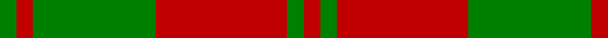
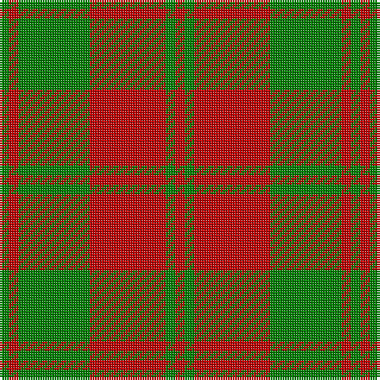

In pattern [GRGRGR](/patterns/grgrgr/).

This was sourced from weddslist.  It is a [6 stripes tartan](/stripes/stripes6/).

Original link http://www.weddslist.com/cgi-bin/tartans/pg.pl?source=sts

## Thread count
G/4 R4 G30 R32 G4 R/4

## Palette
Each colour and its ΔE from the base-6 reference it is a variant of.

| Colour | Shade | Base | ΔE (OKLab) |
|---|---|---|---|
| G | <code style="background-color:#008000;">#008000</code> `#008000` | G <code style="background-color:#006100;">#006100</code> | 0.10 |
| R | <code style="background-color:#C00000;">#C00000</code> `#C00000` | R <code style="background-color:#CC0000;">#CC0000</code> | 0.03 |

# Sample pattern

## Nearest tartans

The nearest existing variants by ΔTartan distance.

1. [Unidentified NW Highlands](/setts/s6/g2r2g15r16g2r2~g005020-rdc0000~x2/) — ΔT 1.01
1. [MacGregor of Glen Strae](/setts/s5/g8r2g9r16g1~g008000-rc00000~x2/) — ΔT 1.34
1. [MacDonald, Lord of The Isles (Artef)](/setts/s5/g16r5g2r18k2~g006818-k101010-rc80000~x2/) — ΔT 1.36
1. [MacDonald, Lord of the Isles](/setts/s5/g16r5g2r18k2~g008000-k000000-rc00000~x2/) — ΔT 1.39
1. [MacGregor of Glen Straye Htg Clan Tartan Tartan Number: 866. Earliest known date: 1842 This sett appears in the text of the Vestiarium but is not illustrated. Glen Straye (Glenstrae) lies in the heart of Campbell country and was the scene of a noteable period in the history of Clan Gregor which led to the prosciption of the name. See products available Copyright © Blair Urquhart, Comrie, 2015](/setts/s5/g8r2g9r16g1~g006818-rc80000~x2/) — ΔT 1.41
1. [Crossnor School](/setts/s7/g4r2g13w2r13g2r4~g285800-rb03000-we8ccb8~x2/) — ΔT 1.42
1. [MacDonald of Glenaladale (symmetrical)](/setts/s6/g5w2r27g27r5w2~g006818-rc80000-we0e0e0~x2/) — ΔT 1.45
1. [Cameron](/setts/s6/r1g3r1g3r8y1~g006818-rc80000-ye8c000~x8/) — ΔT 1.46
1. [Livingstone](/setts/s10/g14r4g2r2g2r4g19r30g2r9~g008000-rc00000~x2/) — ΔT 1.48
1. [Murray, Lord George (Hose)](/setts/s5/g1r5g10r5k1~g006818-k000000-rc80000~x4/) — ΔT 1.50

## Neighbour map

Every grey dot is one of 15726 variants placed by the first two principal components of the ΔTartan feature space (44% of its variance). Red is this tartan; blue dots are its nearest — click one to open its page.

<svg viewBox="0 0 640 380" role="img" style="max-width:100%;height:auto;border:1px solid #e0e0e0;border-radius:4px;display:block" xmlns="http://www.w3.org/2000/svg"><image href="/nn/cloud.v1.png" width="640" height="380"/><a href="/setts/s6/g2r2g15r16g2r2~g005020-rdc0000~x2/"><circle cx="374.7" cy="240.1" r="4" fill="#3465a4"><title>Unidentified NW Highlands</title></circle></a><a href="/setts/s5/g8r2g9r16g1~g008000-rc00000~x2/"><circle cx="386.5" cy="247.4" r="4" fill="#3465a4"><title>MacGregor of Glen Strae</title></circle></a><a href="/setts/s5/g16r5g2r18k2~g006818-k101010-rc80000~x2/"><circle cx="352.3" cy="243.1" r="4" fill="#3465a4"><title>MacDonald, Lord of The Isles (Artef)</title></circle></a><a href="/setts/s5/g16r5g2r18k2~g008000-k000000-rc00000~x2/"><circle cx="333.3" cy="236.9" r="4" fill="#3465a4"><title>MacDonald, Lord of the Isles</title></circle></a><a href="/setts/s5/g8r2g9r16g1~g006818-rc80000~x2/"><circle cx="393.8" cy="249.6" r="4" fill="#3465a4"><title>MacGregor of Glen Straye Htg Clan Tartan Tartan Number: 866. Earliest known date: 1842 This sett appears in the text of the Vestiarium but is not illustrated. Glen Straye (Glenstrae) lies in the heart of Campbell country and was the scene of a noteable period in the history of Clan Gregor which led to the prosciption of the name. See products available Copyright © Blair Urquhart, Comrie, 2015</title></circle></a><a href="/setts/s7/g4r2g13w2r13g2r4~g285800-rb03000-we8ccb8~x2/"><circle cx="326.6" cy="249.3" r="4" fill="#3465a4"><title>Crossnor School</title></circle></a><a href="/setts/s6/g5w2r27g27r5w2~g006818-rc80000-we0e0e0~x2/"><circle cx="334.5" cy="202.0" r="4" fill="#3465a4"><title>MacDonald of Glenaladale (symmetrical)</title></circle></a><a href="/setts/s6/r1g3r1g3r8y1~g006818-rc80000-ye8c000~x8/"><circle cx="371.2" cy="230.3" r="4" fill="#3465a4"><title>Cameron</title></circle></a><a href="/setts/s10/g14r4g2r2g2r4g19r30g2r9~g008000-rc00000~x2/"><circle cx="415.0" cy="197.3" r="4" fill="#3465a4"><title>Livingstone</title></circle></a><a href="/setts/s5/g1r5g10r5k1~g006818-k000000-rc80000~x4/"><circle cx="323.2" cy="242.7" r="4" fill="#3465a4"><title>Murray, Lord George (Hose)</title></circle></a><circle cx="380.0" cy="245.0" r="5" fill="#c00000"/></svg>

ID: /setts/s6/g2r2g15r16g2r2~g008000-rc00000~x2/
