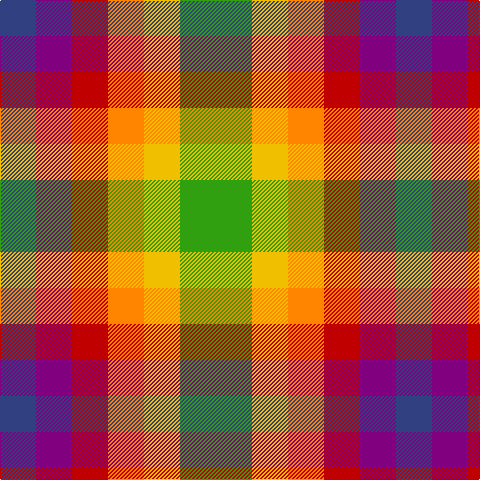

In pattern [BBRYYG](/patterns/bbryyg/).

This was sourced from weddslist.  It is a [6 stripes tartan](/stripes/stripes6/).

Original link http://www.weddslist.com/cgi-bin/tartans/pg.pl?source=sts

## Thread count
B/36 P36 R36 O36 Y36 G/72

## Palette
Each colour and its ΔE from the base-6 reference it is a variant of.

| Colour | Shade | Base | ΔE (OKLab) |
|---|---|---|---|
| B | <code style="background-color:#304080;">#304080</code> `#304080` | B <code style="background-color:#2A418A;">#2A418A</code> | 0.02 |
| G | <code style="background-color:#30A010;">#30A010</code> `#30A010` | G <code style="background-color:#006100;">#006100</code> | 0.20 |
| O | <code style="background-color:#FF8500;">#FF8500</code> `#FF8500` | Y <code style="background-color:#F2BF00;">#F2BF00</code> | 0.14 |
| P | <code style="background-color:#800080;">#800080</code> `#800080` | B <code style="background-color:#2A418A;">#2A418A</code> | 0.17 |
| R | <code style="background-color:#C00000;">#C00000</code> `#C00000` | R <code style="background-color:#CC0000;">#CC0000</code> | 0.03 |
| Y | <code style="background-color:#F0C000;">#F0C000</code> `#F0C000` | Y <code style="background-color:#F2BF00;">#F2BF00</code> | 0.00 |

# Sample pattern

## Nearest tartans

The nearest existing variants by ΔTartan distance.

1. [Rainbow (Fashion)](/setts/s6/g2y1ya1r1b1ba1x36~b780078-ba2c2c80-g289c18-rc80000-ye8c000-yad87c00/) — ΔT 0.24
1. [Titanic](/setts/s9/y2r1y1ra3r3b3y2ya2b1x4~b202060-r888888-rab84c00-ye8c000-yae08070/) — ΔT 1.53
1. [Stirling](/setts/s9/g2ga1r1g1gb1ga1r1w1y2x20~g004010-ga30a010-gb008000-r906030-we0e0e0-yf0a0a0/) — ΔT 1.57
1. [Stirling Millennium](/setts/s9/w2wa1g1ga1gb1gc1g1ga1gc1x20~g8c7038-ga289c18-gb006818-gc003820-wc49cd8-wae0e0e0/) — ΔT 1.81
1. [Krifa-Jean (Personal)](/setts/s7/g4r5b4y4ba2ra4r4x5~b2c2c80-ba441800-g003820-rc80000-ra888888-yfccc00/) — ΔT 1.84
1. [Mitchell, Martin (Personal)](/setts/s6/y12ya8r5k6y7g5x4~g00643c-k101010-r880000-ya0a0a0-yad87c00/) — ΔT 1.86
1. [Dunoon Burgh Hall Trust](/setts/s5/b2r3g3ra6y2x2~b1c1c50-g008b00-rb458ac-ra888888-yffff00/) — ΔT 2.00
1. [Nassau County Firefighters (P&D)](/setts/s10/k13w13r26y13r20b13r26g22w13k13~b003c64-g006818-k101010-rc80000-we0e0e0-yd87c00/) — ΔT 2.01
1. [Krifa-Jean (Personal)](/setts/s7/g4r5y4b4ga2k4ra4x10~b0000cd-g003c14-ga603800-k1c1714-re87878-rac8002c-yfccc00/) — ΔT 2.02
1. [Wild Mustard Dreams](/setts/s5/y17ya17r17g26b5x2~b0000ff-g408060-rb84c00-yd87c00-yaffe600/) — ΔT 2.02

## Neighbour map

Every grey dot is one of 15726 variants placed by the first two principal components of the ΔTartan feature space (44% of its variance). Red is this tartan; blue dots are its nearest — click one to open its page.

<svg viewBox="0 0 640 380" role="img" style="max-width:100%;height:auto;border:1px solid #e0e0e0;border-radius:4px;display:block" xmlns="http://www.w3.org/2000/svg"><image href="/nn/cloud.v1.png" width="640" height="380"/><a href="/setts/s6/g2y1ya1r1b1ba1x36~b780078-ba2c2c80-g289c18-rc80000-ye8c000-yad87c00/"><circle cx="14.0" cy="272.3" r="4" fill="#3465a4"><title>Rainbow (Fashion)</title></circle></a><a href="/setts/s9/y2r1y1ra3r3b3y2ya2b1x4~b202060-r888888-rab84c00-ye8c000-yae08070/"><circle cx="14.0" cy="242.5" r="4" fill="#3465a4"><title>Titanic</title></circle></a><a href="/setts/s9/g2ga1r1g1gb1ga1r1w1y2x20~g004010-ga30a010-gb008000-r906030-we0e0e0-yf0a0a0/"><circle cx="14.0" cy="259.9" r="4" fill="#3465a4"><title>Stirling</title></circle></a><a href="/setts/s9/w2wa1g1ga1gb1gc1g1ga1gc1x20~g8c7038-ga289c18-gb006818-gc003820-wc49cd8-wae0e0e0/"><circle cx="14.0" cy="269.6" r="4" fill="#3465a4"><title>Stirling Millennium</title></circle></a><a href="/setts/s7/g4r5b4y4ba2ra4r4x5~b2c2c80-ba441800-g003820-rc80000-ra888888-yfccc00/"><circle cx="14.0" cy="257.6" r="4" fill="#3465a4"><title>Krifa-Jean (Personal)</title></circle></a><a href="/setts/s6/y12ya8r5k6y7g5x4~g00643c-k101010-r880000-ya0a0a0-yad87c00/"><circle cx="78.5" cy="287.6" r="4" fill="#3465a4"><title>Mitchell, Martin (Personal)</title></circle></a><a href="/setts/s5/b2r3g3ra6y2x2~b1c1c50-g008b00-rb458ac-ra888888-yffff00/"><circle cx="61.3" cy="266.5" r="4" fill="#3465a4"><title>Dunoon Burgh Hall Trust</title></circle></a><a href="/setts/s10/k13w13r26y13r20b13r26g22w13k13~b003c64-g006818-k101010-rc80000-we0e0e0-yd87c00/"><circle cx="14.6" cy="248.3" r="4" fill="#3465a4"><title>Nassau County Firefighters (P&amp;D)</title></circle></a><a href="/setts/s7/g4r5y4b4ga2k4ra4x10~b0000cd-g003c14-ga603800-k1c1714-re87878-rac8002c-yfccc00/"><circle cx="14.0" cy="254.3" r="4" fill="#3465a4"><title>Krifa-Jean (Personal)</title></circle></a><a href="/setts/s5/y17ya17r17g26b5x2~b0000ff-g408060-rb84c00-yd87c00-yaffe600/"><circle cx="65.2" cy="252.6" r="4" fill="#3465a4"><title>Wild Mustard Dreams</title></circle></a><circle cx="14.0" cy="270.3" r="5" fill="#c00000"/></svg>

ID: /setts/s6/g2y1ya1r1b1ba1x36~b800080-ba304080-g30a010-rc00000-yf0c000-yaff8500/
